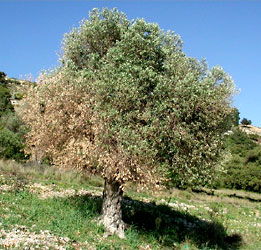

---
aliases:
  - Oleaceae
  - 물푸레나무과
  - Famîleya darzeytûnan
  - Alyvmediniai
  - Маслинки
  - ഒലിയേസീ
  - Oljetrefamilien
  - Olijffamilie
  - Oliwkowate
  - زیتون ٹبر
  - Oleacee
  - Маслиновые
  - olivovníkovité
  - oljkovke
  - Syrenväxter
  - วงศ์มะลิ
  - Zeytingiller
  - Маслинові
  - Zaytundoshlar
  - Họ Ô liu
  - Olyfboomachtign
  - 木樨科
  - 木犀科
  - زيتونية
  - Oleacees
  - Zeytunkimilər
  - Маслинови
  - Oleàcia
  - Oliven-familien
  - Ölbaumgewächse
  - olive Family
  - Oleacoj
  - Oleáceas
  - Õlipuulised
  - oleazeoak
  - تیره زیتون
  - Öljypuukasvit
  - Maslinovke
  - Wolijowcowe rostliny
  - Olajfafélék
  - Ձիթենազգիներ
  - モクセイ科
  - Зәйтүн тұқымдасы
has_id_wikidata: Q155966
title: Oleaceae
taxon_common_name:
  - 물푸레나무과
  - Famîleya darzeytûnan
  - Alyvmediniai
  - Маслинки
  - ഒലിയേസീ
  - Oljetrefamilien
  - Olijffamilie
  - Oljetrefamilien
  - Oliwkowate
  - زیتون ٹبر
  - Oleacee
  - Маслиновые
  - olivovníkovité
  - oljkovke
  - Syrenväxter
  - วงศ์มะลิ
  - Zeytingiller
  - Маслинові
  - Zaytundoshlar
  - Họ Ô liu
  - Olyfboomachtign
  - 木樨科
  - 木犀科
  - 木犀科
  - زيتونية
  - Oleacees
  - Zeytunkimilər
  - Маслинови
  - Oleàcia
  - olivovníkovité
  - Oliven-familien
  - Ölbaumgewächse
  - olive Family
  - Oleacoj
  - Oleáceas
  - Õlipuulised
  - oleazeoak
  - تیره زیتون
  - Öljypuukasvit
  - Oleáceas
  - Maslinovke
  - Wolijowcowe rostliny
  - Olajfafélék
  - Ձիթենազգիներ
  - モクセイ科
  - Зәйтүн тұқымдасы
taxonomic_type: '[[_Standards/WikiData/WD~Olea,296910]]'
described_by_source:
  - '[[../../../../../../../../../../../WikiData/WD~Brockhaus_and_Efron_Encyclopedic_Dictionary,602358]]'
  - '[[_Standards/WikiData/WD~Bible_Encyclopedia_of_Archimandrite_Nicephorus,4086271]]'
  - '[[_Standards/WikiData/WD~Great_Soviet_Encyclopedia_(1926_1947),20078554]]'
  - '[[_Standards/WikiData/WD~Flora_Reipublicae_Popularis_Sinicae,_volume_61,112869463]]'
  - '[[_Standards/WikiData/WD~Armenian_Soviet_Encyclopedia,_vol._6,124737633]]'
instance_of: '[[_Standards/WikiData/WD~taxon,16521]]'
parent_taxon: '[[_Standards/WikiData/WD~Lamiales,21742]]'
taxon_rank: '[[_Standards/WikiData/WD~family,35409]]'
ITIS_TSN: 32927
image: http://commons.wikimedia.org/wiki/Special:FilePath/Olive-tree-fruit-august-0.jpg
GRIN_URL: https://npgsweb.ars-grin.gov/gringlobal/taxonomyfamily.aspx?id=787
EPPO_Code: 1OLEF
MeSH_tree_code: B01.875.800.575.912.250.583.640
NBN_System_Key: NBNSYS0000160558
Commons_category: Oleaceae
taxon_name: Oleaceae
---

# [[Oleaceae]] 

   

#is_/same_as :: [[../../../../../../../../../../../WikiData/WD~Oleaceae,155966|WD~Oleaceae,155966]] 

## #has_/text_of_/abstract 

> **Oleaceae**, also known as the olive family or sometimes the lilac family, 
> is a taxonomic family of flowering shrubs, trees, and a few lianas in the order Lamiales. 
> It presently comprises 28 genera, one of which is recently extinct. 
> 
> The extant genera include Cartrema, which was resurrected in 2012. 
> The number of species in the Oleaceae is variously estimated in a wide range around 700. 
> The flowers are often numerous and highly odoriferous. 
> 
> The family has a subcosmopolitan distribution, 
> ranging from the subarctic to the southernmost parts of Africa, Australia, and South America. 
> 
> Notable members include olive, ash, jasmine, and several popular ornamental plants 
> including privet, forsythia, fringetrees, and lilac.
>
> [Wikipedia](https://en.wikipedia.org/wiki/Oleaceae) 

## Phylogeny 

-   « Ancestral Groups  
    -   [Lamiales](../Lamiales.md)
    -   [Asterids](../../Asterids.md)
    -  [Core Eudicots](../../../Core_Eudicots.md) 
    -   [Eudicots](../../../../Eudicots.md)
    -   [Flowering_Plant](../../../../../Flowering_Plant.md)
    -   [Seed_Plant](../../../../../../Seed_Plant.md)
    -   [Land_Plant](../../../../../../../Land_Plant.md)
    -  [Green plants](../../../../../../../../Plant.md) 
    -  [Eukarya](../../../../../../../../../Eukarya.md) 
    -   [Tree of Life](../../../../../../../../../Tree_of_Life.md)

-   ◊ Sibling Groups of  Lamiales
    -   Oleaceae
    -   [Acanthaceae](Acanthaceae.md)
    -   [Gesneriaceae](Gesneriaceae.md)

-   » Sub-Groups 

## Title Illustrations

---------------------------------------------------------------------------
 
Scientific Name ::   Syringa vulgaris
Location ::         Romania
Identified By      Ilisoi Gabriel
Life Cycle Stage ::   Adult
Body Part          Aerial, Leaves and flowers
Copyright ::          © [Gabriel Ilisoi](mailto:ilisoi_gabriel@yahoo.co.uk) 

------------------------------------------------------------------------
 
Scientific Name ::   Olea europaea
Location ::         Samos, Greece
Acknowledgements   courtesy [Botanical Image Database](http://www.unibas.ch/botimage/)
Copyright ::          © 2001 University of Basel, Basel, Switzerland 

## Confidential Links & Embeds: 

### #is_/same_as :: [Oleaceae](/_Standards/bio/bio~Domain/Eukarya/Plant/Land_Plant/Seed_Plant/Flowering_Plant/Eudicots/Core_Eudicots/Asterids/Lamiales/Oleaceae.md) 

### #is_/same_as :: [Oleaceae.public](/_public/bio/bio~Domain/Eukarya/Plant/Land_Plant/Seed_Plant/Flowering_Plant/Eudicots/Core_Eudicots/Asterids/Lamiales/Oleaceae.public.md) 

### #is_/same_as :: [Oleaceae.internal](/_internal/bio/bio~Domain/Eukarya/Plant/Land_Plant/Seed_Plant/Flowering_Plant/Eudicots/Core_Eudicots/Asterids/Lamiales/Oleaceae.internal.md) 

### #is_/same_as :: [Oleaceae.protect](/_protect/bio/bio~Domain/Eukarya/Plant/Land_Plant/Seed_Plant/Flowering_Plant/Eudicots/Core_Eudicots/Asterids/Lamiales/Oleaceae.protect.md) 

### #is_/same_as :: [Oleaceae.private](/_private/bio/bio~Domain/Eukarya/Plant/Land_Plant/Seed_Plant/Flowering_Plant/Eudicots/Core_Eudicots/Asterids/Lamiales/Oleaceae.private.md) 

### #is_/same_as :: [Oleaceae.personal](/_personal/bio/bio~Domain/Eukarya/Plant/Land_Plant/Seed_Plant/Flowering_Plant/Eudicots/Core_Eudicots/Asterids/Lamiales/Oleaceae.personal.md) 

### #is_/same_as :: [Oleaceae.secret](/_secret/bio/bio~Domain/Eukarya/Plant/Land_Plant/Seed_Plant/Flowering_Plant/Eudicots/Core_Eudicots/Asterids/Lamiales/Oleaceae.secret.md)

