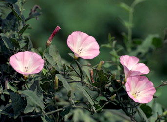
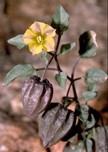

---
aliases:
  - Polemoniales
  - Solanales
has_id_wikidata: Q60790273
title: Solanales
instance_of: '[[_Standards/WikiData/WD~clade,713623]]'
parent_taxon: '[[_Standards/WikiData/WD~Chamaeleontiformes,20686186]]'
taxon_name: Acrodonta
image: http://commons.wikimedia.org/wiki/Special:FilePath/BennyTrapp%20Chamaeleo%20chamaeleon%20Samos%20Griechenland.jpg
---

# [[Solanales]] 

 
  

#is_/same_as :: [[../../../../../../../../../../WikiData/WD~Solanales,60790273|WD~Solanales,60790273]] 

## #has_/text_of_/abstract 

> The **Solanales** are an order of flowering plants, included in the asterid group of the eudicots. 
> Well-known members of Solanales include potatoes, eggplants, tomatoes, chili peppers, 
> tobacco, petunias, nightshades, morning glory, and sweet potato. 
> 
> Some older sources used the name Polemoniales for this order.
>
> [Wikipedia](https://en.wikipedia.org/wiki/Solanales)

## Phylogeny 

-   « Ancestral Groups  
    -   [Asterids](../Asterids.md)
    -  [Core Eudicots](../../Core_Eudicots.md) 
    -   [Eudicots](../../../Eudicots.md)
    -   [Flowering_Plant](../../../../Flowering_Plant.md)
    -   [Seed_Plant](../../../../../Seed_Plant.md)
    -   [Land_Plant](../../../../../../Land_Plant.md)
    -  [Green plants](../../../../../../../Plant.md) 
    -  [Eukarya](../../../../../../../../Eukarya.md) 
    -   [Tree of Life](../../../../../../../../Tree_of_Life.md)

-   ◊ Sibling Groups of  Asterids
    -   [Cornales](Cornales.md)
    -   [Ericales](Cornales/Ericales.md)
    -   Solanales
    -   [Lamiales](Lamiales.md)
    -   [Gentianales](Gentianales.md)
    -   [Garryales](Garryales.md)
    -   [Asterales](Asterales.md)
    -   [Apiales](Apiales.md)
    -   [Dipsacales](Dipsacales.md)
    -   [Aquifoliales](Aquifoliales.md)

-   » Sub-Groups 

## Title Illustrations

------------------------------------------------------------------------- 
)
Scientific Name ::     Calystegia dahurica
Location ::           Vladivostok city, Primorsky Territory (Russian Federation).
Comments             Convolvulaceae
Specimen Condition   Live Specimen
Source Collection    [CalPhotos](http://calphotos.berkeley.edu/)
Copyright ::            © 1999 [Nick Kurzenko](mailto:kurzenko@ibss.dvo.ru) 

------------------------------------------------------------------------------ 
)
Scientific Name ::     Physalis crassifolia
Location ::           Anza Borrego Desert State Park (San Diego County, California, USA).
Comments             Yellow nightshade groundcherry (Solanaceae).
Creator              Photograph by Gerald and Buff Corsi
Specimen Condition   Live Specimen
Source Collection    [CalPhotos](http://calphotos.berkeley.edu/)
Copyright ::            © 1999 [California Academy of Sciences](http://www.calacademy.org/) 

## Confidential Links & Embeds: 

### #is_/same_as :: [Solanales](/_Standards/bio/bio~Domain/Eukarya/Plant/Land_Plant/Seed_Plant/Flowering_Plant/Eudicots/Core_Eudicots/Asterids/Solanales.md) 

### #is_/same_as :: [Solanales.public](/_public/bio/bio~Domain/Eukarya/Plant/Land_Plant/Seed_Plant/Flowering_Plant/Eudicots/Core_Eudicots/Asterids/Solanales.public.md) 

### #is_/same_as :: [Solanales.internal](/_internal/bio/bio~Domain/Eukarya/Plant/Land_Plant/Seed_Plant/Flowering_Plant/Eudicots/Core_Eudicots/Asterids/Solanales.internal.md) 

### #is_/same_as :: [Solanales.protect](/_protect/bio/bio~Domain/Eukarya/Plant/Land_Plant/Seed_Plant/Flowering_Plant/Eudicots/Core_Eudicots/Asterids/Solanales.protect.md) 

### #is_/same_as :: [Solanales.private](/_private/bio/bio~Domain/Eukarya/Plant/Land_Plant/Seed_Plant/Flowering_Plant/Eudicots/Core_Eudicots/Asterids/Solanales.private.md) 

### #is_/same_as :: [Solanales.personal](/_personal/bio/bio~Domain/Eukarya/Plant/Land_Plant/Seed_Plant/Flowering_Plant/Eudicots/Core_Eudicots/Asterids/Solanales.personal.md) 

### #is_/same_as :: [Solanales.secret](/_secret/bio/bio~Domain/Eukarya/Plant/Land_Plant/Seed_Plant/Flowering_Plant/Eudicots/Core_Eudicots/Asterids/Solanales.secret.md)

