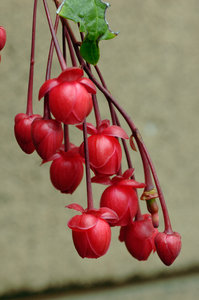

---
aliases:
- Berberidopsidales
- Berberidopsidals
- Berberisopsaloj
- Берберидопсисоцветные
- بربريوسيات
- سرخآویزسانان
- ベルベリドプシス目
- 智利藤目
- 베르베리돕시스목
title: Berberidopsidales
has_id_wikidata: Q793205
dv_has_:
  name_:
    an: Berberidopsidales
    ar: بربريوسيات
    arz: بربريوسيات
    ast: Berberidopsidales
    bg: Berberidopsidales
    bs: Berberidopsidales
    ca: Berberidopsidals
    ceb: Berberidopsidales
    cs: Berberidopsidales
    da: Berberidopsidales
    de: Berberidopsidales
    en: Berberidopsidales
    eo: Berberisopsaloj
    es: Berberidopsidales
    eu: Berberidopsidales
    ext: Berberidopsidales
    fa: سرخآویزسانان
    fi: Berberidopsidales
    fr: Berberidopsidales
    frr: Berberidopsidales
    ga: Berberidopsidales
    gl: Berberidopsidales
    hr: Berberidopsidales
    hu: Berberidopsidales
    ia: Berberidopsidales
    id: Berberidopsidales
    ie: Berberidopsidales
    ilo: Berberidopsidales
    io: Berberidopsidales
    it: Berberidopsidales
    ja: ベルベリドプシス目
    ko: 베르베리돕시스목
    ku: Berberidopsidales
    la: Berberidopsidales
    mul: Berberidopsidales
    nb: Berberidopsidales
    nl: Berberidopsidales
    nn: Berberidopsidales
    oc: Berberidopsidales
    pl: Berberidopsidales
    pt: Berberidopsidales
    pt_br: Berberidopsidales
    ro: Berberidopsidales
    ru: Берберидопсисоцветные
    sq: Berberidopsidales
    sv: Berberidopsidales
    uk: Berberidopsidales
    vi: Berberidopsidales
    vo: Berberidopsidales
    war: Berberidopsidales
    zh: 智利藤目
---
# [[Berberidopsidales]] 

 

## #has_/text_of_/abstract 

> **Berberidopsidales** is an order of Southern Hemisphere woody flowering plants. 
> The name is newly accepted in the APG III system of plant taxonomy. 
> APG II system, of 2003, mentions the possibility of recognizing the order, 
> as comprising the families Berberidopsidaceae and Aextoxicaceae. 
> However, APG II left the families unplaced as to order, assigning them to the clade core eudicots. 
> The APG III system of 2009 formally recognized the order.
>
> The family Aextoxicaceae is a monotypic family native to Chile; 
> Berberidopsidaceae is a family of 2 genera and 3 species native to Chile and eastern Australia.
>
> [Wikipedia](https://en.wikipedia.org/wiki/Berberidopsidales) 

## Phylogeny 

-   « Ancestral Groups  
    -  [Core Eudicots](../Core_Eudicots.md) 
    -   [Core_Eudicots](../Core_Eudicots.md)
    -   [Flowering_Plant](../../../Flowering_Plant.md)
    -   [Seed_Plant](../../../../Seed_Plant.md)
    -   [Land_Plant](../../../../../Land_Plant.md)
    -  [Green plants](../../../../../../Plant.md) 
    -  [Eukarya](../../../../../../../Eukarya.md) 
    -   [Tree of Life](../../../../../../../Tree_of_Life.md)

-   ◊ Sibling Groups of  Core Eudicots
    -   [Santalales](Santalales.md)
    -   [Saxifragales](Saxifragales.md)
    -   Berberidopsidales
    -   [Rosids](Rosids.md)
    -   [Caryophyllales](Caryophyllales.md)
    -   [Asterids](Asterids.md)

-   » Sub-Groups 
	-   *Aextoxicaceae*
	    -   *Aextoxicon punctatum* [(olivillo)]
	-   *Berberidopsidaceae*
	    -   *Berberidopsis corallina*
	    -   *Streptothamnus moorei*
	    -   *Berberidopsis beckleri*

## Title Illustrations

----------------------------------------------------------------
scientific_name ::     Berberidopsis corallina
location ::           cultivated at Strybing Arboretum, San Francisco, native to Chile
specimen_condition ::  Live Specimen
Body Part            flowers
Source               [Berberidopsis corallina](http://www.flickr.com/photos/ericinsf/92947553/)
Source Collection    [Flickr](http://flickr.com/)
Image Use ::    [Attribution-NonCommercial-NoDerivs 2.0 Creative Commons License](http://creativecommons.org/licenses/by-nc-nd/2.0/).
copyright ::            © 2005 [Eric in SF](http://flickr.com/people/39312862@N00)

## Confidential Links & Embeds: 

### #is_/same_as :: [[/_Standards/bio/bio~Domain/Eukarya/Plant/Land_Plant/Seed_Plant/Flowering_Plant/Eudicots/Core_Eudicots/Berberidopsidales|Berberidopsidales]] 

### #is_/same_as :: [[/_public/bio/bio~Domain/Eukarya/Plant/Land_Plant/Seed_Plant/Flowering_Plant/Eudicots/Core_Eudicots/Berberidopsidales.public|Berberidopsidales.public]] 

### #is_/same_as :: [[/_internal/bio/bio~Domain/Eukarya/Plant/Land_Plant/Seed_Plant/Flowering_Plant/Eudicots/Core_Eudicots/Berberidopsidales.internal|Berberidopsidales.internal]] 

### #is_/same_as :: [[/_protect/bio/bio~Domain/Eukarya/Plant/Land_Plant/Seed_Plant/Flowering_Plant/Eudicots/Core_Eudicots/Berberidopsidales.protect|Berberidopsidales.protect]] 

### #is_/same_as :: [[/_private/bio/bio~Domain/Eukarya/Plant/Land_Plant/Seed_Plant/Flowering_Plant/Eudicots/Core_Eudicots/Berberidopsidales.private|Berberidopsidales.private]] 

### #is_/same_as :: [[/_personal/bio/bio~Domain/Eukarya/Plant/Land_Plant/Seed_Plant/Flowering_Plant/Eudicots/Core_Eudicots/Berberidopsidales.personal|Berberidopsidales.personal]] 

### #is_/same_as :: [[/_secret/bio/bio~Domain/Eukarya/Plant/Land_Plant/Seed_Plant/Flowering_Plant/Eudicots/Core_Eudicots/Berberidopsidales.secret|Berberidopsidales.secret]] 

