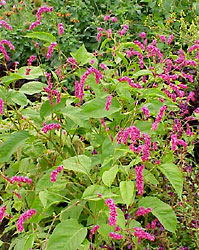
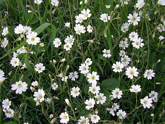
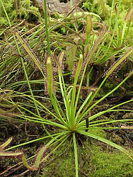

---
aliases:
- Bộ Cẩm chướng
- Cariofil·lals
- Caryophyllales
- goździkowce
- Gvazdikiečiai
- hvozdíkotvaré
- Kariofilaloj
- klinčekotvaré
- Klinčićolike
- klinčkovci
- Koma mêxikan
- Nelgilaadsed
- Nelkenartige
- nellike-ordenen
- Nellikordenen
- neļķu rinda
- Qərənfilçiçəklilər
- szegfűvirágúak
- Tinɣerflin
- Καρυοφυλλώδη
- Гваздзікакветныя
- гвазьдзікакветныя
- гвоздикоцвіті
- гвоздичноцветные
- карамфилоцветни
- каранфиловидни
- Тупалак чечеклисем
- մեխակածաղկավորներ
- ציפורנאים
- قرنفليات
- میخکسانان
- कैरियोफ़िलालीस
- கரியோபிலாலெசு
- കാരിയോഫില്ലേലെസ്
- อันดับคาร์เนชัน
- ナデシコ目
- 石竹目
- 석죽목
title: Caryophyllales
has_id_wikidata: Q21808
dv_has_:
  name_:
    af: Caryophyllales
    an: Caryophyllales
    ar: قرنفليات
    arz: قرنفليات
    ast: Caryophyllales
    az: Qərənfilçiçəklilər
    bar: Caryophyllales
    be: Гваздзікакветныя
    be_tarask: гвазьдзікакветныя
    bg: карамфилоцветни
    br: Caryophyllales
    bs: Caryophyllales
    ca: Cariofil·lals
    ceb: Caryophyllales
    co: Caryophyllales
    cs: hvozdíkotvaré
    cv: Тупалак чечеклисем
    cy: Caryophyllales
    da: nellike-ordenen
    de: Nelkenartige
    de_ch: Caryophyllales
    el: Καρυοφυλλώδη
    en: Caryophyllales
    en_ca: Caryophyllales
    en_gb: Caryophyllales
    eo: Kariofilaloj
    es: Caryophyllales
    et: Nelgilaadsed
    eu: Caryophyllales
    ext: Caryophyllales
    fa: میخکسانان
    fi: Caryophyllales
    fr: Caryophyllales
    frp: Caryophyllales
    frr: Caryophyllales
    fur: Caryophyllales
    ga: Caryophyllales
    gd: Caryophyllales
    gl: Caryophyllales
    gsw: Caryophyllales
    he: ציפורנאים
    hi: कैरियोफ़िलालीस
    hr: Klinčićolike
    hu: szegfűvirágúak
    hy: մեխակածաղկավորներ
    ia: Caryophyllales
    id: Caryophyllales
    ie: Caryophyllales
    io: Caryophyllales
    is: Caryophyllales
    it: Caryophyllales
    ja: ナデシコ目
    jv: Caryophyllales
    kab: Tinɣerflin
    kg: Caryophyllales
    ko: 석죽목
    ku: Koma mêxikan
    la: Caryophyllales
    lb: Caryophyllales
    li: Caryophyllales
    lij: Caryophyllales
    lt: Gvazdikiečiai
    lv: neļķu rinda
    mg: Caryophyllales
    min: Caryophyllales
    mk: каранфиловидни
    ml: കാരിയോഫില്ലേലെസ്
    ms: Caryophyllales
    mt: Caryophyllales
    mul: Caryophyllales
    nap: Caryophyllales
    nb: Nellikordenen
    nds: Caryophyllales
    nds_nl: Caryophyllales
    nl: Caryophyllales
    nn: nellikordenen
    nrm: Caryophyllales
    nys: Caryophyllales
    oc: Caryophyllales
    pcd: Caryophyllales
    pl: goździkowce
    pms: Caryophyllales
    pt: Caryophyllales
    pt_br: Caryophyllales
    rm: Caryophyllales
    ro: Caryophyllales
    ru: гвоздичноцветные
    sc: Caryophyllales
    scn: Caryophyllales
    sco: Caryophyllales
    sh: Caryophyllales
    sk: klinčekotvaré
    sl: klinčkovci
    sq: Caryophyllales
    sr: Caryophyllales
    sv: Caryophyllales
    sw: Caryophyllales
    ta: கரியோபிலாலெசு
    th: อันดับคาร์เนชัน
    tl: Caryophyllales
    tr: Caryophyllales
    uk: гвоздикоцвіті
    vec: Caryophyllales
    vi: Bộ Cẩm chướng
    vls: Caryophyllales
    vo: Caryophyllales
    wa: Caryophyllales
    war: Caryophyllales
    wo: Caryophyllales
    wuu: 石竹目
    yue: 石竹目
    zh: 石竹目
    zh_cn: 石竹目
    zh_hans: 石竹目
    zh_hant: 石竹目
    zh_tw: 石竹目
    zu: Caryophyllales
---

# [[Caryophyllales]]

Caryophyllids 

     

## #has_/text_of_/abstract 

> **Caryophyllales** ( KARR-ee-oh-fih-LAY-leez) is a diverse and heterogeneous order of 
> flowering plants with well-known members including 
> cacti, carnations, beets, quinoa, spinach, amaranths, pigfaces and ice plants, oraches and saltbushes, 
> goosefoots, sundews, Venus flytraps, monkey cup pitcher plants, Malabar spinach, bougainvilleas, 
> four o'clock flowers, buckwheat, knotweeds, rhubarb, sorrel, portulacas, jojoba, and tamarisks. 
> Many members are succulent, having fleshy stems or leaves.
>
> The betalain pigments are unique in plants of this order and occur in all its core families 
> with the exception of Caryophyllaceae and Molluginaceae. 
> Noncore families, such as Nepenthaceae, instead produce anthocyanins. 
> 
> In its modern definition, the order encompasses a whole new group of families 
> (formerly included in the order Polygonales) that never synthesize betalains, 
> among which several families are carnivorous (like Nepenthaceae and Droseraceae).
>
> According to molecular clock calculations, the lineage that led to 
> Caryophyllales split from other plants about 111 million years ago.
>
> [Wikipedia](https://en.wikipedia.org/wiki/Caryophyllales) 

## Introduction

[Pam Soltis and Doug Soltis]()

Caryophyllales have long been recognized as a natural assemblage (e.g.,
Braun 1864; Eichler 1875-1878). Previous circumscriptions based on
morphological and embryological characters recognized up to nine
families, and subsequent classifications that pioneered the use of
chemical and anatomical characters included 12 families (e.g., Dahlgren
1975, 1980; Takhtajan 1980; Cronquist 1981; Thorne 1983, 1992a, 1992b).
These circumscriptions remained largely intact for the past 30 years
until recently when molecular phylogenetic analyses started reshaping
concepts of Caryophyllales. Most notable is the discovery that certain
carnivorous plants---the sundews and Venus flytrap (Droseraceae) and Old
World pitcher plants (Nepenthaceae)---are closely related to Cronquist's
Caryophyllidae (Albert *et al.* 1992; Chase *et al*. 1993; Williams *et
al*. 1994; Meimberg *et al*. 2000; Cuénoud *et al*. 2002). In addition,
many families previously considered distantly related to Caryophyllales
have been found to form a large clade with Caryophyllales (e.g.,
Asteropeiaceae and Physenaceae, Morton *et al.* 1997; Rhabdodendraceae,
Fay *et al*. 1997a; Simmondsiaceae, e.g., D. Soltis *et al*. 2000). The
strong support for this clade in recent multigene analyses (e.g., D.
Soltis *et al.* 2000; Cuénoud *et al.* 2002) has led to a revised---and
broader---circumscription of Caryophyllales by APG (1998) and APG II
(2003).

Because of the potential confusion introduced by applying the name
Caryophyllales to a large clade, not all investigators have accepted
this circumscription. For example, Judd *et al*. (2002) continue to use
Caryophyllales in a narrow sense (= core Caryophyllales in APG and APG
II) and refer to the larger, more inclusive clade as the caryophyllid
clade. Although morphological and anatomical characters are generally
consistent with these expanded circumscriptions, nonDNA synapomorphies
for this newly recognized expanded Caryophyllales have not yet been
discovered. Caryophyllales *sensu* APG II (2003) comprise 29 families,
including Caryophyllaceae, Nyctaginaceae, Phytolaccaceae, Aizoaceae,
Amaranthaceae (including Chenopodiaceae), Molluginaceae, Basellaceae,
Cactaceae, Didiereaceae, a polyphyletic "Portulacaceae" and several
small families, some of them of problematic placement, such as
Frankeniaceae, Tamaricaceae, Asteropeiaceae, Rhabdodendraceae,
Simmondsiaceae, Nepenthaceae and Droseraceae.  Two other families have
been proposed: "Agdestidaceae" and "Petiveriaceae".

### Characteristics

Many members of Caryophyllales are adapted structurally or
physiologically to extreme environments such as deserts, high-alkaline
soils, high-saline substrates, and nutrient-poor soils. They have
conquered these habitats through a variety of adaptations such as
unusual photosynthetic pathways (crassulacean acid metabolism, CAM, and
C~4~ as opposed to C~3~ photosynthesis), unusual morphologies (e.g.,
succulence), secretion of excessive salt by special glands, and unusual
methods of nutrient uptake (e.g., carnivory). Given the distributions of
these adaptations across Caryophyllales, it appears that most of these
adaptations have arisen many times.

### Relationships of Caryophyllales to Other Clades of Eudicots

Relationships of Caryophyllales to other major clades of eudicots remain
unclear. Cronquist (1981) and Takhtajan (1980, 1997), on the basis of
floral characters, viewed Caryophyllidae as being derived from
Ranunculales-type ancestors. However, phylogenetic analyses using many
gene sequences place Caryophyllales firmly within the core eudicots.
They have alternatively been considered to be close relatives of rosids,
asterids, or Santalales and are best regarded at this time simply as one
of the major clades of core eudicots (e.g., D. Soltis *et al.* 2000).
The sister group of Caryophyllales may be Dilleniaceae (e.g., D. Soltis
*et al*. 2000), although this relationship had not previously been
suggested. Further investigation is needed to assess this potential
relationship between Dilleniaceae and Caryophyllales.

### Discussion of Phylogenetic Relationships

Although many aspects of core Caryophyllales have been thoroughly
investigated during the past several decades (e.g., chemistry by Mabry
and colleagues, pollen by Nowicke and colleagues, wood anatomy by
Carlquist and colleagues), revised views on the phylogenetic
relationships of Caryophyllales require renewed efforts to identify
synapomorphies and to reconstruct patterns of morphological, chemical,
and anatomical evolution. Furthermore, the poly- and paraphyly of
several important families of core Caryophyllales demonstrate that
additional phylogenetic studies with increased taxon sampling are needed
to resolve relationships and develop a truly phylogenetic
classification.

The most comprehensive phylogenetic study of Caryophyllales to date is
that of Cuénoud *et al*. (2002), in which 127 taxa of Caryophyllales
representing all 29 families were sampled for *matK* sequence analysis.
A subset of this matrix was combined with sequences from *rbcL*, *atpB*,
and *18S rDNA* to provide a four-gene matrix for 26 genera of
Caryophyllales. This combination of analyses strongly supported the
monophyly of the expanded Caryophyllales *sensu* APG II. Within
Caryophyllales are two large clades (core and noncore Caryophyllales,
which Judd *et al*. 2002 referred to as Caryophyllales and Polygonales,
respectively), with *Rhabdodendron* (of the monogeneric
Rhabdodendraceae) and *Simmondsia* (of the monospecific Simmondsiaceae)
unplaced.

## Phylogeny 

-   « Ancestral Groups  
    -  [Core Eudicots](../Core_Eudicots.md) 
    -   [Core_Eudicots](../Core_Eudicots.md)
    -   [Flowering_Plant](../../../Flowering_Plant.md)
    -   [Seed_Plant](../../../../Seed_Plant.md)
    -   [Land_Plant](../../../../../Land_Plant.md)
    -  [Green plants](../../../../../../Plant.md) 
    -  [Eukarya](../../../../../../../Eukarya.md) 
    -   [Tree of Life](../../../../../../../Tree_of_Life.md)

-   ◊ Sibling Groups of  Core Eudicots
    -   [Santalales](Santalales.md)
    -   [Saxifragales](Saxifragales.md)
    -   [Berberidopsidales](Berberidopsidales.md)
    -   [Rosids](Rosids.md)
    -   Caryophyllales
    -   [Asterids](Asterids.md)

-   » Sub-Groups
    -   [non-core Caryophyllales](non-core_Caryophyllales)
    -  [core Caryophyllales](Caryophyllales/Core_Caryophyllales.md) 

## Title Illustrations

---------------------------------------------------------------------
 
scientific_name ::  Polygonum orientale
Comments          Polygonaceae
copyright ::         © [Kurt Stüber](http://www.biolib.de/) 

---------------------------------------------------------------------------
  
scientific_name ::     Stellaria holostea
specimen_condition ::  Live Specimen
Identified By        Ilisoi Gabriel
Body Part            Aerial - flowers
copyright ::            © [Gabriel Ilisoi](mailto:ilisoi_gabriel@yahoo.co.uk) 

----------------------------------------------------------------------
 
scientific_name ::  Drosera capensis
copyright ::         © 2004 [Kurt Stüber](http://www.biolib.de/) 

## Confidential Links & Embeds: 

### #is_/same_as :: [[/_Standards/bio/bio~Domain/Eukarya/Plant/Land_Plant/Seed_Plant/Flowering_Plant/Eudicots/Core_Eudicots/Caryophyllales|Caryophyllales]] 

### #is_/same_as :: [[/_public/bio/bio~Domain/Eukarya/Plant/Land_Plant/Seed_Plant/Flowering_Plant/Eudicots/Core_Eudicots/Caryophyllales.public|Caryophyllales.public]] 

### #is_/same_as :: [[/_internal/bio/bio~Domain/Eukarya/Plant/Land_Plant/Seed_Plant/Flowering_Plant/Eudicots/Core_Eudicots/Caryophyllales.internal|Caryophyllales.internal]] 

### #is_/same_as :: [[/_protect/bio/bio~Domain/Eukarya/Plant/Land_Plant/Seed_Plant/Flowering_Plant/Eudicots/Core_Eudicots/Caryophyllales.protect|Caryophyllales.protect]] 

### #is_/same_as :: [[/_private/bio/bio~Domain/Eukarya/Plant/Land_Plant/Seed_Plant/Flowering_Plant/Eudicots/Core_Eudicots/Caryophyllales.private|Caryophyllales.private]] 

### #is_/same_as :: [[/_personal/bio/bio~Domain/Eukarya/Plant/Land_Plant/Seed_Plant/Flowering_Plant/Eudicots/Core_Eudicots/Caryophyllales.personal|Caryophyllales.personal]] 

### #is_/same_as :: [[/_secret/bio/bio~Domain/Eukarya/Plant/Land_Plant/Seed_Plant/Flowering_Plant/Eudicots/Core_Eudicots/Caryophyllales.secret|Caryophyllales.secret]] 

