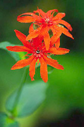
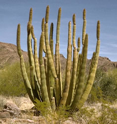
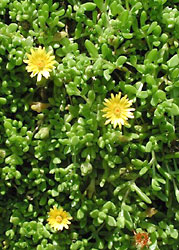

# [[Core_Caryophyllales]]

Caryophyllales sensu stricto 

 
 
 

## Introduction

[Pam Soltis, Doug Soltis, and Monica Arakaki]()

The core Caryophyllales clade has long been recognized; it corresponds
generally to the Caryophyllales of recent classifications (e.g.,
Cronquist 1981; Cronquist and Thorne 1994; Takhtajan 1997). The core
Caryophyllales (or Caryophyllales *sensu* Judd *et al.* 2002) comprise
19 families, although several currently recognized families are clearly
poly- or paraphyletic and require recircumscription (Cuénoud *et al*.
2002).

### Characteristics

Characteristics shared by all members of the core Caryophyllales (=
Caryophyllales *sensu* Judd *et al.* 2002) are unilacunar nodes, stems
often with concentric rings of xylem and phloem or of vascular bundles,
phloem sieve tubes with plastids with a peripheral ring of proteinaceous
filaments and a central protein crystal (rather than the sieve tube
plastids with starch grains of most other core eudicots). They have
betalains (rather than anthocyanins, although anthocyanins are present
in Caryophyllaceae and Molluginaceae, which seems to represent
reversals), loss of the intron in the plastid gene *rpl2,* a single
perianth whorl, "secondarily" free central to (primarily) basal
placentation (Eckardt 1976), embryo curved around the seed, and presence
of perisperm with scanty or no endosperm (per Judd *et al.* 2002).
Within core Caryophyllales, most families exhibit multiple pollen
morphologies, indicating that pollen structure is labile in this clade.
Three basic types of pollen have been observed in core Caryophyllales:
tricolpate, pantoporate, and pantocolpate, all with a spinulose and
tubuliferous/punctate ektexine (Nowicke 1975).

### Discussion of Phylogenetic Relationships

Within core Caryophyllales, *Physena* (Physenaceae) is sister to
*Asteropeia,* and this pair is sister to all other core Caryophyllales.
*Asteropeia* and *Physena,* with five and two species, respectively, all
of which are restricted to Madagascar, have been difficult to place
taxonomically. Within the remaining core Caryophyllales, three major
clades are well supported. The first comprises Caryophyllaceae (86
genera, 2,200 species; mostly with a temperate distribution),
Achatocarpaceae (3 genera, 7 species; western North America to South
America), and Amaranthaceae (including Chenopodiaceae; 174 genera, 2,050
species; warm temperate and subtropical regions) form a clade, with the
last two as sisters.

A second clade within core Caryophyllales consists of Basellaceae (4
genera, 20 species; pantropical), Didiereaceae (4 genera, 11 species;
Madagascar), Portulacaceae (32 genera, 385 species; cosmopolitan),
Cactaceae (100 genera, 1,500 species, mostly New World deserts), and
Halophytaceae (monospecific; Argentina). This succulent group largely
corresponds to the "portulacaceous alliance" of Hershkovitz (1993), the
suborder Portulacinae of Cronquist and Thorne (1994), or the
"portulacaceous cohort" of Applequist and Wallace (2001) and reflects
relationships long recognized, such as that between Basellaceae and
Portulacaceae (e.g., Franz 1908; Bogle 1969; Sperling and Bittrich 1993)
and Cactaceae and Didiereaceae or Portulacaceae (Chorinsky 1931; Gibson
and Nobel 1986). The monophyly of this group was previously supported by
plastid DNA sequence data (e.g., Rettig *et al.* 1992; Downie *et al*.
1997), and phylogenetic analyses of both morphology (Hershkovitz 1993)
and ITS sequences (Hershkovitz and Zimmer 1997) indicated that
Basellaceae, Cactaceae, and Didiereaceae are all embedded in
Portulacaceae.

A third clade within core Caryophyllales is composed of Aizoaceae (125
genera, 2,020 species; mostly warm southern Africa and Australia) and
Nyctaginaceae (30 genera, 395 species; pantropical)---each of which is
monophyletic---and Phytolaccaceae (18 genera, 65 species; pantropical to
warm temperate) and its segregates. Within this clade, Phytolaccaceae
are polyphyletic (with an additional lineage outside this clade), and
several segregate families are recommended by Cuénoud *et al.* (2002):
Agdestidaceae (monospecific; warm Americas; not recognized by APG II),
Petiveriaceae (monospecific; warm Americas; not recognized by APG II),
Barbeuiaceae (monospecific; Madagascar), and Sarcobataceae (monogeneric,
two species; southwestern North America; segregated from Chenopodiaceae
but clearly within this clade). Molluginaceae (13 genera, 120 species;
pantropical and warm temperate) are also polyphyletic, and the precise
relationships of these lineages are not clear. Gisekiaceae (monogeneric,
7 species; Africa, central and eastern Asia) have been segregated from
Molluginaceae and appear closely related to Petiveriaceae (Cuénoud *et
al.* 2002). *Stegnosperma* (3 species from Central America and the
Antilles; Stegnospermataceae or Stegnospermaceae; Nakai 1942) is sister
to this clade in the *rbcL* plus *matK* tree (Cuénoud *et al*. 2002).
*Stegnosperma* was segregated from Phytolaccaceae, in which it was
originally placed, by Nakai (1942). It has since been viewed as a
monogeneric family found to be more similar to Caryophyllaceae than to
Phytolaccaceae (Hofmann 1977; Bedell 1980).

Despite extensive study from many perspectives for several decades,
relationships and patterns of evolution within core Caryophyllales are
not entirely clear. In addition, several new families have been proposed
to accommodate the placement of single genera or small groups of genera
as sister to larger clades.

## Phylogeny 

-   « Ancestral Groups  
    -   [Caryophyllales](../Caryophyllales.md)
    -  [Core Eudicots](../../Core_Eudicots.md))
    -   [Eudicots](../../../Eudicots.md)
    -   [Flowering_Plant](../../../../Flowering_Plant.md)
    -   [Seed_Plant](../../../../../Seed_Plant.md)
    -   [Land_Plant](../../../../../../Land_Plant.md)
    -  [Green plants](../../../../../../../Plant.md))
    -  [Eukarya](../../../../../../../../Eukarya.md))
    -   [Tree of Life](../../../../../../../../Tree_of_Life.md)

-   ◊ Sibling Groups of  Caryophyllales
    -   [non-core Caryophyllales](non-core_Caryophyllales)
    -   core Caryophyllales

-   » Sub-Groups
    -   [Sarcobatus](Sarcobatus)

## Title Illustrations

-------------------------------------------------------------------------
 
Scientific Name ::     Lychnis fulgens
Location ::           Kedrovaja Pad Natural Reserve, Khasansky distr., Primorsky Territory (Russian Federation)
Comments             Brilliant campion (Caryophyllaceae)
Specimen Condition   Live Specimen
Source Collection    [CalPhotos](http://calphotos.berkeley.edu/)
Copyright ::            © 2000 [Nick Kurzenko](mailto:kurzenko@ibss.dvo.ru) 

------------------------------------------------------------------------------
 
Scientific Name ::    Stenocerus
Location ::          Organ Pipe Cactus National Monument (Arizona, US)
Comments            Organ pipe cactus (Cactaceae)
Creator             Photograph by G. Dallas and Margaret Hanna
Source Collection   [CalPhotos](http://calphotos.berkeley.edu/)
Copyright ::           © 2001 [California Academy of Sciences](http://www.calacademy.org/) 

------------------------------------------------------------------------
 
Scientific Name ::   Delosperma lineare
Comments           Aizoaceae. Cultivated at the Botanical Garden Basel, Switzerland
Acknowledgements   courtesy [Botanical Image Database](http://www.unibas.ch/botimage/)
Copyright ::          © 2001 University of Basel, Basel, Switzerland 

## Confidential Links & Embeds: 

### #is_/same_as :: [Core_Caryophyllales](/_Standards/bio/bio~Domain/Eukarya/Plant/Land_Plant/Seed_Plant/Flowering_Plant/Eudicots/Core_Eudicots/Caryophyllales/Core_Caryophyllales.md) 

### #is_/same_as :: [Core_Caryophyllales.public](/_public/bio/bio~Domain/Eukarya/Plant/Land_Plant/Seed_Plant/Flowering_Plant/Eudicots/Core_Eudicots/Caryophyllales/Core_Caryophyllales.public.md) 

### #is_/same_as :: [Core_Caryophyllales.internal](/_internal/bio/bio~Domain/Eukarya/Plant/Land_Plant/Seed_Plant/Flowering_Plant/Eudicots/Core_Eudicots/Caryophyllales/Core_Caryophyllales.internal.md) 

### #is_/same_as :: [Core_Caryophyllales.protect](/_protect/bio/bio~Domain/Eukarya/Plant/Land_Plant/Seed_Plant/Flowering_Plant/Eudicots/Core_Eudicots/Caryophyllales/Core_Caryophyllales.protect.md) 

### #is_/same_as :: [Core_Caryophyllales.private](/_private/bio/bio~Domain/Eukarya/Plant/Land_Plant/Seed_Plant/Flowering_Plant/Eudicots/Core_Eudicots/Caryophyllales/Core_Caryophyllales.private.md) 

### #is_/same_as :: [Core_Caryophyllales.personal](/_personal/bio/bio~Domain/Eukarya/Plant/Land_Plant/Seed_Plant/Flowering_Plant/Eudicots/Core_Eudicots/Caryophyllales/Core_Caryophyllales.personal.md) 

### #is_/same_as :: [Core_Caryophyllales.secret](/_secret/bio/bio~Domain/Eukarya/Plant/Land_Plant/Seed_Plant/Flowering_Plant/Eudicots/Core_Eudicots/Caryophyllales/Core_Caryophyllales.secret.md)

