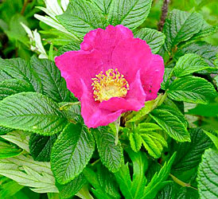
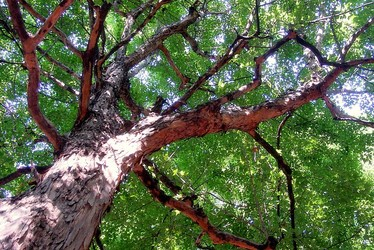

---
aliases:
- Chhiûⁿ-bî-lūi
- Erškietēžeidē
- erškėčiažiedžiai
- nhánh hoa Hồng
- Rosid
- Rosidae
- rosidar
- Rosideae
- rosideh
- Rosiden
- rosider
- rosidit
- Rosids
- Rosidées
- Rosídeas
- Rozedoj
- rozide
- Rozidlər
- ružové
- Ròsides
- Rósidas
- różowe
- Ροδίδες
- разіды
- Розидасем
- розиди
- розиды
- ռոզիդներ
- رزیدها
- روسِڑٕس
- روسڈز
- روسڊس
- وردانيات
- रोज़िड
- रोसाइड
- গোলাপ গোষ্ঠী
- ரோசிதுகள்
- రోసిడ్స్
- റോസിഡുകൾ
- โรสิด
- バラ類
- 蔷薇类植物
- 薔薇類
- 薔薇類植物
- 장미군
title: Rosids
has_id_wikidata: Q338878
dv_has_:
  name_:
    af: Rosids
    ar: وردانيات
    ast: Rosidae
    az: Rozidlər
    bcl: Rosids
    be: Rosids
    be-tarask: разіды
    bg: розиди
    bho: रोसाइड
    bn: গোলাপ গোষ্ঠী
    bs: rozide
    ca: Ròsides
    ceb: rosids
    cv: Розидасем
    cy: Rosid
    de: Rosiden
    el: Ροδίδες
    en: rosids
    en-ca: Rosids
    en-gb: rosids
    eo: Rozedoj
    es: Rósidas
    eu: Rosidae
    fa: رزیدها
    fi: rosidit
    fr: Rosidées
    ga: rosids
    gl: Rosidae
    hi: रोज़िड
    hr: Rosidae
    hu: Rosidae
    hy: ռոզիդներ
    ia: Rosidae
    id: Rosidae
    ilo: rosids
    it: Rosidae
    ja: バラ類
    jv: Rosidae
    ko: 장미군
    ks: روسِڑٕس
    la: Rosidae
    lt: erškėčiažiedžiai
    mk: Розиди
    ml: റോസിഡുകൾ
    ms: Rosids
    mul: rosids
    nan: Chhiûⁿ-bî-lūi
    nb: rosider
    nl: Rosids
    nn: rosidar
    oc: Rosideae
    pl: różowe
    pt: Rosídeas
    pt-br: Rosídeas
    ro: Rosidae
    ru: розиды
    sco: rosids
    sd: روسڊس
    sgs: Erškietēžeidē
    sh: rozide
    sk: ružové
    sl: rozide
    smn: rosideh
    sq: rosids
    sr: Rosids
    sv: Rosidae
    ta: ரோசிதுகள்
    te: రోసిడ్స్
    th: โรสิด
    tl: Rosid
    tr: Rosids
    uk: розиди
    ur: روسڈز
    vi: nhánh hoa Hồng
    vls: Rosids
    war: rosids
    wuu: 蔷薇类植物
    yue: 薔薇類
    zh: 蔷薇类植物
    zh-cn: 蔷薇类植物
    zh-hans: 蔷薇类植物
    zh-tw: 薔薇類植物
---
# [[Rosids]] 

 
 

## #has_/text_of_/abstract 

> The **Rosids** are members of a large clade (monophyletic group) of flowering plants, 
> containing about 70,000 species, more than a quarter of all angiosperms.
>
> The clade is divided into 16 to 20 orders, depending upon circumscription and classification. These orders, in turn, together comprise about 140 families.
>
> Fossil rosids are known from the Cretaceous period. Molecular clock estimates indicate that the rosids may have originated in the Aptian or Albian stages of the Cretaceous, between 125 and 99.6 million years ago.
>
> Today's broadleaved forests are dominated by rosid species, which in turn help with diversification in many other living lineages. Additionally, rosid herbs and shrubs are a significant part of arctic/alpine and temperate floras. The clade also includes some aquatic, desert and parasitic plants.
>
> [Wikipedia](https://en.wikipedia.org/wiki/Rosids) 

## Phylogeny 

-   « Ancestral Groups  
    -  [Core Eudicots](../Core_Eudicots.md) 
    -   [Core_Eudicots](../Core_Eudicots.md)
    -   [Flowering_Plant](../../../Flowering_Plant.md)
    -   [Seed_Plant](../../../../Seed_Plant.md)
    -   [Land_Plant](../../../../../Land_Plant.md)
    -  [Green plants](../../../../../../Plant.md) 
    -  [Eukarya](../../../../../../../Eukarya.md) 
    -   [Tree of Life](../../../../../../../Tree_of_Life.md)

-   ◊ Sibling Groups of  Core Eudicots
    -   [Santalales](Santalales.md)
    -   [Saxifragales](Saxifragales.md)
    -   [Berberidopsidales](Berberidopsidales.md)
    -   Rosids
    -   [Caryophyllales](Caryophyllales.md)
    -   [Asterids](Asterids.md)

-   » Sub-Groups
    -   [Gerrardina](Gerrardina)
    -   [Fagales](Rosids/Fagales.md)
    -   [Cucurbitales](Rosids/Cucurbitales.md)
    -   [Rosales](Rosids/Rosales.md)
    -   [Fabales](Rosids/Fabales.md)
    -   [Zygophyllales](Rosids/Zygophyllales.md)
    -   [Oxalidales](Rosids/Oxalidales.md)
    -   [Malpighiales](Rosids/Malpighiales.md)
    -   [Celastrales](Rosids/Celastrales.md)
    -   [Geraniales](Rosids/Geraniales.md)
    -   [Crossosomatales](Rosids/Crossosomatales.md)
    -   [Myrtales](Rosids/Myrtales.md)
    -   [Brassicales](Rosids/Brassicales.md)
    -   [Malvales](Rosids/Malvales.md)
    -   [Sapindales](Rosids/Sapindales.md)

## Title Illustrations

--------------------------------------------------------------------------
 
scientific_name ::     Euphorbia coerulescens
location ::           Botanical Garden, Valencia, Spain
specimen_condition ::  Live Specimen
Image Use ::    [Attribution-NonCommercial 2.5 Creative Commons License](http://creativecommons.org/licenses/by-nc/2.5/).
copyright ::            © 2005 [Katja Schulz](mailto:treegrow@ag.arizona.edu) 

-------------------------------------------------------------------------
 
scientific_name ::     Rosa rugosa
location ::           Seashore, Tomakomai, Hokkaido (Japan)
Comments             Rosales, Rosaceae
specimen_condition ::  Live Specimen
Source Collection    [CalPhotos](http://calphotos.berkeley.edu/)
copyright ::            © 1998 [Nick Kurzenko](mailto:kurzenko@ibss.dvo.ru) 

-----------------------------
 
scientific_name ::                    Acer buergerianum
location ::                          Japan
Acknowledgements                    The copyright owner has released this image under the [Attribution-NonCommercial-NoDerivs 2.0 Creative Commons license](http://creativecommons.org/licenses/by-nc-nd/2.0/).
source: [flickr: trident maple](http://flickr.com/photos/amehare/211807844/)
specimen_condition ::                 Live Specimen
Source Collection                   [Flickr](http://flickr.com/)
copyright ::                           © 2006 [Amehare](http://flickr.com/people/amehare/) 

## Confidential Links & Embeds: 

### #is_/same_as :: [[/_Standards/bio/bio~Domain/Eukarya/Plant/Land_Plant/Seed_Plant/Flowering_Plant/Eudicots/Core_Eudicots/Rosids|Rosids]] 

### #is_/same_as :: [[/_public/bio/bio~Domain/Eukarya/Plant/Land_Plant/Seed_Plant/Flowering_Plant/Eudicots/Core_Eudicots/Rosids.public|Rosids.public]] 

### #is_/same_as :: [[/_internal/bio/bio~Domain/Eukarya/Plant/Land_Plant/Seed_Plant/Flowering_Plant/Eudicots/Core_Eudicots/Rosids.internal|Rosids.internal]] 

### #is_/same_as :: [[/_protect/bio/bio~Domain/Eukarya/Plant/Land_Plant/Seed_Plant/Flowering_Plant/Eudicots/Core_Eudicots/Rosids.protect|Rosids.protect]] 

### #is_/same_as :: [[/_private/bio/bio~Domain/Eukarya/Plant/Land_Plant/Seed_Plant/Flowering_Plant/Eudicots/Core_Eudicots/Rosids.private|Rosids.private]] 

### #is_/same_as :: [[/_personal/bio/bio~Domain/Eukarya/Plant/Land_Plant/Seed_Plant/Flowering_Plant/Eudicots/Core_Eudicots/Rosids.personal|Rosids.personal]] 

### #is_/same_as :: [[/_secret/bio/bio~Domain/Eukarya/Plant/Land_Plant/Seed_Plant/Flowering_Plant/Eudicots/Core_Eudicots/Rosids.secret|Rosids.secret]] 

