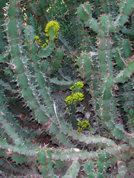

---
aliases:
  - Rosids
title: Rosids
---

# [[Rosids]] 

 
 

## #has_/text_of_/abstract 

> The **Rosids** are members of a large clade (monophyletic group) of flowering plants, 
> containing about 70,000 species, more than a quarter of all angiosperms.
>
> The clade is divided into 16 to 20 orders, depending upon circumscription and classification. These orders, in turn, together comprise about 140 families.
>
> Fossil rosids are known from the Cretaceous period. Molecular clock estimates indicate that the rosids may have originated in the Aptian or Albian stages of the Cretaceous, between 125 and 99.6 million years ago.
>
> Today's broadleaved forests are dominated by rosid species, which in turn help with diversification in many other living lineages. Additionally, rosid herbs and shrubs are a significant part of arctic/alpine and temperate floras. The clade also includes some aquatic, desert and parasitic plants.
>
> [Wikipedia](https://en.wikipedia.org/wiki/Rosids) 

## Phylogeny 

-   « Ancestral Groups  
    -  [Core Eudicots](../Core_Eudicots.md))
    -   [Core_Eudicots](../Core_Eudicots.md)
    -   [Flowering_Plant](../../../Flowering_Plant.md)
    -   [Seed_Plant](../../../../Seed_Plant.md)
    -   [Land_Plant](../../../../../Land_Plant.md)
    -  [Green plants](../../../../../../Plant.md))
    -  [Eukarya](../../../../../../../Eukarya.md))
    -   [Tree of Life](../../../../../../../Tree_of_Life.md)

-   ◊ Sibling Groups of  Core Eudicots
    -   [Santalales](Santalales.md)
    -   [Saxifragales](Saxifragales.md)
    -   [Berberidopsidales](Berberidopsidales.md)
    -   Rosids
    -   [Caryophyllales](Caryophyllales.md)
    -   [Asterids](Asterids.md)

-   » Sub-Groups
    -   [Gerrardina](Gerrardina)
    -   [Fagales](Rosids/Fagales.md)
    -   [Cucurbitales](Rosids/Cucurbitales.md)
    -   [Rosales](Rosids/Rosales.md)
    -   [Fabales](Rosids/Fabales.md)
    -   [Zygophyllales](Rosids/Zygophyllales.md)
    -   [Oxalidales](Rosids/Oxalidales.md)
    -   [Malpighiales](Rosids/Malpighiales.md)
    -   [Celastrales](Rosids/Celastrales.md)
    -   [Geraniales](Rosids/Geraniales.md)
    -   [Crossosomatales](Rosids/Crossosomatales.md)
    -   [Myrtales](Rosids/Myrtales.md)
    -   [Brassicales](Rosids/Brassicales.md)
    -   [Malvales](Rosids/Malvales.md)
    -   [Sapindales](Rosids/Sapindales.md)

## Title Illustrations

--------------------------------------------------------------------------
 
Scientific Name ::     Euphorbia coerulescens
Location ::           Botanical Garden, Valencia, Spain
Specimen Condition   Live Specimen
Image Use ::    [Attribution-NonCommercial 2.5 Creative Commons License](http://creativecommons.org/licenses/by-nc/2.5/).
Copyright ::            © 2005 [Katja Schulz](mailto:treegrow@ag.arizona.edu) 

-------------------------------------------------------------------------
 
Scientific Name ::     Rosa rugosa
Location ::           Seashore, Tomakomai, Hokkaido (Japan)
Comments             Rosales, Rosaceae
Specimen Condition   Live Specimen
Source Collection    [CalPhotos](http://calphotos.berkeley.edu/)
Copyright ::            © 1998 [Nick Kurzenko](mailto:kurzenko@ibss.dvo.ru) 

-----------------------------
 
Scientific Name ::                    Acer buergerianum
Location ::                          Japan
Acknowledgements                    The copyright owner has released this image under the [Attribution-NonCommercial-NoDerivs 2.0 Creative Commons license](http://creativecommons.org/licenses/by-nc-nd/2.0/).
source: [flickr: trident maple](http://flickr.com/photos/amehare/211807844/)
Specimen Condition                  Live Specimen
Source Collection                   [Flickr](http://flickr.com/)
Copyright ::                           © 2006 [Amehare](http://flickr.com/people/amehare/) 

## Confidential Links & Embeds: 

### #is_/same_as :: [Rosids](/_Standards/bio/bio~Domain/Eukarya/Plant/Land_Plant/Seed_Plant/Flowering_Plant/Eudicots/Core_Eudicots/Rosids.md) 

### #is_/same_as :: [Rosids.public](/_public/bio/bio~Domain/Eukarya/Plant/Land_Plant/Seed_Plant/Flowering_Plant/Eudicots/Core_Eudicots/Rosids.public.md) 

### #is_/same_as :: [Rosids.internal](/_internal/bio/bio~Domain/Eukarya/Plant/Land_Plant/Seed_Plant/Flowering_Plant/Eudicots/Core_Eudicots/Rosids.internal.md) 

### #is_/same_as :: [Rosids.protect](/_protect/bio/bio~Domain/Eukarya/Plant/Land_Plant/Seed_Plant/Flowering_Plant/Eudicots/Core_Eudicots/Rosids.protect.md) 

### #is_/same_as :: [Rosids.private](/_private/bio/bio~Domain/Eukarya/Plant/Land_Plant/Seed_Plant/Flowering_Plant/Eudicots/Core_Eudicots/Rosids.private.md) 

### #is_/same_as :: [Rosids.personal](/_personal/bio/bio~Domain/Eukarya/Plant/Land_Plant/Seed_Plant/Flowering_Plant/Eudicots/Core_Eudicots/Rosids.personal.md) 

### #is_/same_as :: [Rosids.secret](/_secret/bio/bio~Domain/Eukarya/Plant/Land_Plant/Seed_Plant/Flowering_Plant/Eudicots/Core_Eudicots/Rosids.secret.md)

