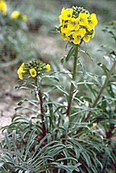
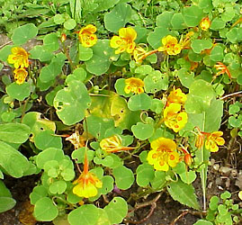
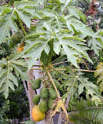

---
aliases:
- Brasikaloj
- Brassicales
- Brassicals
- brukvotvaré
- bộ Cải
- Kapsalaadsed
- kapustotvaré
- kapustowce
- keresztesvirágúak
- Koma kulîlkxaçiyan
- korsblomst-ordenen
- Kreuzblütlerartige
- križničevci
- krossblomordenen
- Krossblómabálkur
- krustziežu rinda
- kålordningen
- Kələmçiçəklilər
- Κραμβώδη
- зелковидни
- Капустакветныя
- Капустоцвіті
- капустоцветные
- Крсташице
- Купӑста чечеклисем
- կաղամբածաղկավորներ
- צלפאים
- كرنبيات
- کلمسانان
- బ్రాసికేలిస్
- ബ്രാസിക്കേൽസ്
- อันดับผักกาด
- アブラナ目
- 十字花目
- 白花菜目
- 십자화목
has_id_wikidata: Q21904
title: Brassicales
parent_taxon: '[[_Standards/WikiData/WD~malvids,2133361]]'
instance_of: '[[_Standards/WikiData/WD~taxon,16521]]'
taxon_rank: '[[_Standards/WikiData/WD~order,36602]]'
OmegaWiki_Defined_Meaning: 358574
ITIS_TSN: 822943
image:
- http://commons.wikimedia.org/wiki/Special:FilePath/Capparis%20zoharyi%204.jpg
- http://commons.wikimedia.org/wiki/Special:FilePath/%28MHNT%29%20Alliaria%20petiolata%20-%20flowers.jpg
EPPO_Code: 1CAPO
Commons_category: Brassicales
taxon_name: Brassicales
UMLS_CUI: C0682485
NBN_System_Key: NHMSYS0021060383
taxon_common_name: 十字花目
dv_has_:
  name_:
    an: Brassicales
    ar: كرنبيات
    arz: كرنبيات
    ast: Brassicales
    az: Kələmçiçəklilər
    be: Капустакветныя
    be_tarask: Капустакветныя
    bg: Brassicales
    bs: Brassicales
    ca: Brassicals
    ceb: Brassicales
    co: Brassicales
    cs: brukvotvaré
    cv: Купӑста чечеклисем
    da: korsblomst-ordenen
    de: Kreuzblütlerartige
    el: Κραμβώδη
    en: Brassicales
    en_ca: Brassicales
    en_gb: Brassicales
    eo: Brasikaloj
    es: Brassicales
    et: Kapsalaadsed
    eu: Brassicales
    ext: Brassicales
    fa: کلمسانان
    fi: Brassicales
    fr: Brassicales
    frr: Brassicales
    ga: Brassicales
    gl: Brassicales
    he: צלפאים
    hr: Brassicales
    hu: keresztesvirágúak
    hy: կաղամբածաղկավորներ
    ia: Brassicales
    id: Brassicales
    ie: Brassicales
    ilo: Brassicales
    io: Brassicales
    is: Krossblómabálkur
    it: Brassicales
    ja: アブラナ目
    jv: Brassicales
    ko: 십자화목
    ku: Koma kulîlkxaçiyan
    la: Brassicales
    lv: krustziežu rinda
    mk: зелковидни
    ml: ബ്രാസിക്കേൽസ്
    ms: Brassicales
    mul: Brassicales
    nb: Brassicales
    nl: Brassicales
    nn: krossblomordenen
    oc: Brassicales
    pl: kapustowce
    pt: Brassicales
    pt_br: Brassicales
    ro: Brassicales
    ru: капустоцветные
    sco: Brassicales
    sk: kapustotvaré
    sl: križničevci
    sq: Brassicales
    sr: Крсташице
    sv: kålordningen
    te: బ్రాసికేలిస్
    th: อันดับผักกาด
    tl: Brassicales
    tr: Brassicales
    uk: Капустоцвіті
    vi: bộ Cải
    vls: Brassicales
    vo: Brassicales
    war: Brassicales
    wuu: 十字花目
    yue: 白花菜目
    zh: 十字花目
    zh_cn: 十字花目
    zh_hans: 十字花目
    zh_hant: 十字花目
    zh_tw: 十字花目
---
# [[Brassicales]] 

     

#is_/same_as :: [[../../../../../../../../../../WikiData/WD~Brassicales,21904|WD~Brassicales,21904]] 

## #has_/text_of_/abstract 

> The **Brassicales** (or Cruciales) are an order of flowering plants, 
> belonging to the malvid group of eudicotyledons under the APG IV system. 
> 
> Well-known members of Brassicales include 
> cabbage, cauliflower, Brussels sprout, broccoli, kale, mustard, turnip, bok choy, rapeseed, radish, 
> horseradish, caper, papaya, moringa or drumstick tree, mignonette, nasturtium, and arabidopsis.
>
> One character common to many members of the order 
> is the production of isothiocyanate (mustard oil) compounds. 
> Most systems of classification have included this order, 
> although sometimes under the name Capparales 
> (the name chosen depending on which is thought to have priority).
>
> The order typically contains the following families:
> - Akaniaceae – two species of turnipwood trees, native to Asia and eastern Australia
> - Bataceae – salt-tolerant shrubs from America and Australasia
> - Brassicaceae – mustard and cabbage family; may include the Cleomaceae
> - Capparaceae – caper family, sometimes included in Brassicaceae
> - Caricaceae – papaya family
> - Cleomaceae
> - Emblingiaceae
> - Gyrostemonaceae – several genera of small shrubs and trees endemic to temperate parts of Australia
> - Koeberliniaceae – one species of thorn bush native to Mexico and the US Southwest
> - Limnanthaceae – meadowfoam family
> - Moringaceae – thirteen species of trees from Africa and India including the drumstick
> - Pentadiplandraceae – African species whose berries have two highly sweet tasting proteins
> - Resedaceae – mignonette family
> - Salvadoraceae – three genera found from Africa to Java
> - Setchellanthaceae
> - Tiganophytaceae
> - Tovariaceae
> - Tropaeolaceae – nasturtium family
>
> [Wikipedia](https://en.wikipedia.org/wiki/Brassicales) 

## Phylogeny 

-   « Ancestral Groups  
    -   [Rosids](../Rosids.md)
    -  [Core Eudicots](../../Core_Eudicots.md) 
    -   [Eudicots](../../../Eudicots.md)
    -   [Flowering_Plant](../../../../Flowering_Plant.md)
    -   [Seed_Plant](../../../../../Seed_Plant.md)
    -   [Land_Plant](../../../../../../Land_Plant.md)
    -   [Green plants](../../../../../../../Plant.md)
    -  [Eukarya](../../../../../../../../Eukarya.md) 
    -   [Tree of Life](../../../../../../../../Tree_of_Life.md)

-   ◊ Sibling Groups of  Rosids
    -   [Gerrardina](Gerrardina)
    -   [Fagales](Fagales.md)
    -   [Cucurbitales](Cucurbitales.md)
    -   [Rosales](Rosales.md)
    -   [Fabales](Fabales.md)
    -   [Zygophyllales](Zygophyllales.md)
    -   [Oxalidales](Oxalidales.md)
    -   [Malpighiales](Malpighiales.md)
    -   [Celastrales](Celastrales.md)
    -   [Geraniales](Geraniales.md)
    -   [Crossosomatales](Crossosomatales.md)
    -   [Myrtales](Myrtales.md)
    -   Brassicales
    -   [Malvales](Malvales.md)
    -   [Sapindales](Sapindales.md)

-   » Sub-Groups 

## Title Illustrations

 

  -------------------------------
  scientific_name ::     Erysimum ammophilum
  location ::           Marina State Beach (Monterey County, California, USA)
  Comments             Coast wallflower (Brassicaceae)
  specimen_condition ::  Live Specimen
  Source Collection    [CalPhotos](http://calphotos.berkeley.edu/)
  copyright ::            © 1995 [Dean Wm. Taylor, Jepson Herbarium, UC Berkeley](mailto:dwtaylor@cruzers.com)
  -------------------------------
 

  ---------------------------------------------------------------------
  scientific_name ::  Tropaeolum minus
  Comments          Indian cress (Tropaeolaceae)
  copyright ::         © [Kurt Stüber](http://www.biolib.de/) 
 
  ---------------------------------------------------------------------
 

  ------------------------------------------------------------------------
  scientific_name ::   Carica papaya
  location ::         Cultivated plant, Puerto de la Cruz, Teneriffa, Canary Islands.
  Comments           Papaya tree (Caricaceae).
  Acknowledgements   courtesy [Botanical Image Database](http://www.unibas.ch/botimage/)
  copyright ::          © 2001 University of Basel, Basel, Switzerland 
  ------------------------------------------------------------------------

## Confidential Links & Embeds: 

### #is_/same_as :: [[/_Standards/bio/bio~Domain/Eukarya/Plant/Land_Plant/Seed_Plant/Flowering_Plant/Eudicots/Core_Eudicots/Rosids/Brassicales|Brassicales]] 

### #is_/same_as :: [[/_public/bio/bio~Domain/Eukarya/Plant/Land_Plant/Seed_Plant/Flowering_Plant/Eudicots/Core_Eudicots/Rosids/Brassicales.public|Brassicales.public]] 

### #is_/same_as :: [[/_internal/bio/bio~Domain/Eukarya/Plant/Land_Plant/Seed_Plant/Flowering_Plant/Eudicots/Core_Eudicots/Rosids/Brassicales.internal|Brassicales.internal]] 

### #is_/same_as :: [[/_protect/bio/bio~Domain/Eukarya/Plant/Land_Plant/Seed_Plant/Flowering_Plant/Eudicots/Core_Eudicots/Rosids/Brassicales.protect|Brassicales.protect]] 

### #is_/same_as :: [[/_private/bio/bio~Domain/Eukarya/Plant/Land_Plant/Seed_Plant/Flowering_Plant/Eudicots/Core_Eudicots/Rosids/Brassicales.private|Brassicales.private]] 

### #is_/same_as :: [[/_personal/bio/bio~Domain/Eukarya/Plant/Land_Plant/Seed_Plant/Flowering_Plant/Eudicots/Core_Eudicots/Rosids/Brassicales.personal|Brassicales.personal]] 

### #is_/same_as :: [[/_secret/bio/bio~Domain/Eukarya/Plant/Land_Plant/Seed_Plant/Flowering_Plant/Eudicots/Core_Eudicots/Rosids/Brassicales.secret|Brassicales.secret]] 

