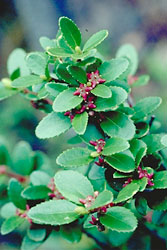

---
aliases:
  - Celastrales
title: Celastrales
has_id_wikidata: Q21870
---
## Phylogeny 

-   « Ancestral Groups  
    -   [Rosids](../Rosids.md)
    -  [Core Eudicots](../../Core_Eudicots.md) 
    -   [Eudicots](../../../Eudicots.md)
    -   [Flowering_Plant](../../../../Flowering_Plant.md)
    -   [Seed_Plant](../../../../../Seed_Plant.md)
    -   [Land_Plant](../../../../../../Land_Plant.md)
    -  [Green plants](../../../../../../../Plant.md) 
    -  [Eukarya](../../../../../../../../Eukarya.md) 
    -   [Tree of Life](../../../../../../../../Tree_of_Life.md)

-   ◊ Sibling Groups of  Rosids
    -   [Gerrardina](Gerrardina)
    -   [Fagales](Fagales.md)
    -   [Cucurbitales](Cucurbitales.md)
    -   [Rosales](Rosales.md)
    -   [Fabales](Fabales.md)
    -   [Zygophyllales](Zygophyllales.md)
    -   [Oxalidales](Oxalidales.md)
    -   [Malpighiales](Malpighiales.md)
    -   Celastrales
    -   [Geraniales](Geraniales.md)
    -   [Crossosomatales](Crossosomatales.md)
    -   [Myrtales](Myrtales.md)
    -   [Brassicales](Brassicales.md)
    -   [Malvales](Malvales.md)
    -   [Sapindales](Sapindales.md)

-   » Sub-Groups 

# [[Celastrales]] 

     

## #has_/text_of_/abstract 

> The **Celastrales** are an order of flowering plants found throughout the tropics and subtropics, with only a few species extending far into the temperate regions. The 1200 to 1350 species are in about 100 genera. All but seven of these genera are in the large family Celastraceae. Until recently, the composition of the order and its division into families varied greatly from one author to another.
>
> [Wikipedia](https://en.wikipedia.org/wiki/Celastrales) 

## Title Illustrations

--------------------------------- 
 
scientific_name ::     Parnassia californica
location ::           Big Valley, \~5400\', near waterfall, south of Cisco Grove (Placer County, California, USA)
Comments             California Grass-of-Parnassus (Parnassiaceae)
specimen_condition ::  Live Specimen
Source Collection    [CalPhotos](http://calphotos.berkeley.edu/)
copyright ::            © 2002 [Russell Towle](mailto:rtowle@neworld.net)

-------------------------- 
 
scientific_name ::     Euonymus occidentalis var. occidentalis
location ::           Bear Valley trail, Point Reyes N. S. (Marin County, California, USA)
Comments             Western burning bush (Celastraceae)
specimen_condition ::  Live Specimen
Source Collection    [CalPhotos](http://calphotos.berkeley.edu/)
copyright ::            © 2002 [Brad Kelley](mailto:bkelley5@yahoo.com)

--------------------------------- 
 
scientific_name ::    Paxistima myrsinites
location ::          Grayback Pass (Siskiyou County, California, USA)
Comments            Oregon boxwood (Celastraceae)
Creator             Photograph by G. F. Hrusa
Source Collection   [CalPhotos](http://calphotos.berkeley.edu/)
copyright ::           © 2001 [California Dept. of Food & Agriculture, Botany Laboratory](mailto:FHrusa@ca.gov)

## Confidential Links & Embeds: 

### #is_/same_as :: [[/_Standards/bio/bio~Domain/Eukarya/Plant/Land_Plant/Seed_Plant/Flowering_Plant/Eudicots/Core_Eudicots/Rosids/Celastrales|Celastrales]] 

### #is_/same_as :: [[/_public/bio/bio~Domain/Eukarya/Plant/Land_Plant/Seed_Plant/Flowering_Plant/Eudicots/Core_Eudicots/Rosids/Celastrales.public|Celastrales.public]] 

### #is_/same_as :: [[/_internal/bio/bio~Domain/Eukarya/Plant/Land_Plant/Seed_Plant/Flowering_Plant/Eudicots/Core_Eudicots/Rosids/Celastrales.internal|Celastrales.internal]] 

### #is_/same_as :: [[/_protect/bio/bio~Domain/Eukarya/Plant/Land_Plant/Seed_Plant/Flowering_Plant/Eudicots/Core_Eudicots/Rosids/Celastrales.protect|Celastrales.protect]] 

### #is_/same_as :: [[/_private/bio/bio~Domain/Eukarya/Plant/Land_Plant/Seed_Plant/Flowering_Plant/Eudicots/Core_Eudicots/Rosids/Celastrales.private|Celastrales.private]] 

### #is_/same_as :: [[/_personal/bio/bio~Domain/Eukarya/Plant/Land_Plant/Seed_Plant/Flowering_Plant/Eudicots/Core_Eudicots/Rosids/Celastrales.personal|Celastrales.personal]] 

### #is_/same_as :: [[/_secret/bio/bio~Domain/Eukarya/Plant/Land_Plant/Seed_Plant/Flowering_Plant/Eudicots/Core_Eudicots/Rosids/Celastrales.secret|Celastrales.secret]] 

