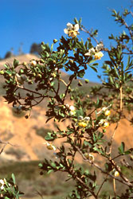

---
aliases:
- Bộ Toại thể mộc
- Crossosomatales
- Crossosomatals
- Krososomaloj
- Κροσσοσωματώδη
- кросозомоцветни
- Крососомовидни
- кроссосомоцветные
- متصالبيات
- クロッソソマ目
- 燧体木目
- 燧體木目
- 缨子木目
- 크로소소마목
title: Crossosomatales
has_id_wikidata: Q21860
dv_has_:
  name_:
    an: Crossosomatales
    ar: متصالبيات
    arz: متصالبيات
    ast: Crossosomatales
    az: Crossosomatales
    bg: кросозомоцветни
    bs: Crossosomatales
    ca: Crossosomatals
    ceb: Crossosomatales
    cs: Crossosomatales
    da: Crossosomatales
    de: Crossosomatales
    el: Κροσσοσωματώδη
    en: Crossosomatales
    en_ca: Crossosomatales
    en_gb: Crossosomatales
    eo: Krososomaloj
    es: Crossosomatales
    eu: Crossosomatales
    ext: Crossosomatales
    fi: Crossosomatales
    fr: Crossosomatales
    frr: Crossosomatales
    ga: Crossosomatales
    gl: Crossosomatales
    hr: Crossosomatales
    hu: Crossosomatales
    ia: Crossosomatales
    id: Crossosomatales
    ie: Crossosomatales
    io: Crossosomatales
    it: Crossosomatales
    ja: クロッソソマ目
    ko: 크로소소마목
    la: Crossosomatales
    mk: Крососомовидни
    mul: Crossosomatales
    nb: Crossosomatales
    nl: Crossosomatales
    oc: Crossosomatales
    pl: Crossosomatales
    pt: Crossosomatales
    pt_br: Crossosomatales
    ro: Crossosomatales
    ru: кроссосомоцветные
    sq: Crossosomatales
    sv: Crossosomatales
    tr: Crossosomatales
    uk: Crossosomatales
    vi: Bộ Toại thể mộc
    vo: Crossosomatales
    war: Crossosomatales
    zh: 缨子木目
    zh_cn: 燧体木目
    zh_hans: 燧体木目
    zh_hant: 燧体木目
    zh_tw: 燧體木目
---
## Phylogeny 

-   « Ancestral Groups  
    -   [Rosids](../Rosids.md)
    -  [Core Eudicots](../../Core_Eudicots.md) 
    -   [Eudicots](../../../Eudicots.md)
    -   [Flowering_Plant](../../../../Flowering_Plant.md)
    -   [Seed_Plant](../../../../../Seed_Plant.md)
    -   [Land_Plant](../../../../../../Land_Plant.md)
    -  [Green plants](../../../../../../../Plant.md) 
    -  [Eukarya](../../../../../../../../Eukarya.md) 
    -   [Tree of Life](../../../../../../../../Tree_of_Life.md)

-   ◊ Sibling Groups of  Rosids
    -   [Gerrardina](Gerrardina)
    -   [Fagales](Fagales.md)
    -   [Cucurbitales](Cucurbitales.md)
    -   [Rosales](Rosales.md)
    -   [Fabales](Fabales.md)
    -   [Zygophyllales](Zygophyllales.md)
    -   [Oxalidales](Oxalidales.md)
    -   [Malpighiales](Malpighiales.md)
    -   [Celastrales](Celastrales.md)
    -   [Geraniales](Geraniales.md)
    -   Crossosomatales
    -   [Myrtales](Myrtales.md)
    -   [Brassicales](Brassicales.md)
    -   [Malvales](Malvales.md)
    -   [Sapindales](Sapindales.md)

-   » Sub-Groups 

# [[Crossosomatales]] 

     

## #has_/text_of_/abstract 

> The **Crossosomatales** are an order, first recognized as such by APG II. 
> They are flowering plants included within the Rosid eudicots.
>
> [Wikipedia](https://en.wikipedia.org/wiki/Crossosomatales) 

## Title Illustrations

------------------------------------------------------------------------------ 
 
scientific_name ::     Crossosoma californicum
location ::           Forrestal Quarry, Rancho Palos Verdes, \~560\' elev. (Los Angeles County, California, USA)
Comments             California rockflower (Crossosomataceae)
Creator              Photograph by Angelika Brinkman-Busi
specimen_condition ::  Live Specimen
Source Collection    [CalPhotos](http://calphotos.berkeley.edu/)
copyright ::            © 1990 [California Native Plant Society](mailto:dtibor@CNPS.org) 

--------------------------------------------------------------------- 
 
scientific_name ::  Stachyurus chinensis
Comments          Stachyuraceae
copyright ::         © [Kurt Stüber](http://www.biolib.de/) 

--------------------------------------------------------------------------------- 
 
scientific_name ::     Staphylea bolanderi
location ::           California, USA
Comments             Bladdernut (Staphyleaceae)
Creator              Photograph by Brother Alfred Brousseau
specimen_condition ::  Live Specimen
Source Collection    [CalPhotos](http://calphotos.berkeley.edu/)
copyright ::            © 1995 [Saint Mary\'s College of California](mailto:rpolowin@stmarys-ca.edu) 

## Confidential Links & Embeds: 

### #is_/same_as :: [[/_Standards/bio/bio~Domain/Eukarya/Plant/Land_Plant/Seed_Plant/Flowering_Plant/Eudicots/Core_Eudicots/Rosids/Crossosomatales|Crossosomatales]] 

### #is_/same_as :: [[/_public/bio/bio~Domain/Eukarya/Plant/Land_Plant/Seed_Plant/Flowering_Plant/Eudicots/Core_Eudicots/Rosids/Crossosomatales.public|Crossosomatales.public]] 

### #is_/same_as :: [[/_internal/bio/bio~Domain/Eukarya/Plant/Land_Plant/Seed_Plant/Flowering_Plant/Eudicots/Core_Eudicots/Rosids/Crossosomatales.internal|Crossosomatales.internal]] 

### #is_/same_as :: [[/_protect/bio/bio~Domain/Eukarya/Plant/Land_Plant/Seed_Plant/Flowering_Plant/Eudicots/Core_Eudicots/Rosids/Crossosomatales.protect|Crossosomatales.protect]] 

### #is_/same_as :: [[/_private/bio/bio~Domain/Eukarya/Plant/Land_Plant/Seed_Plant/Flowering_Plant/Eudicots/Core_Eudicots/Rosids/Crossosomatales.private|Crossosomatales.private]] 

### #is_/same_as :: [[/_personal/bio/bio~Domain/Eukarya/Plant/Land_Plant/Seed_Plant/Flowering_Plant/Eudicots/Core_Eudicots/Rosids/Crossosomatales.personal|Crossosomatales.personal]] 

### #is_/same_as :: [[/_secret/bio/bio~Domain/Eukarya/Plant/Land_Plant/Seed_Plant/Flowering_Plant/Eudicots/Core_Eudicots/Rosids/Crossosomatales.secret|Crossosomatales.secret]] 

