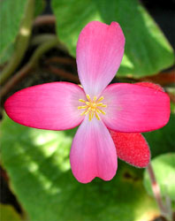

---
aliases:
- Balqabaqçiçəklilər
- Bộ Bầu bí
- Cucurbitales
- Cucurbitals
- dyniowce
- Græskar-ordenen
- Koma kundirawayan
- Kukurbaloj
- Kõrvitsalaadsed
- Kürbisartige
- Tanom nga pepino
- tekvicotvaré
- Tikvolike
- tykvotvaré
- tökvirágúak
- ķirbju rinda
- Κολοκυνθώδη
- Гарбузакветныя
- гарбузоцвіті
- Кавăн чечеклисем
- тиквовидни
- тиквоцветни
- тыквоцветные
- դդմածաղկավորներ
- דלועאים
- قرعيات
- کدوسانان
- కుకుర్బిటేలిస్
- കുക്കുർബിറ്റൈൽസ്
- อันดับแตง
- ウリ目
- 葫芦目
- 葫蘆目
- 박목
title: Cucurbitales
has_id_wikidata: Q21875
dv_has_:
  name_:
    an: Cucurbitales
    ar: قرعيات
    arz: قرعيات
    ast: Cucurbitales
    az: Balqabaqçiçəklilər
    be: Гарбузакветныя
    be_tarask: Гарбузакветныя
    bg: тиквоцветни
    bs: Cucurbitales
    ca: Cucurbitals
    ceb: Tanom nga pepino
    co: Cucurbitales
    cs: tykvotvaré
    cv: Кавăн чечеклисем
    da: Græskar-ordenen
    de: Kürbisartige
    el: Κολοκυνθώδη
    en: Cucurbitales
    en_ca: Cucurbitales
    en_gb: Cucurbitales
    eo: Kukurbaloj
    es: Cucurbitales
    et: Kõrvitsalaadsed
    eu: Cucurbitales
    ext: Cucurbitales
    fa: کدوسانان
    fi: Cucurbitales
    fr: Cucurbitales
    frr: Cucurbitales
    ga: Cucurbitales
    gl: Cucurbitales
    he: דלועאים
    hr: Tikvolike
    hu: tökvirágúak
    hy: դդմածաղկավորներ
    ia: Cucurbitales
    id: Cucurbitales
    ie: Cucurbitales
    ilo: Cucurbitales
    io: Cucurbitales
    it: Cucurbitales
    ja: ウリ目
    ko: 박목
    ku: Koma kundirawayan
    la: Cucurbitales
    lv: ķirbju rinda
    mk: тиквовидни
    ml: കുക്കുർബിറ്റൈൽസ്
    ms: Cucurbitales
    mul: Cucurbitales
    nb: Cucurbitales
    nl: Cucurbitales
    nn: Cucurbitales
    oc: Cucurbitales
    pl: dyniowce
    pt: Cucurbitales
    pt_br: Cucurbitales
    ro: Cucurbitales
    ru: тыквоцветные
    sco: Cucurbitales
    sk: tekvicotvaré
    sq: Cucurbitales
    sv: Cucurbitales
    te: కుకుర్బిటేలిస్
    th: อันดับแตง
    tr: Cucurbitales
    uk: гарбузоцвіті
    vi: Bộ Bầu bí
    vo: Cucurbitales
    war: Cucurbitales
    wuu: 葫芦目
    yue: 葫蘆目
    zh: 葫芦目
    zh_cn: 葫芦目
    zh_hans: 葫芦目
    zh_hant: 葫芦目
---

# [[Cucurbitales]] 

     

## #has_/text_of_/abstract 

> The **Cucurbitales** are an order of flowering plants, included in the rosid group of dicotyledons. 
> This order mostly belongs to tropical areas, 
> with limited presence in subtropical and temperate regions. 
> 
> The order includes shrubs and trees, together with many herbs and climbers. 
> One major characteristic of the Cucurbitales is the presence of unisexual flowers, 
> mostly pentacyclic, with thick pointed petals (whenever present). 
> The pollination is usually performed by insects, 
> but wind pollination is also present (in Coriariaceae and Datiscaceae).
>
> The order consists of roughly 2600 species in eight families. 
> The largest families are Begoniaceae (begonia family) with around 1500 species 
> and Cucurbitaceae (gourd family) with around 900 species. 
> These two families include the only economically important plants. 
> 
> Specifically, the Cucurbitaceae (gourd family) include some food species, 
> such as squash, pumpkin (both from Cucurbita), watermelon (Citrullus vulgaris), 
> and cucumber and melons  (Cucumis). 
> 
> The Begoniaceae are known for their horticultural species, 
> of which there are over 130 with many more varieties.
>
> [Wikipedia](https://en.wikipedia.org/wiki/Cucurbitales) 

## Phylogeny 

-   « Ancestral Groups  
    -   [Rosids](../Rosids.md)
    -  [Core Eudicots](../../Core_Eudicots.md) 
    -   [Eudicots](../../../Eudicots.md)
    -   [Flowering_Plant](../../../../Flowering_Plant.md)
    -   [Seed_Plant](../../../../../Seed_Plant.md)
    -   [Land_Plant](../../../../../../Land_Plant.md)
    -  [Green plants](../../../../../../../Plant.md) 
    -  [Eukarya](../../../../../../../../Eukarya.md) 
    -   [Tree of Life](../../../../../../../../Tree_of_Life.md)

-   ◊ Sibling Groups of  Rosids
    -   [Gerrardina](Gerrardina)
    -   [Fagales](Fagales.md)
    -   Cucurbitales
    -   [Rosales](Rosales.md)
    -   [Fabales](Fabales.md)
    -   [Zygophyllales](Zygophyllales.md)
    -   [Oxalidales](Oxalidales.md)
    -   [Malpighiales](Malpighiales.md)
    -   [Celastrales](Celastrales.md)
    -   [Geraniales](Geraniales.md)
    -   [Crossosomatales](Crossosomatales.md)
    -   [Myrtales](Myrtales.md)
    -   [Brassicales](Brassicales.md)
    -   [Malvales](Malvales.md)
    -   [Sapindales](Sapindales.md)

-   » Sub-Groups 

## Title Illustrations

------------------------------------------------------------------------ 
 
scientific_name ::   Begonia froebelii
Comments           Begoniaceae. Male flower of a plant cultivated at the Botanical Garden Basel, Switzerland.
Acknowledgements   courtesy [Botanical Image Database](http://www.unibas.ch/botimage/)
Sex ::              Male
copyright ::          © 2001 University of Basel, Basel, Switzerland 

--------------------------------------------------------------------- 
 
scientific_name ::  Cucumis sativus
Comments          Cucumber plant (Cucurbitaceae)
copyright ::         © [Kurt Stüber](http://www.biolib.de/) 

------------------------------------------------------------------------ 
 
scientific_name ::   Datisca cannabina
Comments           Datiscaceae. Young plant cultivated at the Botanical Garden Basel, Switzerland
Acknowledgements   courtesy [Botanical Image Database](http://www.unibas.ch/botimage/)
copyright ::          © 2001 University of Basel, Basel, Switzerland 

## Confidential Links & Embeds: 

### #is_/same_as :: [[/_Standards/bio/bio~Domain/Eukarya/Plant/Land_Plant/Seed_Plant/Flowering_Plant/Eudicots/Core_Eudicots/Rosids/Cucurbitales|Cucurbitales]] 

### #is_/same_as :: [[/_public/bio/bio~Domain/Eukarya/Plant/Land_Plant/Seed_Plant/Flowering_Plant/Eudicots/Core_Eudicots/Rosids/Cucurbitales.public|Cucurbitales.public]] 

### #is_/same_as :: [[/_internal/bio/bio~Domain/Eukarya/Plant/Land_Plant/Seed_Plant/Flowering_Plant/Eudicots/Core_Eudicots/Rosids/Cucurbitales.internal|Cucurbitales.internal]] 

### #is_/same_as :: [[/_protect/bio/bio~Domain/Eukarya/Plant/Land_Plant/Seed_Plant/Flowering_Plant/Eudicots/Core_Eudicots/Rosids/Cucurbitales.protect|Cucurbitales.protect]] 

### #is_/same_as :: [[/_private/bio/bio~Domain/Eukarya/Plant/Land_Plant/Seed_Plant/Flowering_Plant/Eudicots/Core_Eudicots/Rosids/Cucurbitales.private|Cucurbitales.private]] 

### #is_/same_as :: [[/_personal/bio/bio~Domain/Eukarya/Plant/Land_Plant/Seed_Plant/Flowering_Plant/Eudicots/Core_Eudicots/Rosids/Cucurbitales.personal|Cucurbitales.personal]] 

### #is_/same_as :: [[/_secret/bio/bio~Domain/Eukarya/Plant/Land_Plant/Seed_Plant/Flowering_Plant/Eudicots/Core_Eudicots/Rosids/Cucurbitales.secret|Cucurbitales.secret]] 

