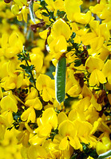
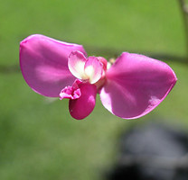
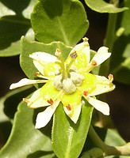
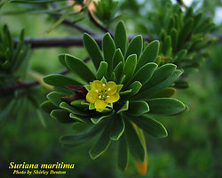

---
aliases:
  - Fabales
  - 豆目
has_id_wikidata: Q21878
title: Fabales
parent_taxon: '[[_Standards/WikiData/WD~fabids,2683213]]'
instance_of: '[[_Standards/WikiData/WD~taxon,16521]]'
taxon_rank: '[[_Standards/WikiData/WD~order,36602]]'
OmegaWiki_Defined_Meaning: 358691
ITIS_TSN: 500022
image:
  - http://commons.wikimedia.org/wiki/Special:FilePath/Fabaceae%20flower.jpg
  - http://commons.wikimedia.org/wiki/Special:FilePath/Polygala%20senega%20-%20K%C3%B6hler%E2%80%93s%20Medizinal-Pflanzen-247.jpg
  - http://commons.wikimedia.org/wiki/Special:FilePath/Senna%20occidentalis%28Flower%29.jpg
EPPO_Code: 1FABO
Commons_category: Fabales
taxon_name: Fabales
NBN_System_Key: NHMSYS0000066094
taxon_common_name: 豆目
---

# [[Fabales]] 

       

#is_/same_as :: [[../../../../../../../../../../WikiData/WD~Fabales,21878|WD~Fabales,21878]] 

## #has_/text_of_/abstract 

> **Fabales** is an order of flowering plants included in the rosid group of the eudicots 
> in the Angiosperm Phylogeny Group II classification system. 
> In the APG II circumscription, this order includes the families Fabaceae or legumes 
> (including the subfamilies Caesalpinioideae, Mimosoideae, and Faboideae), 
> Quillajaceae, Polygalaceae or milkworts 
> (including the families Diclidantheraceae, Moutabeaceae, and Xanthophyllaceae), 
> and Surianaceae. 
> 
> Under the  Cronquist system and some other plant classification systems, 
> the order Fabales contains only the family Fabaceae. 
> 
> In the classification system of Dahlgren the Fabales were in the superorder Fabiflorae 
> (also called Fabanae) with three families corresponding to the subfamilies of Fabaceae in APG II. 
> 
> The other families treated in the Fabales by the APG II classification 
> were placed in separate orders by Cronquist, 
> - the Polygalaceae within its own order, 
> - the Polygalales, and the Quillajaceae and Surianaceae within the Rosales.
>
> The Fabaceae, as the third-largest plant family in the world, 
> contain most of the diversity of the Fabales, 
> the other families making up a comparatively small portion of the order's diversity. 
> 
> Research in the order is largely focused on the Fabaceae, 
> due in part to its great biological diversity, and to its importance as food plants. 
> 
> The Polygalaceae are fairly well researched among plant families, 
> in part due to the large diversity of the genus Polygala, 
> and other members of the family being 
> food plants for various Lepidoptera (butterfly and moth) species.  
> 
> While taxonomists using molecular phylogenetic techniques find strong support for the order, 
> questions remain about the morphological relationships of the Quillajaceae and Surianaceae 
> to the rest of the order, due in part to limited research on these families.
>
> According to molecular clock calculations, 
> the lineage that led to Fabales split from other plants about 101 million years ago.
>
> [Wikipedia](https://en.wikipedia.org/wiki/Fabales) 

## Phylogeny 

-   « Ancestral Groups  
    -   [Rosids](../Rosids.md)
    -  [Core Eudicots](../../Core_Eudicots.md))
    -   [Eudicots](../../../Eudicots.md)
    -   [Flowering_Plant](../../../../Flowering_Plant.md)
    -   [Seed_Plant](../../../../../Seed_Plant.md)
    -   [Land_Plant](../../../../../../Land_Plant.md)
    -  [Green plants](../../../../../../../Plant.md))
    -  [Eukarya](../../../../../../../../Eukarya.md))
    -   [Tree of Life](../../../../../../../../Tree_of_Life.md)

-   ◊ Sibling Groups of  Rosids
    -   [Gerrardina](Gerrardina)
    -   [Fagales](Fagales.md)
    -   [Cucurbitales](Cucurbitales.md)
    -   [Rosales](Rosales.md)
    -   Fabales
    -   [Zygophyllales](Zygophyllales.md)
    -   [Oxalidales](Oxalidales.md)
    -   [Malpighiales](Malpighiales.md)
    -   [Celastrales](Celastrales.md)
    -   [Geraniales](Geraniales.md)
    -   [Crossosomatales](Crossosomatales.md)
    -   [Myrtales](Myrtales.md)
    -   [Brassicales](Brassicales.md)
    -   [Malvales](Malvales.md)
    -   [Sapindales](Sapindales.md)

-   » Sub-Groups
    -   [Fabaceae](Fabales/Fabaceae.md)
    -   [Surianaceae](Fabales/Surianaceae.md)
    -   [Polygalaceae](Fabales/Polygalaceae.md)
    -   [Quillaja](Quillaja)

## Introduction

[Martin F. Wojciechowski, Johanna Mahn, and Bruce Jones]() 

The traditional orders Fabales, Rosales, Cucurbitales, and Fagales
comprise one of the major clades within Eurosids I. This clade is
characterized by the ability of many of its members to fix atmospheric
nitrogen (N~2~) to a form usable by plants (Soltis et al. 2000). Within
this 'nitrogen-fixing' clade the monophyly of each of its subclades
receives strong support from analyses of molecular data. The monophyly
of Fabales (sensu Angiosperm Phylogeny Group, 2003) and a sister group
relationship of legumes (family Fabaceae) to the families Quillajaceae,
Polygalaceae, and Surianaceae, are all strongly supported (Doyle et al.
2000), but the relationship among these lineages is not clearly resolved
at the present time.

### Discussion of Phylogenetic Relationships

Within angiosperms, Fabaceae has traditionally been considered 'rosid'
in its taxonomic relationships, with Connaraceae, Chrysobalanaceae,
Crossosomataceae, Krameriaceae, and even Sapindaceae suggested as
closely related families (potential sister groups) by different authors
at one time or another (reviewed by Dickison, 1981; Thorne, 1992). The
first challenge to these hypotheses came from the now landmark study of
Chase et al. (1993) based on cladistic analysis of the chloroplast
*rbcL* gene, which suggested Polygalaceae and Surianaceae as potential
sister groups to Fabaceae and resolved the other families as more
distantly related. A close relationship of Fabaceae to Polygalaceae (and
Surianaceae) within a more inclusive Fabales clade has been
substantiated by most subsequent angiosperm-wide analyses of molecular
data (Savolainen et al., 2000; Soltis et al., 2000). In addition,
studies focused on relationships within rosids (Soltis et al., 1995;
Steele et al., 2000; Persson, 2001) have shown the rosacean genus
*Quillaja* Molina strongly supported as a member of Fabales, although
relationships within Fabales are still only weakly resolved.

## Title Illustrations

------------------------------)
Scientific Name ::     Cytisus scoparius
Acknowledgements     Photograph courtesy [InsectImages.org](http://www.insectimages.org/) (#0022099)
Specimen Condition   Live Specimen
Source Collection    [InsectImages.org](http://www.insectimages.org/)
Copyright ::            © Eric Coombs, Oregon Department of Agriculture

------------------------
 
Scientific Name ::     Securidaca diversifolia S.F. Blake
Location ::           Fairchild Tropical Garden, Coral Gables, FL
Specimen Condition   Live Specimen
Copyright ::            © 2006 [Dennis Stevenson](http://www.plantsystematics.org/)

-------------------------
 
Scientific Name ::     Quillaja saponaria Poir.
Specimen Condition   Live Specimen
Copyright ::            © 2003-2006 [David L. Magney](http://www.magney.org)

----------

Scientific Name ::     Suriana maritima L.
Specimen Condition   Live Specimen
Copyright ::            © Shirley Denton

## Confidential Links & Embeds: 

### #is_/same_as :: [Fabales](/_Standards/bio/bio~Domain/Eukarya/Plant/Land_Plant/Seed_Plant/Flowering_Plant/Eudicots/Core_Eudicots/Rosids/Fabales.md) 

### #is_/same_as :: [Fabales.public](/_public/bio/bio~Domain/Eukarya/Plant/Land_Plant/Seed_Plant/Flowering_Plant/Eudicots/Core_Eudicots/Rosids/Fabales.public.md) 

### #is_/same_as :: [Fabales.internal](/_internal/bio/bio~Domain/Eukarya/Plant/Land_Plant/Seed_Plant/Flowering_Plant/Eudicots/Core_Eudicots/Rosids/Fabales.internal.md) 

### #is_/same_as :: [Fabales.protect](/_protect/bio/bio~Domain/Eukarya/Plant/Land_Plant/Seed_Plant/Flowering_Plant/Eudicots/Core_Eudicots/Rosids/Fabales.protect.md) 

### #is_/same_as :: [Fabales.private](/_private/bio/bio~Domain/Eukarya/Plant/Land_Plant/Seed_Plant/Flowering_Plant/Eudicots/Core_Eudicots/Rosids/Fabales.private.md) 

### #is_/same_as :: [Fabales.personal](/_personal/bio/bio~Domain/Eukarya/Plant/Land_Plant/Seed_Plant/Flowering_Plant/Eudicots/Core_Eudicots/Rosids/Fabales.personal.md) 

### #is_/same_as :: [Fabales.secret](/_secret/bio/bio~Domain/Eukarya/Plant/Land_Plant/Seed_Plant/Flowering_Plant/Eudicots/Core_Eudicots/Rosids/Fabales.secret.md)

