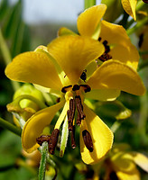
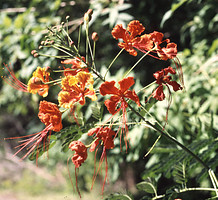
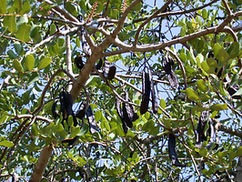

---
aliases:
- Caesalpinioideae
- "peacock flower"
title: "Caesalpinieae s.l. & s.s., Cassieae sensu stricto, Mimosoideae"
---

# [[Caesalpinieae]] s.l. & s.s., Cassieae sensu stricto, Mimosoideae 

     

## #has_/text_of_/abstract 

> Caesalpinioideae is a botanical name at the rank of subfamily, 
> placed in the large family Fabaceae or Leguminosae. 
> 
> Its name is formed from the generic name Caesalpinia. 
> It is known also as the peacock flower subfamily. 
> 
> The Caesalpinioideae are mainly trees distributed in the moist tropics, 
> but include such temperate species as the honeylocust (Gleditsia triacanthos) 
> and Kentucky coffeetree (Gymnocladus dioicus). 
> 
> It has the following clade-based definition:
>
> The most inclusive crown clade containing Arcoa gonavensis Urb. and Mimosa pudica L., but not Bobgunnia fistuloides (Harms) J. H. Kirkbr. & Wiersema, Duparquetia orchidacea Baill., or Poeppigia procera C.Presl In some classifications, for example the Cronquist system, the group is recognized at the rank of family, Caesalpiniaceae.
>
> [Wikipedia](https://en.wikipedia.org/wiki/Caesalpinioideae) 

## Phylogeny 

-   « Ancestral Groups  
    -   [Fabaceae](../Fabaceae.md)
    -   [Fabales](../../Fabales.md)
    -   [Rosids](../../../Rosids.md)
    -  [Core Eudicots](../../../../Core_Eudicots.md))
    -   [Eudicots](../../../../../Eudicots.md)
    -   [Flowering_Plant](../../../../../../Flowering_Plant.md)
    -   [Seed_Plant](../../../../../../../Seed_Plant.md)
    -   [Land_Plant](../../../../../../../../Land_Plant.md)
    -  [Green plants](../../../../../../../../../Plant.md))
    -  [Eukarya](../../../../../../../../../../Eukarya.md))
    -   [Tree of Life](../../../../../../../../../../Tree_of_Life.md)

-   ◊ Sibling Groups of  Fabaceae
    -   [Cercideae](Cercideae.md)
    -   [Detarieae sensu lato](Detarieae.md)
    -   [Cassieae sensu lato (pro         parte)](Cassieae_%28pro_parte%29)
    -   Caesalpinieae s.l. & s.s., Cassieae sensu stricto, Mimosoideae
    -   [Papilionoideae](Papilionoideae.md)

-   » Sub-Groups
    -   [Mimosoideae](Caesalpinieae/Mimosoideae.md)

## Introduction

[Martin F. Wojciechowski]() 

The clade shown here, referred to as the \"Caesalpinioid crown\" clade
(Wojciechowski et al., 2004), containing Cassieae subtribes Cassiinae
and Ceratoniinae (sensu Irwin and Barneby, 1981) as well as tribe
Caesalpinieae and the entire subfamily Mimosoideae, has been resolved in
all molecular phylogenetic analyses (see below). The members of tribe
Caesalpinieae have been divided into eight to nine informal generic
groups (e.g., Polhill, 1994). These include the Umtiza, Pterogyne,
Caesalpinia, Batesia, Moldenhawera, Tachigali, core-Peltophorum, and
Dimorphandra groups, which as currently presented by Lewis (2005b),
contain 56 genera and 430-440 species.

### Discussion of Phylogenetic Relationships

Results from phylogenetic studies have led to the restructuring of some
of the eight informal groups within Caesalpinieae. For example, recent
analyses of molecular sequence data have supported some of these
informal groups as monophyletic (e.g., Bruneau et al., 2001; Kajita et
al., 2001; Wojciechowski et al. 2004) but the tribe as a whole is
clearly paraphyletic, and the Mimosoideae and Cassieae sens. strict. are
nested within its lineages. As a result of phylogenetic analysis,
Bruneau et al. (2001) removed *Ceratonia* from Cassieae sensu lato
(Lewis, 2005a), showing it was sister to *Acrocarpus* among the
Caesalpinieae in the Umtiza clade, which now includes *Gymnocladus,
Gleditsia, Umtiza, Tetrapterocarpon, Arcoa, Acrocarpus,* and *Ceratonia*
(Herendeen et al. 2003).

The Caesalpinia group is a broad, apparently monophyletic group
containing 20 or more genera (Lewis, 2005b) considered closely related
to the type genus *Caesalpinia*. Numerous studies (e.g., Lewis and
Schrire, 1995; Simpson and Lewis, 2003; Simpson et al., 2003) have
clearly demonstrated that *Caesalpinia*, as traditionally circumscribed
with c. 140 spp., is paraphyletic; *Caesalpinia* in the strict sense is
now reduced to a genus of c. 25 spp. (Lewis, 2005b).

A recent molecular phylogenetic study by Marazzi et al. (2006) greatly
clarified relationships within *Senna*. The Pterogyne and Moldenhawera
groups contain only their name sakes, the genera *Pterogyne* and
*Moldenhawera*, respectively. Haston et al. (2003) found that the
Peltophorum group of Polhill (1994) was non-monophyletic and removed
genera from the group limiting it to what is now referred to as the
\'core-Peltophorum\' group, with *Schizolobium, Bussea, Peltophorum,
Parkinsonia, Conzattia, Delonix, Covillea,* and *Lemuropisum*.
Relationships within this core-Peltophorum group have been further
resolved by Haston et al. (2005).

With the exception of *Dinizia* (currently treated in Mimoseae), which
appears more closely related to members of Caesalpinieae than to
mimosoids on the basis of both molecular and morphological evidence
(Luckow et al., 2003), the subfamily Mimosoideae is resolved as
monophyletic with strong support (Luckow et al., 2003; Wojciechowski et
al., 2004). Phylogenetic studies so far indicate that members of the
Dimorphandra group of Caesalpinieae (e.g., *Dimorphandra, Erythrophleum,
Mora*) comprise the sister group to the Mimosoideae, although
relationships of lineages near the \'base\' of the mimosoids clade are
still poorly resolved.

## Title Illustrations

---------------------)
Scientific Name ::     Senna marilandica (L.) \[=Cassia marilandica L.\]
Location ::           Konza Prairie, Riley County, Kansas
Comments             Commonly called Wild Senna or Maryland Senna.
Specimen Condition   Live Specimen
Copyright ::            © [Eva Horne](http://www.lib.ksu.edu/wildflower/)

----------------------)
Scientific Name ::     Caesalpinia pulcherrima Sw.
Location ::           Arizona
Specimen Condition   Live Specimen
Copyright ::            © [Chris Martin](http://www.public.asu.edu/%7Ecamartin/)

---------------------------)
Scientific Name ::     Ceratonia siliqua L.
Specimen Condition   Live Specimen
Copyright ::            © [Annette Hoggemeier](http://www.boga.ruhr-uni-bochum.de/index.html)

## Confidential Links & Embeds: 

### #is_/same_as :: [Caesalpinieae](/_Standards/bio/bio~Domain/Eukarya/Plant/Land_Plant/Seed_Plant/Flowering_Plant/Eudicots/Core_Eudicots/Rosids/Fabales/Fabaceae/Caesalpinieae.md) 

### #is_/same_as :: [Caesalpinieae.public](/_public/bio/bio~Domain/Eukarya/Plant/Land_Plant/Seed_Plant/Flowering_Plant/Eudicots/Core_Eudicots/Rosids/Fabales/Fabaceae/Caesalpinieae.public.md) 

### #is_/same_as :: [Caesalpinieae.internal](/_internal/bio/bio~Domain/Eukarya/Plant/Land_Plant/Seed_Plant/Flowering_Plant/Eudicots/Core_Eudicots/Rosids/Fabales/Fabaceae/Caesalpinieae.internal.md) 

### #is_/same_as :: [Caesalpinieae.protect](/_protect/bio/bio~Domain/Eukarya/Plant/Land_Plant/Seed_Plant/Flowering_Plant/Eudicots/Core_Eudicots/Rosids/Fabales/Fabaceae/Caesalpinieae.protect.md) 

### #is_/same_as :: [Caesalpinieae.private](/_private/bio/bio~Domain/Eukarya/Plant/Land_Plant/Seed_Plant/Flowering_Plant/Eudicots/Core_Eudicots/Rosids/Fabales/Fabaceae/Caesalpinieae.private.md) 

### #is_/same_as :: [Caesalpinieae.personal](/_personal/bio/bio~Domain/Eukarya/Plant/Land_Plant/Seed_Plant/Flowering_Plant/Eudicots/Core_Eudicots/Rosids/Fabales/Fabaceae/Caesalpinieae.personal.md) 

### #is_/same_as :: [Caesalpinieae.secret](/_secret/bio/bio~Domain/Eukarya/Plant/Land_Plant/Seed_Plant/Flowering_Plant/Eudicots/Core_Eudicots/Rosids/Fabales/Fabaceae/Caesalpinieae.secret.md)

