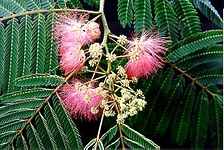
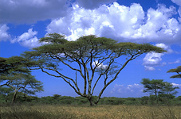
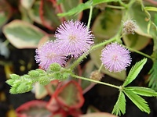

---
aliases:
  - Mimosoideae
title: Mimosoideae
---

# [[Mimosoideae]] 

 
 

## #has_/text_of_/abstract 

> The **Mimosoideae** are a traditional subfamily of trees, herbs, lianas, and shrubs in the pea family (Fabaceae) 
> that mostly grow in tropical and subtropical climates.  
> They are typically characterized by having radially symmetric flowers, 
> with petals that are twice divided (valvate) in bud and with numerous showy, prominent stamens.
>
> Recent work on phylogenetic relationships has found 
> that the Mimosoideae form a clade nested with subfamily Caesalpinioideae 
> and the most recent classification by The Legume Phylogeny Working Group 
> refer to them as the Mimosoid clade within subfamily Caesalpinioideae. 
> The group includes about 40 genera and 2,500 species.
>
> [Wikipedia](https://en.wikipedia.org/wiki/Mimosoideae) 
## Phylogeny 

-   « Ancestral Groups  
    -   [Caesalpinieae s.l. & s.s., Cassieae sensu stricto,         Mimosoideae](Caesalpinieae_s.l._%26_s.s.%2C_Cassieae_sensu_stricto%2C_Mimosoideae)
    -   [Fabaceae](../../Fabaceae.md)
    -   [Fabales](../../../Fabales.md)
    -   [Rosids](../../../../Rosids.md)
    -  [Core Eudicots](../../../../../Core_Eudicots.md) 
    -   [Eudicots](../../../../../../Eudicots.md)
    -   [Flowering_Plant](../../../../../../../Flowering_Plant.md)
    -   [Seed_Plant](../../../../../../../../Seed_Plant.md)
    -   [Land_Plant](../../../../../../../../../Land_Plant.md)
    -  [Green plants](../../../../../../../../../../Plant.md) 
    -  [Eukarya](../../../../../../../../../../../Eukarya.md) 
    -   [Tree of Life](../../../../../../../../../../../Tree_of_Life.md)

-   ◊ Sibling Groups of  Caesalpinieae s.l. & s.s., Cassieae sensu stricto,
        Mimosoideae
    -   Mimosoideae

-   » Sub-Groups 

## Introduction

[Martin F. Wojciechowski]() 

\"Mimosoids\" form one of the major groups of legumes and have been
usually recognized as the subfamily Mimosoideae within the family
Fabaceae. The group consists of about 80 genera (c. 3,270 spp.) of
trees, shrubs, and lianas found mainly in tropical, subtropical, and
warm temperate regions of the world where they serve as important
sources of forage and fuel (Luckow et al., 2003). Tropical America,
Africa and Australasia are centers of greatest diversity for mimosoids.
Members of this subfamily are common in lowland tropical rainforests,
especially along rivers and near lakes, but have also successfully
adapted to drier savannas, scrub and thorn forests, and arid desert
regions in the Americas and Africa (Elias, 1981).

### Characteristics

As mentioned elsewhere, the aestivation of petals and sepals \[see [aestivation patterns](http://www.tolweb.org/notes/?note_id=4195)\]
(pattern of arrangement of these organs in the developing flower) have
been of fundamental importance in distinguishing the three subfamilies
within Fabaceae (Polhill and Raven, 1981), with the Mimosoideae
characterized as having valvate (non-overlapping), rather than imbricate
(as in the Caesalpinioideae and Papilionoideae), aestivation of the
petals and typically the sepals (Luckow et al., 2003). Most mimosoids
have small (\< 1-2 cm), regular or actinomorphic (radially symmetrical)
flowers aggregated into spicate or capitate heads, with stamens usually
3 to 10 but sometimes many (\>100). The filaments of the stamens are
often long and brightly colored (orange to red), making for attractive
inflorescences. Root nodules are generally present suggesting most if
not all mimosoids exhibit symbiotic nitrogen fixation (Sprent, 2001).
Leaves in this subfamily are mostly bipinnate (i.e., twice pinnately
compound) and often have specialized glands. In many of the endemic
Australian species of *Acacia* the leaves are reduced to simple
\"phyllodes\".

### Discussion of Phylogenetic Relationships

The classification of Mimosoideae has until recently followed closely
that of Bentham (1875), who recognized five tribes based partly on
aestivation of the sepals but also on androecial characters (male
reproductive parts, stamens). However, recent phylogenetic studies based
on molecular sequence and morphological data have cast serious doubt on
the monophyly of these tribes in Mimosoideae (Luckow et al., 2000,
2003). Previously separated into twelve informal generic groups (Lewis &
Elias, 1981; Polhill, 1994) based largely on morphological and chemical
data, Luckow et al. (2003) and Miller et al. (2003) have used analyses
of DNA sequences to begin to resolve relationships among these groups
within the subfamily. Results from their work and other studies (e.g.,
Wojciechowski et al., 2004) have suggested members of the *Dinizia*
and/or *Pentaclethra* groups comprise the basally branching lineages
within mimosoids with tribes Acacieae and Ingeae nested within a
paraphyletic Mimoseae. Neither Acacieae nor Ingeae are presently
resolved as monophyletic groups, but sampling of taxa from these, as all
the tribes, is still not extensive. The placement of *Faidherbia*
(formerly Acacieae) in Ingeae (Polhill, 1994; Luckow et al., 2003)
renders Acacieae monogeneric, with the single genus *Acacia*. Recent
work by Luckow et al. (submitted) indicates that *Mimozyganthus*
(formerly treated as monotypic tribe Mimozyganthese) is also nested
within the paraphyletic tribe Mimoseae.

The taxonomic status of the predominantly southern hemisphere genus
*Acacia* (\"acacias\", \"wattles\"), containing more than 1450 species,
has long been controversial, and recent morphological and molecular
phylogenetic studies have shown that the genus as currently
circumscribed is polyphyletic and will ultimately need to be divided
into four to five genera. Pedley (1986) recommended the three presently
recognized subgenera, *Acacia, Aculeiferum,* and *Phyllodineae*, be
segregated as *Acacia* sens. str., *Senegalia* Raf., and *Racosperma*
Mart., respectively, but other authors, such as Maslin (1988) and Vassal
(1988), did not adopt Pedley\'s segregates although they agreed that
*Acacia* was polyphyletic. The proposal (number 1584 by Orchard &
Maslin, 2003) to retypify *Acacia* according to rules governing the
International Code of Botanical Nomenclature, based on the type of the
Australian taxon *Acacia penninervis* Sieber ex. DC., and recommended by
the Committee for Spermatophyta, was controversial within the legume
systematics community (Luckow et al., 2005). The proposal was recently
adopted at the XVII International Botanical Congress in Vienna, Austria,
in July 2005. This decision, effectively conserving the name *Acacia* so
that it applies to the Australian species, will require a substantial
number of changes to generic and infrageneric names in *Acacia* (e.g.
Luckow et al., 2005).
## Title Illustrations

------------------------------------ 
 
scientific_name ::     Albizia julibrissin Durazz.
specimen_condition ::  Live Specimen
copyright ::            © 2005 [Mike Hogan, Todd Langston](http://www.forestry.auburn.edu/samuelson/dendrology/index.html)

----------------------------------------------------------------------------- 
 
scientific_name ::     Acacia tortilis
location ::           Southern Serengeti near Ndutu, Tanzania
specimen_condition ::  Live Specimen
copyright ::            © [Greg and Marybeth Dimijian](http://www.dimijianimages.com/) 

------------------------------------------ 
 
scientific_name ::     Mimosa pudica Mill.
specimen_condition ::  Live Specimen
copyright ::            © [Loison Bernard](http://www.mytho-fleurs.com/images/jardins_botaniques/serre%20mabundu/mimosa%20pudica-sensitive.jpg)

## Confidential Links & Embeds: 

### #is_/same_as :: [[/_Standards/bio/bio~Domain/Eukarya/Plant/Land_Plant/Seed_Plant/Flowering_Plant/Eudicots/Core_Eudicots/Rosids/Fabales/Fabaceae/Caesalpinieae/Mimosoideae|Mimosoideae]] 

### #is_/same_as :: [[/_public/bio/bio~Domain/Eukarya/Plant/Land_Plant/Seed_Plant/Flowering_Plant/Eudicots/Core_Eudicots/Rosids/Fabales/Fabaceae/Caesalpinieae/Mimosoideae.public|Mimosoideae.public]] 

### #is_/same_as :: [[/_internal/bio/bio~Domain/Eukarya/Plant/Land_Plant/Seed_Plant/Flowering_Plant/Eudicots/Core_Eudicots/Rosids/Fabales/Fabaceae/Caesalpinieae/Mimosoideae.internal|Mimosoideae.internal]] 

### #is_/same_as :: [[/_protect/bio/bio~Domain/Eukarya/Plant/Land_Plant/Seed_Plant/Flowering_Plant/Eudicots/Core_Eudicots/Rosids/Fabales/Fabaceae/Caesalpinieae/Mimosoideae.protect|Mimosoideae.protect]] 

### #is_/same_as :: [[/_private/bio/bio~Domain/Eukarya/Plant/Land_Plant/Seed_Plant/Flowering_Plant/Eudicots/Core_Eudicots/Rosids/Fabales/Fabaceae/Caesalpinieae/Mimosoideae.private|Mimosoideae.private]] 

### #is_/same_as :: [[/_personal/bio/bio~Domain/Eukarya/Plant/Land_Plant/Seed_Plant/Flowering_Plant/Eudicots/Core_Eudicots/Rosids/Fabales/Fabaceae/Caesalpinieae/Mimosoideae.personal|Mimosoideae.personal]] 

### #is_/same_as :: [[/_secret/bio/bio~Domain/Eukarya/Plant/Land_Plant/Seed_Plant/Flowering_Plant/Eudicots/Core_Eudicots/Rosids/Fabales/Fabaceae/Caesalpinieae/Mimosoideae.secret|Mimosoideae.secret]] 

