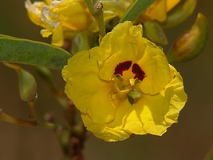
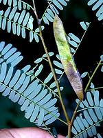
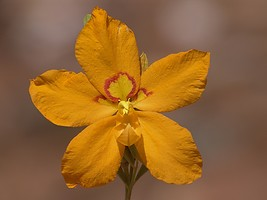

---
aliases:
  - Cassieae
title: Cassieae sensu lato (pro parte)
---

# [[Cassieae]] sensu lato (pro parte) 

 
 
 

## #has_/text_of_/abstract 

> Caesalpinioideae is a botanical name at the rank of subfamily, 
> placed in the large family Fabaceae or Leguminosae. 
> Its name is formed from the generic name Caesalpinia. 
> It is known also as the peacock flower subfamily. The Caesalpinioideae are mainly trees distributed in the moist tropics, but include such temperate species as the honeylocust (Gleditsia triacanthos) and Kentucky coffeetree (Gymnocladus dioicus). It has the following clade-based definition:
>
> 
>
> The most inclusive crown clade containing Arcoa gonavensis Urb. and Mimosa pudica L., but not Bobgunnia fistuloides (Harms) J. H. Kirkbr. & Wiersema, Duparquetia orchidacea Baill., or Poeppigia procera C.Presl In some classifications, for example the Cronquist system, the group is recognized at the rank of family, Caesalpiniaceae.
>
> [Wikipedia](https://en.wikipedia.org/wiki/Caesalpinioideae) 

## Introduction

[Martin F. Wojciechowski and Bruce Jones]() 

Tribe Cassieae has long been considered an artificial assemblage of
unrelated taxa in Caesalpinioideae (Polhill, 1994). In the last formal
treatment of this tribe, Irwin and Barneby (1981) divided Cassieae Bronn
into five subtribes, Ceratoniinae, Dialiinae, Duparquetiinae, Cassiinae,
and Labicheinae (Lewis, 2005). Three of these subtribes, Dialiinae,
Duparquetiinae, and Labicheinae, comprise the clade informally referred
to here as Cassieae sens. lat. pro parte (Lewis, 2005). The remaining
two subtribes are now considered more closely related to other
caesalpinioid groups.

Most of the genera in this group (18) are monotypic (with a single
species) or very small, with the exception of *Labichea* Gaudich. ex.
DC. (14 species) and *(Dialium* L. (28 species). They are trees, shrubs,
or herbs primarily distributed in forests and woodlands of subtropical
and tropical regions around the world (Lewis, 2005). *Koompassia
excelsa* (Becc.) Taub. - at heights of 84-88 m from Sarawak, Malaysia -
is regarded as the tallest angiosperm in tropical forests (Mabberley,
1993).

### Discussion of Phylogenetic Relationships

Tribe Cassieae, as treated by Irwin and Barneby (1981), is not
monophyletic based on analyses of molecular sequence data (e.g., Doyle
et al., 1997; Kajita et al., 2001; Herendeen et al., 2003; Wojciechowski
et al., 2004). Three of the five subtribes, Dialiinae, Duparquetiinae,
and Labicheinae, form a monophyletic group that branches early in the
family tree, whereas subtribes Cassiinae and Ceratoniinae are more
closely related to other caesalpinioid groups (Cassiinae, with *Cassia,
Chamaecrista*, and *Senna* as "Cassieae sens. strict.", in the clade
referred to as Caesalpinieae s.l. & s.s., Cassieae sensu stricto, and
Mimosoideae, and Ceratoniinae, with the single genus *Ceratonia*, in the
Umtiza clade). Within this group, Bruneau et al. (2001) found support
for the monophyly of the three subtribes, although Dialiinae is
monophyletic only if the Australian subtribe Labicheinae (with two
genera, *Labichea* and *Petalostylis* R. Br.) is included within it,
closely related to *Storckeilla* Seem. Sampling of species from the
genera shown here is still quite incomplete and so it is uncertain
whether any of them are monophyletic or not.

## Phylogeny 

-   « Ancestral Groups  
    -   [Fabaceae](../Fabaceae.md)
    -   [Fabales](../../Fabales.md)
    -   [Rosids](../../../Rosids.md)
    -  [Core Eudicots](../../../../Core_Eudicots.md) 
    -   [Eudicots](../../../../../Eudicots.md)
    -   [Flowering_Plant](../../../../../../Flowering_Plant.md)
    -   [Seed_Plant](../../../../../../../Seed_Plant.md)
    -   [Land_Plant](../../../../../../../../Land_Plant.md)
    -  [Green plants](../../../../../../../../../Plant.md) 
    -  [Eukarya](../../../../../../../../../../Eukarya.md) 
    -   [Tree of Life](../../../../../../../../../../Tree_of_Life.md)

-   ◊ Sibling Groups of  Fabaceae
    -   [Cercideae](Cercideae.md)
    -   [Detarieae sensu lato](Detarieae.md)
    -   Cassieae sensu lato (pro parte)
    -   [Caesalpinieae s.l. & s.s., Cassieae sensu stricto,         Mimosoideae](Caesalpinieae_s.l._%26_s.s.%2C_Cassieae_sensu_stricto%2C_Mimosoideae)
    -   [Papilionoideae](Papilionoideae.md)

-   » Sub-Groups 

## Title Illustrations

----------------- 
 
Scientific Name ::     Labichea lanceolata Benth.
Location ::           West Australia
Specimen Condition   Live Specimen
Copyright ::            © [Bernd Krüger](http://www.bkaussi.de/)

----------------------- 
) 
Scientific Name ::     Poeppigia procera Presl
Location ::           Bolivia
Specimen Condition   Live Specimen
Copyright ::            © [Robin Foster](http://fm2.fieldmuseum.org/plantguides/)

----------------- 
 
Scientific Name ::     Petalostylis labicheoides R.Br.
Location ::           West Australia
Specimen Condition   Live Specimen
Copyright ::            © [Bernd Krüger](http://www.bkaussi.de/)

## Confidential Links & Embeds: 

### #is_/same_as :: [[/_Standards/bio/bio~Domain/Eukarya/Plant/Land_Plant/Seed_Plant/Flowering_Plant/Eudicots/Core_Eudicots/Rosids/Fabales/Fabaceae/Cassieae|Cassieae]] 

### #is_/same_as :: [[/_public/bio/bio~Domain/Eukarya/Plant/Land_Plant/Seed_Plant/Flowering_Plant/Eudicots/Core_Eudicots/Rosids/Fabales/Fabaceae/Cassieae.public|Cassieae.public]] 

### #is_/same_as :: [[/_internal/bio/bio~Domain/Eukarya/Plant/Land_Plant/Seed_Plant/Flowering_Plant/Eudicots/Core_Eudicots/Rosids/Fabales/Fabaceae/Cassieae.internal|Cassieae.internal]] 

### #is_/same_as :: [[/_protect/bio/bio~Domain/Eukarya/Plant/Land_Plant/Seed_Plant/Flowering_Plant/Eudicots/Core_Eudicots/Rosids/Fabales/Fabaceae/Cassieae.protect|Cassieae.protect]] 

### #is_/same_as :: [[/_private/bio/bio~Domain/Eukarya/Plant/Land_Plant/Seed_Plant/Flowering_Plant/Eudicots/Core_Eudicots/Rosids/Fabales/Fabaceae/Cassieae.private|Cassieae.private]] 

### #is_/same_as :: [[/_personal/bio/bio~Domain/Eukarya/Plant/Land_Plant/Seed_Plant/Flowering_Plant/Eudicots/Core_Eudicots/Rosids/Fabales/Fabaceae/Cassieae.personal|Cassieae.personal]] 

### #is_/same_as :: [[/_secret/bio/bio~Domain/Eukarya/Plant/Land_Plant/Seed_Plant/Flowering_Plant/Eudicots/Core_Eudicots/Rosids/Fabales/Fabaceae/Cassieae.secret|Cassieae.secret]] 

