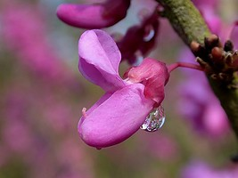
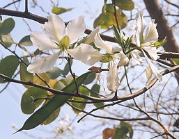
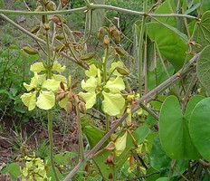

# [[Cercideae]] 

     

## #has_/text_of_/abstract 

> Cercidoideae is a subfamily in the pea family, Fabaceae. 
> 
> Well-known members include Cercis (redbuds), 
> including species widely cultivated as ornamental trees in the United States and Europe, 
> Bauhinia, widely cultivated as an ornamental tree in tropical Asia, 
> and Tylosema , a semi-woody genus of Africa. 
> 
> The subfamily occupies a basal position within the Fabaceae 
> and is supported as monophyletic in many molecular phylogenies. 
> 
> At the 6th International Legume Conference, 
> the Legume Phylogeny Working Group proposed elevating the tribe Cercidae 
> to the level of subfamily within the Leguminosae (Fabaceae). 
> The consensus agreed to the change, which was fully implemented in 2017. 
> It has the following clade-based definition:
>
>
> The most inclusive crown clade containing Cercis canadensis L. and Bauhinia divaricata L. but not Poeppigia procera C.Presl, Duparquetia orchidacea Baill., or Bobgunnia fistuloides (Harms) J.H.Kirkbr. & Wiersema.
>
> Many genera show unique palynology.
>
> [Wikipedia](https://en.wikipedia.org/wiki/Cercidoideae) 

## Introduction

[Martin F. Wojciechowski and Johanna Mahn]() 

Found across the globe from North America to East Asia, the tribe
Cercideae is the basally branching lineage in Fabaceae. The tribe is
divided into two subtribes, *Cercidinae*, the subtribe containing
*Cercis, Griffonia*, and *Adenolobus*, and *Bauhiniinae*, the subtribe
containing *Bauhinia* sens. lat. and *Brenierea*, based on seed, floral
and fruit characters (Wunderlin et al., 1981, 1987).

Within Cercideae, *Cercis* L. (\"redbud\"), which is the sister group to
the rest of the tribe, includes 10 species of shrubs and small trees
found in Mediterranean climates from western North America to central
Asia. Many of the species of *Cercis* have papilionoid-like flowers, but
the genus is not closely related evolutionarily to Papilionoideae (Lewis
and Forest, 2005). *Cercis canadensis,* found in the eastern United
States, produces red-purple flowers that are edible and used in salads.
*Griffonia* and *Adenolobus* are both African genera, with *Griffonia*
found in Western Africa and *Adenolobus* found in Southwestern Africa
(Mabberley, 1993). *Adenolobus* often have glandular fruits, the
characteristic they get their name from, and grow in tropical to
subtropical shrublands. *Griffonia* are shrubs and lianas found in
tropical humid forests, swamp forests, thickets, and grasslands and are
often used to make huts and baskets, and as medicines (Lewis and Forest,
2005).

According to Lewis and Forest (2005) *Bauhinia* sens. lat. is divided
into eight genera of trees and shrubs found in pantropical regions. The
number of genera in *Bauhinia sens. lat.* is still debated due to great
diversity among the group. The eight genera included in *Bauhinia sens.
lat.* are *Bauhinia, Gigasiphon, Tylosema, Barklya, Lysiphyllum,
Phanera, Lasiobema,* and *Piliostigma*. *Brenierea* is a monotypic genus
(one species) of tree or shrub found in Madagascar in subtropical
scrubland (Lewis and Forest, 2005). *Bauhinia* is a pantropical genus of
150 to 160 species of trees and shrubs, although most abundant in the
Neotropics (Lewis and Forest, 2005), and many species are lianas. The
flowers of *Bauhinia* are often pollinated by bats, birds, or insects
and some species produce explosive fruit, known to project seeds up to
15 m (Mabberley, 1993). Species of *Bauhinia* are used medicinally, for
tanning, and as food, dyes, and timber (Mabberley, 1993). The other
genera in *Bauhinia* sens. lat. include several species of lianas and
species that are important economically for their uses as timber,
medicinally, and sources of food.

### Discussion of Phylogenetic Relationships

Tribe Cercideae forms the basally branching lineage within Fabaceae
(i.e., the sister group to the rest of the family), a position supported
by numerous studies (e.g., Bruneau et al., 2001; Kajita et al., 2001;
Herendeen et al., 2003). In spite of considerable taxonomic work on the
tribe in the last 30 years, few species have been included in
phylogenetic analyses of either molecular or morphological data and thus
inter- and intrageneric relationships remain largely unresolved (Bruneau
et al., 2001; Herendeen et al., 2003). Within Cercideae, *Cercis* L. is
the most basally branching genus in the tribe, and recent studies have
provided some resolution of relationships in this genus (e.g., Davis et
al., 2002). *Cercis* plus *Adenolobus* and *Griffonia* appear to form
the sister group to *Brenierea* plus *Bauhinia* sens. lat., but this
relationship has not been well supported (here shown as a polytomy). In
addition, relationships among *Lysiphyllum, Phanera, Lasiobema,* and
*Piliostigma* are poorly resolved, largely due to sparse sampling from
these genera.

## Phylogeny 

-   « Ancestral Groups  
    -   [Fabaceae](../Fabaceae.md)
    -   [Fabales](../../Fabales.md)
    -   [Rosids](../../../Rosids.md)
    -  [Core Eudicots](../../../../Core_Eudicots.md))
    -   [Eudicots](../../../../../Eudicots.md)
    -   [Flowering_Plant](../../../../../../Flowering_Plant.md)
    -   [Seed_Plant](../../../../../../../Seed_Plant.md)
    -   [Land_Plant](../../../../../../../../Land_Plant.md)
    -  [Green plants](../../../../../../../../../Plant.md))
    -  [Eukarya](../../../../../../../../../../Eukarya.md))
    -   [Tree of Life](../../../../../../../../../../Tree_of_Life.md)

-   ◊ Sibling Groups of  Fabaceae
    -   Cercideae
    -   [Detarieae sensu lato](Detarieae.md)
    -   [Cassieae sensu lato (pro         parte)](Cassieae_%28pro_parte%29)
    -   [Caesalpinieae s.l. & s.s., Cassieae sensu stricto,         Mimosoideae](Caesalpinieae_s.l._%26_s.s.%2C_Cassieae_sensu_stricto%2C_Mimosoideae)
    -   [Papilionoideae](Papilionoideae.md)

-   » Sub-Groups 

## Title Illustrations

------------------------)
Scientific Name ::     Cercis chinensis Bunge
Specimen Condition   Live Specimen
Body Part            flower
Copyright ::            © [Annette Hoeggemeier](http://www.boga.ruhr-uni-bochum.de/)

-------------------)
Scientific Name ::     Bauhinia variegata L. (var. candida)
Specimen Condition   Live Specimen
Copyright ::            © [L. Ramsden](http://web.hku.hk/%7Elramsden/)

---------------------------)
Scientific Name ::  Tylosema fassoglensis (Kotschy) Torre & Hillc.
Location ::        Vumba rd near Altar Site, Mutare, Zimbabwe
Copyright ::         © 06/2006 [Mark Hyde and Bart Wursten](http://www.zimbabweflora.co.zw/)

## Confidential Links & Embeds: 

### #is_/same_as :: [Cercideae](/_Standards/bio/bio~Domain/Eukarya/Plant/Land_Plant/Seed_Plant/Flowering_Plant/Eudicots/Core_Eudicots/Rosids/Fabales/Fabaceae/Cercideae.md) 

### #is_/same_as :: [Cercideae.public](/_public/bio/bio~Domain/Eukarya/Plant/Land_Plant/Seed_Plant/Flowering_Plant/Eudicots/Core_Eudicots/Rosids/Fabales/Fabaceae/Cercideae.public.md) 

### #is_/same_as :: [Cercideae.internal](/_internal/bio/bio~Domain/Eukarya/Plant/Land_Plant/Seed_Plant/Flowering_Plant/Eudicots/Core_Eudicots/Rosids/Fabales/Fabaceae/Cercideae.internal.md) 

### #is_/same_as :: [Cercideae.protect](/_protect/bio/bio~Domain/Eukarya/Plant/Land_Plant/Seed_Plant/Flowering_Plant/Eudicots/Core_Eudicots/Rosids/Fabales/Fabaceae/Cercideae.protect.md) 

### #is_/same_as :: [Cercideae.private](/_private/bio/bio~Domain/Eukarya/Plant/Land_Plant/Seed_Plant/Flowering_Plant/Eudicots/Core_Eudicots/Rosids/Fabales/Fabaceae/Cercideae.private.md) 

### #is_/same_as :: [Cercideae.personal](/_personal/bio/bio~Domain/Eukarya/Plant/Land_Plant/Seed_Plant/Flowering_Plant/Eudicots/Core_Eudicots/Rosids/Fabales/Fabaceae/Cercideae.personal.md) 

### #is_/same_as :: [Cercideae.secret](/_secret/bio/bio~Domain/Eukarya/Plant/Land_Plant/Seed_Plant/Flowering_Plant/Eudicots/Core_Eudicots/Rosids/Fabales/Fabaceae/Cercideae.secret.md)

