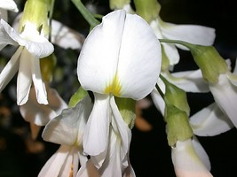
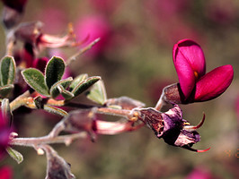

---
aliases:
  - Cladrastis
title: Cladrastis clade
---

## Phylogeny 

-   « Ancestral Groups  
    -   [Papilionoideae](../Papilionoideae.md)
    -   [Fabaceae](../../Fabaceae.md)
    -   [Fabales](../../../Fabales.md)
    -   [Rosids](../../../../Rosids.md)
    -  [Core Eudicots](../../../../../Core_Eudicots.md) 
    -   [Eudicots](../../../../../../Eudicots.md)
    -   [Flowering_Plant](../../../../../../../Flowering_Plant.md)
    -   [Seed_Plant](../../../../../../../../Seed_Plant.md)
    -   [Land_Plant](../../../../../../../../../Land_Plant.md)
    -  [Green plants](../../../../../../../../../../Plant.md) 
    -  [Eukarya](../../../../../../../../../../../Eukarya.md) 
    -   [Tree of Life](../../../../../../../../../../../Tree_of_Life.md)

-   ◊ Sibling Groups of  Papilionoideae
    -   Cladrastis clade
    -   [Genistoid clade](Genistoid_clade)
    -   [Dalbergioid sensu lato clade](Dalbergioid_clade)
    -   [Millettioid sensu lato clade](Millettioid_clade)
    -   [Hologalegina](Hologalegina.md)

-   » Sub-Groups 

# [[Cladrastis]] 

 
 
 

## #has_/text_of_/abstract 

> **Cladrastis** (yellowwood) is a genus of flowering plants in the family Fabaceae. 
> It includes four species, three native to eastern Asia and one to southeastern North America.
>
> Species of Cladrastis are small to medium-sized deciduous trees 
> typically growing 10–20 m tall, exceptionally to 27 m tall. 
> The leaves are compound pinnate, with 5–17 alternately arranged leaflets. 
> The flowers are fragrant, white or pink, produced in racemes or panicles 15–40 cm long. 
> The fruit is a pod 3–8 cm long, containing one to six seeds.
>
> Cladrastis is related to the genus Maackia, 
> from which it differs in having the buds concealed in the leaf base, 
> and in the leaflets being arranged alternately on the leaf rachis, not in opposite pairs. 
> 
> The genus name derives from the Greek klados, branch, and thraustos, fragile, 
> referring to the brittle nature of the twigs.  
> 
> The combination of Cladrastis, Pickeringia and Styphnolobium form a monophyletic 
> clade known as the Cladrastis clade; 
> as the other two originated from within Cladrastis, Cladrastis is paraphyletic.
>
> [Wikipedia](https://en.wikipedia.org/wiki/Cladrastis) 

## Introduction

[Martin F. Wojciechowski]() 

Tribe Sophoreae has been considered a \"tribe of convenience\" to
include the heterogenous assemblage of genera within Papilionoideae that
have relatively simple flowers and unspecialized pinnate leaves
(Polhill, 1994). Since Polhill\'s last (1994) treatment of Sophoreae,
cladistic analyses of morphology (Chappill, 1995), pollen data (Ferguson
et al., 1994), and molecular sequences (e.g. Doyle et al., 1997; Kajita
et al., 2001; Pennington et al., 2001; Wojciechowski et al., 2004) have
clearly shown Sophoreae to be paraphyletic, its constituent genera
distributed as members of disparate, early-branching papilionoid
lineages.

One of the more interesting clades to emerge from these analyses is the
\"Cladrastis\" clade (Wojciechowski et al., 2004) containing the genera
*Cladrastis* Raf., *Pickeringia* Nutt. ex Torrey & A. Gray, and
*Styphnolobium* Schott. *Cladrastis* and *Styphnolobium* (segregate of
*Sophora* L.) have been traditionally classified in Sophoreae sens. str.
(Polhill, 1981, 1994), whereas *Pickeringia* has been classified in
tribe Thermopsideae (Turner, 1981). The close relationship of
*Cladrastis* and *Styphnolobium* is notable biogeographically because
both genera exhibit East Asian-North American disjunctions.

*Cladrastis*, with 6 to 7 species of trees found in warm temperate
montane evergreen, mixed-deciduous forests, is distributed in east Asia
(6 species; China to Japan) and eastern North America (1 sp.; southern
Illinois to North Carolina) (Duley and Vincent, 2003; Pennington et al.,
2005). *Styphnolobium*, with 9 species of trees inhabiting temperate to
seasonally-dry tropical woodlands to montane forests, is distributed
from North and Central America (8 species) to west-central China (1
species) (Pennington et al., 2005). *Pickeringia* is a monotypic genus
of spiny, xerophytic shrub restricted to the sclerophyllous chaparral
and mixed evergreen-woodland forest vegetation of California and
northern Baja California of Western North America (Raven and Axelrod,
1995).

Consistent with evidence of both *Cladrastis* (subgenus *Cladrastis* and
subgenus *Platycarpus*) and *Styphnolobium* represented in the fossil
record from the Middle Eocene (minimum 40 Ma) of Tennessee (Herendeen,
1992), age estimates based on rates analyses of molecular sequences
suggest this is one of the oldest clades of papilionoids (Lavin et al.,
2005).

### Discussion of Phylogenetic Relationships

The \"Cladrastis\" clade is one of the well-supported, early branching
clades of papilionoids to emerge from recent molecular analyses
(Wojciechowski et al., 2004). In this clade, the genera *Styphnolobium*
and *Pickeringia* are nested within a paraphyletic *Cladrastis*. The
close relationship between these three genera is supported by
similarities in floral morphology, chromosome number, and absence of
quinolizidine alkaloids.

The position of *Pickeringia* in the Cladrastis clade is consistent with
Polhill\'s (1981) and Sousa and Rudd\'s (1993) predictions of a close
relationship between these three genera based on floral morphology,
cytogenetic evidence, and the absence of quinolizidine alkaloids in
*Pickeringia* of the type that is characteristic of other members of
Thermopsideae (Turner, 1981). Recent analyses have failed to detect
similar alkaloids in *Cladrastis* and *Styphnolobium* (Kite and
Pennington, 2003), a finding consistent with the molecular data showing
a close phylogenetic relationship between these three genera.

## Title Illustrations

----------------------- 
)
Scientific Name ::     Cladrastis kentukea (Dum.-Cours.) Rudd
Location ::           Ithaca, NY, Cornell University Plantations
Specimen Condition   Live Specimen
Copyright ::            © 2006 [Kevin C. Nixon](http://www.plantsystematics.org/)

------------------------ 
)
Scientific Name ::     Styphnolobium japonicum (L.) Schott
Comments             Commonly called Japanese Pagodatree or Scholar-tree.
Specimen Condition   Live Specimen
Copyright ::            © [Mark Brand](http://www.hort.uconn.edu/plants/index.html)

------------------------ 
)
Scientific Name ::     Pickeringia montana var. tomentosa
Comments             Commonly called Chaparral Pea.
Specimen Condition   Live Specimen
Source Collection    [CalPhotos](http://calphotos.berkeley.edu/)
Copyright ::            © 1996 [Christopher L. Christie](mailto:refugee2000@qwest.net)

## Confidential Links & Embeds: 

### #is_/same_as :: [Cladrastis](/_Standards/bio/bio~Domain/Eukarya/Plant/Land_Plant/Seed_Plant/Flowering_Plant/Eudicots/Core_Eudicots/Rosids/Fabales/Fabaceae/Papilionoideae/Cladrastis.md) 

### #is_/same_as :: [Cladrastis.public](/_public/bio/bio~Domain/Eukarya/Plant/Land_Plant/Seed_Plant/Flowering_Plant/Eudicots/Core_Eudicots/Rosids/Fabales/Fabaceae/Papilionoideae/Cladrastis.public.md) 

### #is_/same_as :: [Cladrastis.internal](/_internal/bio/bio~Domain/Eukarya/Plant/Land_Plant/Seed_Plant/Flowering_Plant/Eudicots/Core_Eudicots/Rosids/Fabales/Fabaceae/Papilionoideae/Cladrastis.internal.md) 

### #is_/same_as :: [Cladrastis.protect](/_protect/bio/bio~Domain/Eukarya/Plant/Land_Plant/Seed_Plant/Flowering_Plant/Eudicots/Core_Eudicots/Rosids/Fabales/Fabaceae/Papilionoideae/Cladrastis.protect.md) 

### #is_/same_as :: [Cladrastis.private](/_private/bio/bio~Domain/Eukarya/Plant/Land_Plant/Seed_Plant/Flowering_Plant/Eudicots/Core_Eudicots/Rosids/Fabales/Fabaceae/Papilionoideae/Cladrastis.private.md) 

### #is_/same_as :: [Cladrastis.personal](/_personal/bio/bio~Domain/Eukarya/Plant/Land_Plant/Seed_Plant/Flowering_Plant/Eudicots/Core_Eudicots/Rosids/Fabales/Fabaceae/Papilionoideae/Cladrastis.personal.md) 

### #is_/same_as :: [Cladrastis.secret](/_secret/bio/bio~Domain/Eukarya/Plant/Land_Plant/Seed_Plant/Flowering_Plant/Eudicots/Core_Eudicots/Rosids/Fabales/Fabaceae/Papilionoideae/Cladrastis.secret.md)

