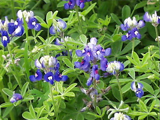
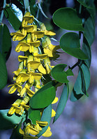
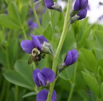

## Phylogeny 

-   « Ancestral Groups  
    -   [Papilionoideae](../Papilionoideae.md)
    -   [Fabaceae](../../Fabaceae.md)
    -   [Fabales](../../../Fabales.md)
    -   [Rosids](../../../../Rosids.md)
    -  [Core Eudicots](../../../../../Core_Eudicots.md))
    -   [Eudicots](../../../../../../Eudicots.md)
    -   [Flowering_Plant](../../../../../../../Flowering_Plant.md)
    -   [Seed_Plant](../../../../../../../../Seed_Plant.md)
    -   [Land_Plant](../../../../../../../../../Land_Plant.md)
    -  [Green plants](../../../../../../../../../../Plant.md))
    -  [Eukarya](../../../../../../../../../../../Eukarya.md))
    -   [Tree of Life](../../../../../../../../../../../Tree_of_Life.md)

-   ◊ Sibling Groups of  Papilionoideae
    -   [Cladrastis clade](Cladrastis_clade)
    -   Genistoid clade
    -   [Dalbergioid sensu lato clade](Dalbergioid_clade)
    -   [Millettioid sensu lato clade](Millettioid_clade)
    -   [Hologalegina](Hologalegina.md)

-   » Sub-Groups 

# [[Genistoid]] 

     

## Introduction

[Martin F. Wojciechowski and Johanna Mahn]() 

The \"Genistoid\" clade is an informal name given to a group of
papilionoids that includes the many genera traditionally classified in
the tribes Genisteae, Brongniartieae, Crotalarieae, Euchresteae,
Liparieae, Podalyrieae, and Thermopsideae, and some genera of the
polyphyletic tribe Sophoreae (Käss and Wink, 1997; Crisp et al., 2000).
The \"genistoid alliance\" as circumscribed by Polhill (1981, 1994)
brought together this group of predominantly Old World, Southern
Hemisphere tribes (and others) that have been considered closely related
and comprising four separate lineages: one lineage included the
predominantly Northern Hemisphere Genisteae sens. str., Euchresteae,
Thermopsideae, together with the \"Sophora\" group of Sophoreae; the
second consists of the mainly southern African Crotalarieae, Podalyrieae
(now including Liparieae), and Hypocalypteae; a third comprised of the
endemic Australasian Bossiaeeae and Mirbelieae; and the fourth, the
Neotropical-Australian Brongniartieae.

Of the four lineages proposed by Polhill (1981, 1994), only the
Australasian Bossiaeeae-Mirbelieae lineage appears to be monophyletic
based on recent phylogenetic studies. Bossiaeeae plus Mirbelieae,
together with the South African Hypocalypteae as its sister group, form
a well-supported monophyletic group which is more closely related to
Baphioid clade of Sophoreae (Kajita et al., 2001; Pennington et al.,
2001) and the larger clade that includes the Millettioid sens. lat.
clade and Hologalegina than to the Genistoids (Wojciechowski et al.,
2004). The remaining three lineages (minus tribe Hypocalypteae) comprise
the Genistoid clade; see Discussion of Phylogenetic Relationships below.

### Characteristics

Members of the Genistoid clade are commonly shrubs and often have a
broom-like habit, sharing a variety of morphological features, base
chromosome numbers, and chemical synthetic capabilities (Polhill, 1994).
The genistoids were previously distinguished by their different types
and degrees of staminal fusion, but this characteristic has been shown
to have multiple origins and proven unreliable as a defining
characteristic (Crisp et al., 2000).

Common traits among species of genistoids include: xeromorphic growth,
simple or reduced leaves or, if the leaves are compound, they have few
leaflets, contracted vegetative structure and inflorescences, elaborated
flowers, dimorphic anthers, and seeds that produce a hilar lobe
extension of the radicle (Crisp et al., 2000). The synthesis of
quinolizidine alkaloids may prove to be a chemical synapomorphy for this
clade (see Discussion of Phylogenetic Relationships).

### Discussion of Phylogenetic Relationships

Early molecular phylogenetic studies (e.g., Doyle et al., 1997; Käss and
Wink, 1997) suggested the existence of a monophyletic group branching
near the base of papilionoids that included many members of the
Polhill\'s (1981) \"genistoid alliance\" together with certain genera of
Sophoreae. Crisp et al. (2000) confirmed the polyphyly of the genistoid
alliance and suggested the name be restricted to a smaller,
well-supported \"core genistoids\" group that comprises the majority of
the tribes from Africa and Eurasia (Crotalarieae, Euchresteae,
Genisteae, Podalyrieae, Sophoreae sens. strict., and Thermopsideae).
Studies based on molecular data alone or molecular data combined with
phytochemical data (e.g., Crisp et al., 2000; Kajita et al., 2001;
Pennington et al., 2001; Wink and Mohamed, 2003; Wojciechowski et al.,
2004) are still far from complete with regard to resolving relationships
among the members of these tribes within the larger groups that comprise
this clade.

This clade has also received strong support from more recent studies
which additionally suggest this core genistoids group is nested within a
more inclusive Genistoid clade that includes the Brongniartieae (sensu
Crisp and Weston, 1987), recently expanded to include two Neotropical
genera, *Cyclolobium* Benth. and *Poecilanthe* Benth. (both formerly of
tribe Millettieae), based on molecular sequence and phytochemical data
(Crisp et al., 2000; Hu et al., 2000; Kite, 2005), and a number of
largely woody, Neotropical genera of Sophoreae such as *Acosmium*
Schott, *Bolusanthus* Harms, *Diplotropis* Benth., and most likely
*Ormosia* Jackson and *Clathrotropis* Harms (Kajita et al., 2001;
Pennington et al., 2001; Wojciechowski et al., 2004). The relationships
among these particular taxa (e.g., Sophoreae pro parte) has not been
definitively resolved by these studies but is the subject of active
investigation.

The monophyly of the Genistoid clade is also supported by the taxonomic
distribution of the synthesis of quinolizidine alkaloids (Kinghorn and
Balandrin, 1984; Crisp et al., 2000; van Wyk, 2003); all species known
to accumulate these particular alkaloids, with few exceptions (e.g.
*Calia*, Kite and Pennington, 2003; and *Ormosia*, Kinghorn and
Balandrin, 1984) are members of the Genistoid clade as defined here
(Lewis et al., 2005). More comprehensive sampling for alkaloids and more
robust molecular phylogenies of papilionoids should clarify the
relationship of these specific taxa to the genistoids (i.e., as the
sister group to genistoids) as well as resolve the issue of whether the
synthesis of quinolizidine alkaloids is indeed a non-molecular
synapomorphy for the Genistoid clade.

## Title Illustrations

----------------------------------)
Scientific Name ::  Lupinus texensis Hook.
Copyright ::         © [Bill Lindemann](http://www.depts.ttu.edu/hillcountry/research/images/LUPINUS%20TEXENSIS.JPG)

---------------------------)
Scientific Name ::  Sophora tomentosa L.
Copyright ::         © [J. Paul Scurlock Collection](http://www.fairchildgarden.org/index.html)

------------------)
Scientific Name ::     Baptisia australis R.Br.
Specimen Condition   Live Specimen
Copyright ::            © 2006 [Don Les](mailto:don.les@uconn.edu)

## Confidential Links & Embeds: 

### #is_/same_as :: [Genistoid](/_Standards/bio/bio~Domain/Eukarya/Plant/Land_Plant/Seed_Plant/Flowering_Plant/Eudicots/Core_Eudicots/Rosids/Fabales/Fabaceae/Papilionoideae/Genistoid.md) 

### #is_/same_as :: [Genistoid.public](/_public/bio/bio~Domain/Eukarya/Plant/Land_Plant/Seed_Plant/Flowering_Plant/Eudicots/Core_Eudicots/Rosids/Fabales/Fabaceae/Papilionoideae/Genistoid.public.md) 

### #is_/same_as :: [Genistoid.internal](/_internal/bio/bio~Domain/Eukarya/Plant/Land_Plant/Seed_Plant/Flowering_Plant/Eudicots/Core_Eudicots/Rosids/Fabales/Fabaceae/Papilionoideae/Genistoid.internal.md) 

### #is_/same_as :: [Genistoid.protect](/_protect/bio/bio~Domain/Eukarya/Plant/Land_Plant/Seed_Plant/Flowering_Plant/Eudicots/Core_Eudicots/Rosids/Fabales/Fabaceae/Papilionoideae/Genistoid.protect.md) 

### #is_/same_as :: [Genistoid.private](/_private/bio/bio~Domain/Eukarya/Plant/Land_Plant/Seed_Plant/Flowering_Plant/Eudicots/Core_Eudicots/Rosids/Fabales/Fabaceae/Papilionoideae/Genistoid.private.md) 

### #is_/same_as :: [Genistoid.personal](/_personal/bio/bio~Domain/Eukarya/Plant/Land_Plant/Seed_Plant/Flowering_Plant/Eudicots/Core_Eudicots/Rosids/Fabales/Fabaceae/Papilionoideae/Genistoid.personal.md) 

### #is_/same_as :: [Genistoid.secret](/_secret/bio/bio~Domain/Eukarya/Plant/Land_Plant/Seed_Plant/Flowering_Plant/Eudicots/Core_Eudicots/Rosids/Fabales/Fabaceae/Papilionoideae/Genistoid.secret.md)

