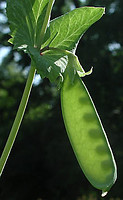
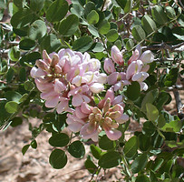
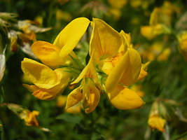

---
aliases:
  - Hologalegina
title: Hologalegina
---

## Phylogeny 

-   « Ancestral Groups  
    -   [Papilionoideae](../Papilionoideae.md)
    -   [Fabaceae](../../Fabaceae.md)
    -   [Fabales](../../../Fabales.md)
    -   [Rosids](../../../../Rosids.md)
    -  [Core Eudicots](../../../../../Core_Eudicots.md) 
    -   [Eudicots](../../../../../../Eudicots.md)
    -   [Flowering_Plant](../../../../../../../Flowering_Plant.md)
    -   [Seed_Plant](../../../../../../../../Seed_Plant.md)
    -   [Land_Plant](../../../../../../../../../Land_Plant.md)
    -  [Green plants](../../../../../../../../../../Plant.md) 
    -  [Eukarya](../../../../../../../../../../../Eukarya.md) 
    -   [Tree of Life](../../../../../../../../../../../Tree_of_Life.md)

-   ◊ Sibling Groups of  Papilionoideae
    -   [Cladrastis clade](Cladrastis_clade)
    -   [Genistoid clade](Genistoid_clade)
    -   [Dalbergioid sensu lato clade](Dalbergioid_clade)
    -   [Millettioid sensu lato clade](Millettioid_clade)
    -   Hologalegina

-   » Sub-Groups
    -   [IRLC (Inverted Repeat-lacking         clade)](IRLC_%28Inverted_Repeat-lacking_clade%29)
    -   [Robinioid clade](Robinioid_clade)

# [[Hologalegina]] 

      

## Introduction

[Martin F. Wojciechowski]() 

\"Hologalegina\" is an informal name given to the largest of the
well-supported major clades of papilionoids (Wojciechowski et al., 2000). 

It contains the mainly Old World tribes Galegeae, Carmichaelieae,
Cicereae, Hedysareae, Trifolieae, Fabeae (a.k.a. Vicieae) 
plus Loteae sens. lat. (Loteae and Coronilleae) 
and predominantly New World Robinieae. 

This clade includes over 4,800 species which make up the vast
majority of predominantly herbaceous legumes distributed in temperate
regions of the world (especially Eurasia, North and South America),
including many of the familiar, domesticated crop and forage legumes
such as *Pisum sativum* (garden pea), *Medicago sativum* (alfalfa),
*Lens* (lentils), *Cicer arietinum* (chickpea), (*Trifolium* spp.
(clovers), *Vicia faba* (faba bean), *Wisteria* spp. (wisterias),
*Astragalus* (locoweeds; the largest genus of vascular plants, with
2,500 spp.), and the genetic/genomic model species *Medicago truncatula*
(barrel medic), *Pisum sativum* (garden pea), and *Lotus corniculatus*.
Unlike some of the other major papilionoid subclades, Hologalegina lacks
an Early Eocene fossil record. Remarkably the mean age of this crown
clade is estimated at 50.6 Ma (Lavin et al., 2005).

### Discussion of Phylogenetic Relationships

Hologalegina corresponds closely to Polhill\'s (1981, 1994) \"temperate
herbaceous group\", or the \"galegoid alliance\" as it is sometimes
called, long considered a natural group based on a combination of
morphological and anatomical features shared by most of its members and
centers of diversity (and presumed origin) in Eurasia and to a lesser
extent, North America. Two well-supported subclades, the \"robinioids\"
and the \"Inverted Repeat-lacking\" clade or IRLC, comprise
Hologalegina. Evidence for this clade emerged from early phylogenetic
studies based on the *rbcL* gene (Doyle et al., 1997; Käss and Wink,
1997) but sampling was sparse and support was quite limited. The
monophyly of Hologalegina is now substantiated by phylogenetic analyses
of both plastid *matK*/*trnK* sequences (Hu et al., 2000; Wojciechowski
et al., 2000, 2004), from nuclear *PHY* gene sequences (Lavin et al.,
1998) and rDNA ITS sequences (Hu, 2000), and an early supertree analysis
based on published molecular studies (Wojciechowski et al., 2000). These
same studies have conclusively shown strong support not only for the two
subclades, the IRLC and Robinioids, but also for a sister group
relationship of Hologalegina to the Millettioids sens. lat. clade.

## Title Illustrations

--------------------------- 
)
Scientific Name ::     Pisum sativum L.
Specimen Condition   Live Specimen
Copyright ::            © [H. Schneider](http://www.biologie.uni-hamburg.de/b-online/e02/02.htm)

------------------------------------------------------------------------------

Scientific Name ::  Robinia neomexicana A. Gray
Location ::        Mount Ord, AZ
Copyright ::         © [Martin F. Wojciechowski](http://www.public.asu.edu/%7Emfwojci/) 

----------------------------------------- 
)
Scientific Name ::  Lotus corniculatus L.
Copyright ::         © [Franco Tobias](http://serc.fiu.edu/periphyton/periphyton/factwebpage/Franco%27s%20photo%20webpage/Main%20page.htm)

## Confidential Links & Embeds: 

### #is_/same_as :: [Hologalegina](/_Standards/bio/bio~Domain/Eukarya/Plant/Land_Plant/Seed_Plant/Flowering_Plant/Eudicots/Core_Eudicots/Rosids/Fabales/Fabaceae/Papilionoideae/Hologalegina.md) 

### #is_/same_as :: [Hologalegina.public](/_public/bio/bio~Domain/Eukarya/Plant/Land_Plant/Seed_Plant/Flowering_Plant/Eudicots/Core_Eudicots/Rosids/Fabales/Fabaceae/Papilionoideae/Hologalegina.public.md) 

### #is_/same_as :: [Hologalegina.internal](/_internal/bio/bio~Domain/Eukarya/Plant/Land_Plant/Seed_Plant/Flowering_Plant/Eudicots/Core_Eudicots/Rosids/Fabales/Fabaceae/Papilionoideae/Hologalegina.internal.md) 

### #is_/same_as :: [Hologalegina.protect](/_protect/bio/bio~Domain/Eukarya/Plant/Land_Plant/Seed_Plant/Flowering_Plant/Eudicots/Core_Eudicots/Rosids/Fabales/Fabaceae/Papilionoideae/Hologalegina.protect.md) 

### #is_/same_as :: [Hologalegina.private](/_private/bio/bio~Domain/Eukarya/Plant/Land_Plant/Seed_Plant/Flowering_Plant/Eudicots/Core_Eudicots/Rosids/Fabales/Fabaceae/Papilionoideae/Hologalegina.private.md) 

### #is_/same_as :: [Hologalegina.personal](/_personal/bio/bio~Domain/Eukarya/Plant/Land_Plant/Seed_Plant/Flowering_Plant/Eudicots/Core_Eudicots/Rosids/Fabales/Fabaceae/Papilionoideae/Hologalegina.personal.md) 

### #is_/same_as :: [Hologalegina.secret](/_secret/bio/bio~Domain/Eukarya/Plant/Land_Plant/Seed_Plant/Flowering_Plant/Eudicots/Core_Eudicots/Rosids/Fabales/Fabaceae/Papilionoideae/Hologalegina.secret.md)

