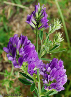

# IRLC (Inverted Repeat-lacking clade) 

        

## Introduction

[Martin F. Wojciechowski]() 

The Inverted Repeat-lacking clade or IRLC (Wojciechowski et al., 2000),
so-called because it is uniquely marked by the loss of one copy of the
large inverted repeat (approx. 25 kilobase) in the chloroplast genome
(see below, under Characteristics), includes most members of Polhill\'s
(1981) \"temperate herbaceous group\" of papilionoids. This group
comprises all members of tribes Cicereae, Hedysareae, Trifolieae, and
Fabeae (also known as Vicieae), as well as at least three genera,
*Afgekia* Craib., *Callerya* Endl., and *Wisteria* Nutt., currently
treated in tribe Millettieae (Schrire, 2005), nested within the
paraphyletic tribe Galegeae (Polhill, 1994).

Polhill\'s \"temperate herbaceous group\" of tribes 
had been distinguished from other predominantly temperate tribes 
such as Thermopsideae (e.g., genera such as *Baptisia, Thermopsis*) 
by the accumulation of the non-protein amino acid canavanine, 
rather than alkaloids, in seeds. 

This group contains many of the familiar temperate
and [agriculturally important legumes](http://www.tolweb.org/notes/?note_id=3968) such as 
alfalfa, clovers, lentils, chickpea, garden pea, vetches, as well as locoweeds,
and ornamental \"desert peas\" and wisterias. 

The IRLC also includes a large number of model species 
such as *Medicago truncatula* (barrel medic), *Medicago sativa* (alfalfa), 
*Pisum sativum* (garden pea), *Vicia faba* (fava bean), and *Trifolium repens* (white clover), 
used for studies of symbiotic nitrogen fixation, root nodule development,
legume development, genetics and genomics, and bacterial-plant coevolution.

### Characteristics

The IRLC is dominated by often large, temperate genera such as
*Astragalus* L., *Hedysarum* L., *Medicago* L., *Oxytropis* DC.,
*Swainsona* Salisb., and *Trifolium* L., which share a number of
morphological characters including a predominantly herbaceous habit
(annual and perennial), epulvinate compound leaves, stipules adnate to
the petiole, base chromosome numbers of *n* = 7 or *n* = 8, and centers
of greatest species diversity in Eurasia and North America (Polhill and
Raven, 1981; Polhill, 1994), in addition to the loss of one copy of the
inverted repeat in the chloroplast genome. This structural mutation in
legumes (Palmer et al., 1987; Lavin et al., 1990) is particularly
remarkable since the inverted repeat, which encodes a duplicate set of
ribosomal RNA genes (structural RNA molecules used to make ribosomes
which are part of the cell machinery for protein synthesis), is an
evolutionary conserved feature of green algal and land plant
[chloroplast genomes](http://www.tolweb.org/notes/?note_id=4148) (Palmer
et al., 1988), and is known to be absent otherwise only from certain
conifers (Strauss et al., 1988) and a few, specific genera in the
angiosperm families Geraniaceae and Orobanchaceae (Downie and Palmer,
1992).

### Discussion of Phylogenetic Relationships

The IRLC was the first clade within legumes essentially distinguished on
the basis of a molecular synapomorphy, the loss of one copy of the 25-kb
IR in the chloroplast genome. The monophyly of the IRLC has been
consistently and strongly supported (e.g., 100% bootstrap proportions)
in essentially all studies based on cladistic analyses of molecular
data, including chloroplast DNA restriction fragment length
polymorphisms (Lavin et al., 1990; Liston, 1995), nuclear rDNA ITS
sequences (Sanderson and Wojciechowski, 1996) and chloroplast
gene/intron sequences (Doyle et al., 1997; Käss and Wink, 1997; Hu et
al., 2000; Kajita et al., 2001; Wojciechowski et al., 2004).

Within the IRLC, the so-called \"IRLC millettioids\", genera *Afgekia*,
*Callerya*, and *Wisteria* (and possibly *Endosamara*) along with
*Glycyrrhiza* of Galegeae form a paraphyletic grade at the base of the
IRLC. Relationships among these lineages are currently not well-resolved
or supported, a consequence most likely due to the lack of adequate
sampling. Three well-supported subclades, the \"Hedysaroid\" clade,
Galegeae sens. lat., and the \"Vicioid\" clade, comprise the remainder
of the IRLC. The tribe Hedysareae (Polhill, 1994), recently expanded by
Lock (2005) to include the genera *Calophaca*, *Caragana*,
*Halimodendron*, and *Alhagi* formerly treated in Galegeae (Polhill,
1994) in addition to the large genera *Hedysarum* and *Onobrychis*,
comprises the Hedysaroid clade. However, sampling within the Hedysaroid
clade has been limited and relationships both within and among the 12
genera (and 400-450 species) remain poorly understood.

The Galegeae sens. lat. subclade of the IRLC consists of the majority of
genera formerly treated in tribe Galegeae (sensu Polhill, 1994; Lock and
Schrire, 2005) and include *Astragalus*, *Chesneya*, *Oxytropis*,
*Sutherlandia*, *Swainsona*, *Colutea*, and *Carmichaelia*. With the
exception of *Astragalus* and *Oxytropis*, all of these genera are
distributed exclusively in Eurasia, Africa, or Australasia. Nested
within this group is the well-supported \"Astragalean\" clade which
includes the genus *Astragalus*, the largest genus of vascular plants
with an estimated 2,500 species (plus a number of segregates),
*Oxytropis*, and subtribe Colutinae (Wojciechowsk et al., 1999, 2000).

The Vicioid subclade of the IRLC includes many of the agriculturally
important genera and model species such as *Cicer, Medicago, Pisum,
Trifolium*, and *Vicia*. Within this subclade, the genus *Parochetus*
(Trifolieae) is consistently resolved as the sister group to all other
vicioid taxa; genus *Galega* forms the sister group to the monogeneric
tribe Cicereae (*Cicer*), and together these taxa form the sister group
to a clade that includes the tribes Trifolieae and Fabeae (formely known
as Vicieae) (Steele and Wojciechowski, 2003; Wojciechowski et al.,
2004). Results based on analyses of the *matK* gene (Steele and
Wojciechowski, 2003) suggest the genus *Trifolium* (\"clovers\") is the
sister group to the Fabeae rather than to remaining members of the tribe
Trifolieae, but this position is still weakly supported and the subject
of on-going investigation (e.g., see recent phylogeny of *Trifolium*;
Ellison et al., 2006).

## Phylogeny 

-   « Ancestral Groups  
    -   [Hologalegina](../Hologalegina.md)
    -   [Papilionoideae](../../Papilionoideae.md)
    -   [Fabaceae](../../../Fabaceae.md)
    -   [Fabales](../../../../Fabales.md)
    -   [Rosids](../../../../../Rosids.md)
    -  [Core Eudicots](../../../../../../Core_Eudicots.md))
    -   [Eudicots](../../../../../../../Eudicots.md)
    -   [Flowering_Plant](../../../../../../../../Flowering_Plant.md)
    -   [Seed_Plant](../../../../../../../../../Seed_Plant.md)
    -   [Land_Plant](../../../../../../../../../../Land_Plant.md)
    -  [Green plants](../../../../../../../../../../../Plant.md))
    -  [Eukarya](../../../../../../../../../../../../Eukarya.md))
    -   [Tree of Life](../../../../../../../../../../../../Tree_of_Life.md)

-   ◊ Sibling Groups of  Hologalegina
    -   IRLC (Inverted Repeat-lacking clade)
    -   [Robinioid clade](Robinioid_clade)

-   » Sub-Groups 

## Title Illustrations

------------------------------)
Scientific Name ::     Medicago sativa L.
Specimen Condition   Live Specimen
Copyright ::            © 2006 [International Legume Research Institute](http://www.tropicalforages.info/)

---------------------)
Scientific Name ::     Astragalus purshii Dougl. ex G.Don
Location ::           California, USA
Specimen Condition   Live Specimen
Copyright ::            © 2006 [Jay Sullivan](http://www.timetotrack.com/jay/)

---------------------

Scientific Name ::     Pisum sativum L.
Location ::           Island of Mallorca, Spain
Specimen Condition   Live Specimen
Copyright ::            © 2006 [Jardin Mundani](http://jardin-mundani.info/)

-------------------------)
Scientific Name ::     Wisteria sinensis (Sims) Sweet
Specimen Condition   Live Specimen
Copyright ::            © 2006 [Annette Höggemeier](http://www.boga.ruhr-uni-bochum.de/)

## Confidential Links & Embeds: 

### #is_/same_as :: [Inverted_Repeat-lacking](/_Standards/bio/bio~Domain/Eukarya/Plant/Land_Plant/Seed_Plant/Flowering_Plant/Eudicots/Core_Eudicots/Rosids/Fabales/Fabaceae/Papilionoideae/Hologalegina/Inverted_Repeat-lacking.md) 

### #is_/same_as :: [Inverted_Repeat-lacking.public](/_public/bio/bio~Domain/Eukarya/Plant/Land_Plant/Seed_Plant/Flowering_Plant/Eudicots/Core_Eudicots/Rosids/Fabales/Fabaceae/Papilionoideae/Hologalegina/Inverted_Repeat-lacking.public.md) 

### #is_/same_as :: [Inverted_Repeat-lacking.internal](/_internal/bio/bio~Domain/Eukarya/Plant/Land_Plant/Seed_Plant/Flowering_Plant/Eudicots/Core_Eudicots/Rosids/Fabales/Fabaceae/Papilionoideae/Hologalegina/Inverted_Repeat-lacking.internal.md) 

### #is_/same_as :: [Inverted_Repeat-lacking.protect](/_protect/bio/bio~Domain/Eukarya/Plant/Land_Plant/Seed_Plant/Flowering_Plant/Eudicots/Core_Eudicots/Rosids/Fabales/Fabaceae/Papilionoideae/Hologalegina/Inverted_Repeat-lacking.protect.md) 

### #is_/same_as :: [Inverted_Repeat-lacking.private](/_private/bio/bio~Domain/Eukarya/Plant/Land_Plant/Seed_Plant/Flowering_Plant/Eudicots/Core_Eudicots/Rosids/Fabales/Fabaceae/Papilionoideae/Hologalegina/Inverted_Repeat-lacking.private.md) 

### #is_/same_as :: [Inverted_Repeat-lacking.personal](/_personal/bio/bio~Domain/Eukarya/Plant/Land_Plant/Seed_Plant/Flowering_Plant/Eudicots/Core_Eudicots/Rosids/Fabales/Fabaceae/Papilionoideae/Hologalegina/Inverted_Repeat-lacking.personal.md) 

### #is_/same_as :: [Inverted_Repeat-lacking.secret](/_secret/bio/bio~Domain/Eukarya/Plant/Land_Plant/Seed_Plant/Flowering_Plant/Eudicots/Core_Eudicots/Rosids/Fabales/Fabaceae/Papilionoideae/Hologalegina/Inverted_Repeat-lacking.secret.md)

