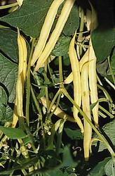
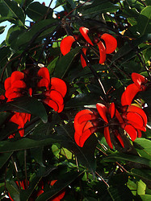

---
aliases:
  - Millettioid
title: Millettioid sensu lato clade
---

# [[Millettioid]] sensu lato 

 
 

## Introduction

[Martin F. Wojciechowski]() 

The Millettioid sens. lat. clade includes all genera in the tribes
Millettieae (except for *Afgekia*, *Callerya*, and *Wisteria* in the
IRLC), Abreae, Indigofereae, Phaseoleae, and Psoraleeae, and subtribes
Desmodiinae and Lespedezinae of Desmodieae (Wojciechowski et al., 2004).
The predominantly tropical, woody Old World tribe Millettieae has been
considered to be a \"transitional link\" from the \"less advanced\"
members of tribes Dalbergieae and Sophoreae to the putatively \"more
advanced\" Old World tribes like Phaseoleae and Galegeae (Geesink, 1981,
1984; Polhill, 1981); the term \"advanced\" was used by these authors to
indicate a high degree of fusion of stamens and keep petals, as well as
the accumulation of non-protein amino acids in seeds rather than
alkaloids.

Members of this clade are primarily distributed in tropical and
subtropical to warm temperate regions of the Old World. Tribe
Indigofereae, with seven genera and c. 768 species, is predominantly
African-Madagascan in distribution; the large genus *Indigofera* (c. 700
spp.) is distributed pantropically (Schrire, 2005a. Tribe Abreae, with
17 species in the sole genus *Abrus*, is predominantly
African-Madagascan in distribution, with a few species in Asia and two
that are pantropical (Schrire, 2005c). Tribe Millettieae, with 45 genera
such as *Derris, Millettia*, and *Lonchocarpus*, and c. 910 species
(Schrire, 2005b), is primarily distributed in tropical to subtropical
Africa and Australasia with a few groups found in the Neotropics (e.g.,
the Lonchocarpus, Piscidia, and Tephrosia groups).

### Discussion of Phylogenetic Relationships

Early studies using *rbcL* sequences by Doyle et al. (1997) and
subsequent studies using nuclear phytochrome gene sequences (Lavin et
al., 1998), chloroplast *matK/trnK* sequences (Hu et al., 2000), and
combined molecular data (Hu, 2000) conclusively showed that Millettieae
and Phaseoleae are polyphyletic tribes, and that tribe Indigofereae
formed the sister group to them. The emerging pattern of relationships
in the Millettieae sens. lat. clade derived from these studies and more
recent analyses of molecular sequence data (Kajita et al., 2001;
Wojciechowski et al., 2004) is that most of the constituent genera of
Millettieae and Phaseoleae are included in two very well-supported
subclades, the first dominated by tribe Millettieae and including tribe
Abreae and subtribes Diocleinae and Ophrestinae of Phaseoleae, forming
the sister group to a second subclade comprised of tribe Phaseoleae
(sens. strict.) together with tribes Desmodieae and Psoraleeae.
Relationships within each of these subclades are still very uncertain,
due in large part to the large number of genera in Millettieae (45
genera & c. 910 spp.; Schrire, 2005b) and Phaseoleae (89 genera & c.
1570 spp.; Schrire, 2005d), many of which have not been sampled for any
analysis to date. However, it is clear that neither tribe Millettieae
(Schrire, 2005b) nor Phaseoleae (Schrire, 2005d), as currently
circumscribed, are monophyletic; i.e., Abreae and subtribes Diocleinae
and Ophrestinae of Phaseoleae are nested within a paraphyletic
Millettieae, and Desmodieae and Psoraleeae are nested within a
paraphyletic Phaseoleae.

## Phylogeny 

-   « Ancestral Groups  
    -   [Papilionoideae](../Papilionoideae.md)
    -   [Fabaceae](../../Fabaceae.md)
    -   [Fabales](../../../Fabales.md)
    -   [Rosids](../../../../Rosids.md)
    -  [Core Eudicots](../../../../../Core_Eudicots.md) 
    -   [Eudicots](../../../../../../Eudicots.md)
    -   [Flowering_Plant](../../../../../../../Flowering_Plant.md)
    -   [Seed_Plant](../../../../../../../../Seed_Plant.md)
    -   [Land_Plant](../../../../../../../../../Land_Plant.md)
    -  [Green plants](../../../../../../../../../../Plant.md) 
    -  [Eukarya](../../../../../../../../../../../Eukarya.md) 
    -   [Tree of Life](../../../../../../../../../../../Tree_of_Life.md)

-   ◊ Sibling Groups of  Papilionoideae
    -   [Cladrastis clade](Cladrastis_clade)
    -   [Genistoid clade](Genistoid_clade)
    -   [Dalbergioid sensu lato clade](Dalbergioid_clade)
    -   Millettioid sensu lato clade
    -   [Hologalegina](Hologalegina.md)

-   » Sub-Groups 

## Title Illustrations

---------------------- 
 
scientific_name ::     Phaseolus vulgaris L.
specimen_condition ::  Live Specimen
copyright ::            © [Robert Kiedrowski](http://www.danad.com.pl/foto.htm)

----------------------- 
 
scientific_name ::     Erythrina falcata Bentham
location ::           Peru
Comments             Member of tribe Phaseoleae
specimen_condition ::  Live Specimen
copyright ::            © [Robin Foster](http://fm2.fieldmuseum.org/plantguides/)

## Confidential Links & Embeds: 

### #is_/same_as :: [[/_Standards/bio/bio~Domain/Eukarya/Plant/Land_Plant/Seed_Plant/Flowering_Plant/Eudicots/Core_Eudicots/Rosids/Fabales/Fabaceae/Papilionoideae/Millettioid|Millettioid]] 

### #is_/same_as :: [[/_public/bio/bio~Domain/Eukarya/Plant/Land_Plant/Seed_Plant/Flowering_Plant/Eudicots/Core_Eudicots/Rosids/Fabales/Fabaceae/Papilionoideae/Millettioid.public|Millettioid.public]] 

### #is_/same_as :: [[/_internal/bio/bio~Domain/Eukarya/Plant/Land_Plant/Seed_Plant/Flowering_Plant/Eudicots/Core_Eudicots/Rosids/Fabales/Fabaceae/Papilionoideae/Millettioid.internal|Millettioid.internal]] 

### #is_/same_as :: [[/_protect/bio/bio~Domain/Eukarya/Plant/Land_Plant/Seed_Plant/Flowering_Plant/Eudicots/Core_Eudicots/Rosids/Fabales/Fabaceae/Papilionoideae/Millettioid.protect|Millettioid.protect]] 

### #is_/same_as :: [[/_private/bio/bio~Domain/Eukarya/Plant/Land_Plant/Seed_Plant/Flowering_Plant/Eudicots/Core_Eudicots/Rosids/Fabales/Fabaceae/Papilionoideae/Millettioid.private|Millettioid.private]] 

### #is_/same_as :: [[/_personal/bio/bio~Domain/Eukarya/Plant/Land_Plant/Seed_Plant/Flowering_Plant/Eudicots/Core_Eudicots/Rosids/Fabales/Fabaceae/Papilionoideae/Millettioid.personal|Millettioid.personal]] 

### #is_/same_as :: [[/_secret/bio/bio~Domain/Eukarya/Plant/Land_Plant/Seed_Plant/Flowering_Plant/Eudicots/Core_Eudicots/Rosids/Fabales/Fabaceae/Papilionoideae/Millettioid.secret|Millettioid.secret]] 

