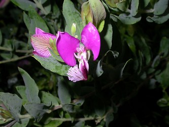

---
aliases:
- Blåfjærfamilien
- horčinkovité
- Họ Viễn chí
- Jungfrulinsväxter
- Krestuščevke
- Kreuzblumengewächse
- krzyżownicowate
- Krüsbluumplaanten
- Křižničkowe rostliny
- linnunruohokasvit
- milkwort
- Mælkeurt-familien
- pacsirtafűfélék
- Poligalacoj
- poligalàcies
- Polygalaceae
- Polygalales
- Putokšliniai
- Südotukimilər
- Vahulillelised
- vleugeltjesbloemfamilie
- vítodovité
- Ziepenīšu dzimta
- Πολυγαλοειδή
- Истодовые
- Китяткові
- Крапінцовыя
- Млечни треви
- Полигала тұқымдасы
- телчаркови
- կաթնախոտազգիներ
- משפחת המרבה-חלב
- سود اوْتوچیچکلیلر
- شیرآوریان
- مغزرية
- مغزريه
- പോളിഗാലേസീ
- วงศ์ต่างไก่ป่า
- წიწინაურისებრნი
- ヒメハギ科
- 远志科
- 遠志科
- 원지과
title: Polygalaceae
has_id_wikidata: Q156360
dv_has_:
  name_:
    af: Polygalaceae
    an: Polygalaceae
    ar: مغزرية
    arz: مغزريه
    ast: Polygalaceae
    az: Südotukimilər
    azb: سود اوْتوچیچکلیلر
    be: Крапінцовыя
    be-tarask: крапінцовыя
    bg: телчаркови
    bs: Polygalaceae
    ca: poligalàcies
    ceb: Polygalaceae
    cs: vítodovité
    da: Mælkeurt-familien
    de: Kreuzblumengewächse
    el: Πολυγαλοειδή
    en: Polygalaceae
    eo: Poligalacoj
    es: Polygalaceae
    et: Vahulillelised
    eu: Polygalaceae
    ext: Polygalaceae
    fa: شیرآوریان
    fi: linnunruohokasvit
    fr: Polygalaceae
    frr: Krüsbluumplaanten
    ga: Polygalaceae
    gl: Polygalaceae
    he: משפחת המרבה-חלב
    hr: Krestuščevke
    hsb: Křižničkowe rostliny
    hu: pacsirtafűfélék
    hy: կաթնախոտազգիներ
    ia: Polygalaceae
    id: Polygalales
    ie: Polygalaceae
    io: Polygalaceae
    it: Polygalaceae
    ja: ヒメハギ科
    ka: წიწინაურისებრნი
    kk: Полигала тұқымдасы
    ko: 원지과
    la: Polygalaceae
    lmo: Polygalaceae
    lt: Putokšliniai
    lv: Ziepenīšu dzimta
    mk: Млечни треви
    ml: പോളിഗാലേസീ
    mul: Polygalaceae
    nb: Blåfjærfamilien
    nl: vleugeltjesbloemfamilie
    oc: Polygalaceae
    pl: krzyżownicowate
    pt: Polygalaceae
    pt-br: Polygalaceae
    ro: Polygalaceae
    ru: Истодовые
    sk: horčinkovité
    sq: Polygalaceae
    sr: Polygalaceae
    sr-ec: Polygalaceae
    sr-el: Polygalaceae
    sv: Jungfrulinsväxter
    th: วงศ์ต่างไก่ป่า
    tr: Polygalaceae
    uk: Китяткові
    vi: Họ Viễn chí
    vo: Polygalaceae
    war: Polygalaceae
    zh: 远志科
    zh-cn: 远志科
    zh-hans: 远志科
    zh-hant: 遠志科
    zh-hk: 遠志科
    zh-sg: 远志科
    zh-tw: 遠志科
---
# [[Polygalaceae]] 

 

## #has_/text_of_/abstract 

> The **Polygalaceae** or the milkwort family are made up of flowering plants in the order Fabales. 
> They have a near-cosmopolitan range, with about 27 genera 
> and ca. 900 known species of herbs, shrubs and trees. 
> Over half of the species are in one genus, Polygala, the milkworts.
>
> The family was first described in 1809 by Johann Hoffmansegg and Johann Link. In 1896, Robert Chodat split it into 3 tribes. A fourth tribe was split off from the tribe Polygaleae in 1992.  Under the Cronquist classification system, Polygalaceae were treated in a separate order of their own, Polygalales. Currently, according to the Angiosperm Phylogeny Group, the family belongs in Fabales.
>
> [Wikipedia](https://en.wikipedia.org/wiki/Polygalaceae) 

## Phylogeny 

-   « Ancestral Groups  
    -   [Fabales](../Fabales.md)
    -   [Rosids](../../Rosids.md)
    -  [Core Eudicots](../../../Core_Eudicots.md) 
    -   [Eudicots](../../../../Eudicots.md)
    -   [Flowering_Plant](../../../../../Flowering_Plant.md)
    -   [Seed_Plant](../../../../../../Seed_Plant.md)
    -   [Land_Plant](../../../../../../../Land_Plant.md)
    -  [Green plants](../../../../../../../../Plant.md) 
    -  [Eukarya](../../../../../../../../../Eukarya.md) 
    -   [Tree of Life](../../../../../../../../../Tree_of_Life.md)

-   ◊ Sibling Groups of  Fabales
    -   [Fabaceae](Fabaceae.md)
    -   [Surianaceae](Surianaceae.md)
    -   Polygalaceae
    -   [Quillaja](Quillaja)

-   » Sub-Groups 

## Introduction

[Martin F. Wojciechowski and Johanna Mahn]() 

Polygalaceae R. Br., a widespread family of ca. 18 genera and perhaps
1050 species, is considered to be monophyletic on the basis of
morphological and molecular data (*trnL-F*; Persson, 2001). This family
of trees, lianas and herbs is distributed worldwide except for the
western Pacific (e.g., New Zealand). Polygalaceae were traditionally
considered to be related to Malpighiaceae or Krameriaceae, all three of
which have bilaterally symmetrical flowers that superficially resemble
those of Fabaceae, however, analyses of molecular data (*rbcL*, 18S rDNA
and *atpB*; Soltis et al. 2000; Doyle et al. 2000) place the family as
the sister group of Fabaceae.

## Title Illustrations

-----------------------

scientific_name ::     Polygala dalmaisiana
location ::           Sea World, San Diego, CA
specimen_condition ::  Live Specimen
copyright ::            © 2005 [Kevin C. Nixon](http://www.plantsystematics.org/)

## Confidential Links & Embeds: 

### #is_/same_as :: [[/_Standards/bio/bio~Domain/Eukarya/Plant/Land_Plant/Seed_Plant/Flowering_Plant/Eudicots/Core_Eudicots/Rosids/Fabales/Polygalaceae|Polygalaceae]] 

### #is_/same_as :: [[/_public/bio/bio~Domain/Eukarya/Plant/Land_Plant/Seed_Plant/Flowering_Plant/Eudicots/Core_Eudicots/Rosids/Fabales/Polygalaceae.public|Polygalaceae.public]] 

### #is_/same_as :: [[/_internal/bio/bio~Domain/Eukarya/Plant/Land_Plant/Seed_Plant/Flowering_Plant/Eudicots/Core_Eudicots/Rosids/Fabales/Polygalaceae.internal|Polygalaceae.internal]] 

### #is_/same_as :: [[/_protect/bio/bio~Domain/Eukarya/Plant/Land_Plant/Seed_Plant/Flowering_Plant/Eudicots/Core_Eudicots/Rosids/Fabales/Polygalaceae.protect|Polygalaceae.protect]] 

### #is_/same_as :: [[/_private/bio/bio~Domain/Eukarya/Plant/Land_Plant/Seed_Plant/Flowering_Plant/Eudicots/Core_Eudicots/Rosids/Fabales/Polygalaceae.private|Polygalaceae.private]] 

### #is_/same_as :: [[/_personal/bio/bio~Domain/Eukarya/Plant/Land_Plant/Seed_Plant/Flowering_Plant/Eudicots/Core_Eudicots/Rosids/Fabales/Polygalaceae.personal|Polygalaceae.personal]] 

### #is_/same_as :: [[/_secret/bio/bio~Domain/Eukarya/Plant/Land_Plant/Seed_Plant/Flowering_Plant/Eudicots/Core_Eudicots/Rosids/Fabales/Polygalaceae.secret|Polygalaceae.secret]] 

