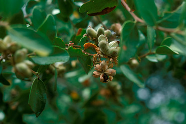

---
title: Quillaja
---

## Phylogeny 

-   « Ancestral Groups  
    -   [Fabales](../Fabales.md)
    -   [Rosids](../../Rosids.md)
    -  [Core Eudicots](../../../Core_Eudicots.md))
    -   [Eudicots](../../../../Eudicots.md)
    -   [Flowering_Plant](../../../../../Flowering_Plant.md)
    -   [Seed_Plant](../../../../../../Seed_Plant.md)
    -   [Land_Plant](../../../../../../../Land_Plant.md)
    -  [Green plants](../../../../../../../../Plant.md))
    -  [Eukarya](../../../../../../../../../Eukarya.md))
    -   [Tree of Life](../../../../../../../../../Tree_of_Life.md)

-   ◊ Sibling Groups of  Fabales
    -   [Fabaceae](Fabaceae.md)
    -   [Surianaceae](Surianaceae.md)
    -   [Polygalaceae](Polygalaceae.md)
    -   Quillaja

-   » Sub-Groups 

## [[Quillajaceae]] 

*Quillaja* 

 

## #has_/text_of_/abstract 

> **Quillajaceae**, the soapbark family, is a family of flowering plants.  
> It contains a single extant genus Quillaja, containing only two species, 
> and one fossil species, Dakotanthus cordiformis.
>
> [Wikipedia](https://en.wikipedia.org/wiki/Quillajaceae) 

## Introduction

[Martin F. Wojciechowski and Johanna Mahn]() 

*Quillaja* Molina, a genus of small evergreen trees with three to four
species from temperate South America, was included in Rosaceae as part
of Quillajoideae (Takhtajan, 1997) or as Spiraeaoideae-Quillajeae
(Robertson, 1974), but wood anatomical data, etc., suggest that it
should be removed (Lotova & Timonin, 1999; cf. Zhang 1992).

## Title Illustrations

------------------------

Scientific Name ::     Quillaja saponaria Molina
Location ::           Cerro Manquehue, Chile
Specimen Condition   Live Specimen
Copyright ::            © 2005 [John D. Mitchell](http://www.plantsystematics.org/)

## Confidential Links & Embeds: 

### #is_/same_as ::[Quillajaceae](Quillajaceae.md)) 

### #is_/same_as :: [Quillajaceae.public](/_public/bio/bio~Domain/Eukarya/Plants/Land_Plant/Seed_Plant/Flowering_Plant/Eudicots/Core_Eudicots/Rosids/Fabales/Quillajaceae.public.md) 

### #is_/same_as :: [Quillajaceae.internal](/_internal/bio/bio~Domain/Eukarya/Plants/Land_Plant/Seed_Plant/Flowering_Plant/Eudicots/Core_Eudicots/Rosids/Fabales/Quillajaceae.internal.md) 

### #is_/same_as :: [Quillajaceae.protect](/_protect/bio/bio~Domain/Eukarya/Plants/Land_Plant/Seed_Plant/Flowering_Plant/Eudicots/Core_Eudicots/Rosids/Fabales/Quillajaceae.protect.md) 

### #is_/same_as :: [Quillajaceae.private](/_private/bio/bio~Domain/Eukarya/Plants/Land_Plant/Seed_Plant/Flowering_Plant/Eudicots/Core_Eudicots/Rosids/Fabales/Quillajaceae.private.md) 

### #is_/same_as :: [Quillajaceae.personal](/_personal/bio/bio~Domain/Eukarya/Plants/Land_Plant/Seed_Plant/Flowering_Plant/Eudicots/Core_Eudicots/Rosids/Fabales/Quillajaceae.personal.md) 

### #is_/same_as :: [Quillajaceae.secret](/_secret/bio/bio~Domain/Eukarya/Plants/Land_Plant/Seed_Plant/Flowering_Plant/Eudicots/Core_Eudicots/Rosids/Fabales/Quillajaceae.secret.md)

