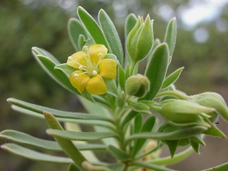

---
aliases:
- Họ Suyên biển
- Surianaceae
- Surianacoj
- surianàcies
- Zabłędowate
- Стиракс котыр
- Суриана котыр
- сурианови
- Суриановые
- משפחת הלבניים
- سوريانيات
- スリアナ科
- 海人树科
- 海人樹科
- 수리아나과
title: Surianaceae
has_id_wikidata: Q131362
dv_has_:
  name_:
    an: Surianaceae
    ar: سوريانيات
    arz: سوريانيات
    ast: Surianaceae
    az: Surianaceae
    be: Surianaceae
    bg: сурианови
    bs: Surianaceae
    ca: surianàcies
    ceb: Surianaceae
    cs: Surianaceae
    de: Surianaceae
    en: Surianaceae
    eo: Surianacoj
    es: Surianaceae
    eu: Surianaceae
    ext: Surianaceae
    fi: Surianaceae
    fr: Surianaceae
    ga: Surianaceae
    gl: Surianaceae
    he: משפחת הלבניים
    hr: Surianaceae
    ia: Surianaceae
    id: Surianaceae
    ie: Surianaceae
    io: Surianaceae
    it: Surianaceae
    ja: スリアナ科
    ko: 수리아나과
    koi: Суриана котыр
    kv: Стиракс котыр
    la: Surianaceae
    mul: Surianaceae
    nb: Surianaceae
    nl: Surianaceae
    oc: Surianaceae
    pl: Zabłędowate
    pt: Surianaceae
    pt_br: Surianaceae
    ro: Surianaceae
    ru: Суриановые
    sq: Surianaceae
    sr: Surianaceae
    sr_ec: Surianaceae
    sr_el: Surianaceae
    sv: Surianaceae
    tr: Surianaceae
    uk: Surianaceae
    vi: Họ Suyên biển
    vo: Surianaceae
    war: Surianaceae
    zh: 海人树科
    zh_cn: 海人树科
    zh_hans: 海人树科
    zh_hant: 海人樹科
    zh_hk: 海人樹科
    zh_sg: 海人树科
    zh_tw: 海人樹科
---
# [[Surianaceae]] 

 

## #has_/text_of_/abstract 

> The **Surianaceae** are a family of plants in the order Fabales with five genera and eight known species. 
> It has an unusual distribution: the genus Recchia is native to Mexico, 
> and the sole member of Suriana, S. maritima, is a coastal plant with a pantropical distribution; 
> and the remaining three genera are endemic to Australia.
>
> They range in form from small shrubs to tall trees.
>
> [Wikipedia](https://en.wikipedia.org/wiki/Surianaceae) 

## Phylogeny 

-   « Ancestral Groups  
    -   [Fabales](../Fabales.md)
    -   [Rosids](../../Rosids.md)
    -  [Core Eudicots](../../../Core_Eudicots.md) 
    -   [Eudicots](../../../../Eudicots.md)
    -   [Flowering_Plant](../../../../../Flowering_Plant.md)
    -   [Seed_Plant](../../../../../../Seed_Plant.md)
    -   [Land_Plant](../../../../../../../Land_Plant.md)
    -  [Green plants](../../../../../../../../Plant.md) 
    -  [Eukarya](../../../../../../../../../Eukarya.md) 
    -   [Tree of Life](../../../../../../../../../Tree_of_Life.md)

-   ◊ Sibling Groups of  Fabales
    -   [Fabaceae](Fabaceae.md)
    -   Surianaceae
    -   [Polygalaceae](Polygalaceae.md)
    -   [Quillaja](Quillaja)

-   » Sub-Groups 

	-   *Cadellia*
	-   *Guilfoylia*
	-   *Recchia*
	-   *Stylobasium*
	-   *Suriana*

## Introduction

[Martin F. Wojciechowski and Johanna Mahn]() 

Surianaceae consists of five genera, *Cadellia* F. Muell., *Guilfoylia*
F. Muell., *Recchia* Moc. & Sesse ex DC., *Stylobasium* Desf., and
*Suriana* L., each having one or two species. Members of this family are
primarily trees and shrubs found mostly in Australia but also Mexico
(*Recchia*), and pantropical (*Suriana maritima*). They inhabit a range
of environments from beaches and deserts to tropical rainforests
(Fernando et al. 1993). Molecular data supports a sister group
relationship of Surianaceae to Polygalaceae and Fabaceae (Crayn et al.,
1995; Persson, 2001; Soltis et al., 2000).

## Title Illustrations

------------------------
scientific_name ::     Suriana maritima L.
location ::           Dade Co. Coral Gables, Fairchild Tropical Garden, Florida
specimen_condition ::  Live Specimen
copyright ::            © 2005 [Dennis Stevenson](http://www.plantsystematics.org/)

## Confidential Links & Embeds: 

### #is_/same_as :: [[/_Standards/bio/bio~Domain/Eukarya/Plant/Land_Plant/Seed_Plant/Flowering_Plant/Eudicots/Core_Eudicots/Rosids/Fabales/Surianaceae|Surianaceae]] 

### #is_/same_as :: [[/_public/bio/bio~Domain/Eukarya/Plant/Land_Plant/Seed_Plant/Flowering_Plant/Eudicots/Core_Eudicots/Rosids/Fabales/Surianaceae.public|Surianaceae.public]] 

### #is_/same_as :: [[/_internal/bio/bio~Domain/Eukarya/Plant/Land_Plant/Seed_Plant/Flowering_Plant/Eudicots/Core_Eudicots/Rosids/Fabales/Surianaceae.internal|Surianaceae.internal]] 

### #is_/same_as :: [[/_protect/bio/bio~Domain/Eukarya/Plant/Land_Plant/Seed_Plant/Flowering_Plant/Eudicots/Core_Eudicots/Rosids/Fabales/Surianaceae.protect|Surianaceae.protect]] 

### #is_/same_as :: [[/_private/bio/bio~Domain/Eukarya/Plant/Land_Plant/Seed_Plant/Flowering_Plant/Eudicots/Core_Eudicots/Rosids/Fabales/Surianaceae.private|Surianaceae.private]] 

### #is_/same_as :: [[/_personal/bio/bio~Domain/Eukarya/Plant/Land_Plant/Seed_Plant/Flowering_Plant/Eudicots/Core_Eudicots/Rosids/Fabales/Surianaceae.personal|Surianaceae.personal]] 

### #is_/same_as :: [[/_secret/bio/bio~Domain/Eukarya/Plant/Land_Plant/Seed_Plant/Flowering_Plant/Eudicots/Core_Eudicots/Rosids/Fabales/Surianaceae.secret|Surianaceae.secret]] 

