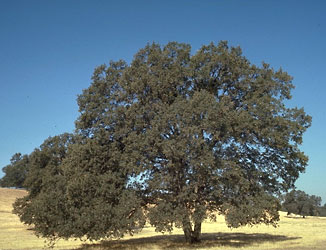

# [[Fagales]] 

     

## #has_/text_of_/abstract 

> The **Fagales** are an order of flowering plants in the rosid group of dicotyledons, 
> including some of the best-known trees. 
> 
> Well-known members of Fagales include: 
> beeches, chestnuts, oaks, walnut, pecan, hickory, birches, alders, hazels, hornbeams, she-oaks, and southern beeches. The order name is derived from genus Fagus (beeches).
>
> [Wikipedia](https://en.wikipedia.org/wiki/Fagales) 

## Phylogeny 

-   « Ancestral Groups  
    -   [Rosids](../Rosids.md)
    -  [Core Eudicots](../../Core_Eudicots.md))
    -   [Eudicots](../../../Eudicots.md)
    -   [Flowering_Plant](../../../../Flowering_Plant.md)
    -   [Seed_Plant](../../../../../Seed_Plant.md)
    -   [Land_Plant](../../../../../../Land_Plant.md)
    -  [Green plants](../../../../../../../Plant.md))
    -  [Eukarya](../../../../../../../../Eukarya.md))
    -   [Tree of Life](../../../../../../../../Tree_of_Life.md)

-   ◊ Sibling Groups of  Rosids
    -   [Gerrardina](Gerrardina)
    -   Fagales
    -   [Cucurbitales](Cucurbitales.md)
    -   [Rosales](Rosales.md)
    -   [Fabales](Fabales.md)
    -   [Zygophyllales](Zygophyllales.md)
    -   [Oxalidales](Oxalidales.md)
    -   [Malpighiales](Malpighiales.md)
    -   [Celastrales](Celastrales.md)
    -   [Geraniales](Geraniales.md)
    -   [Crossosomatales](Crossosomatales.md)
    -   [Myrtales](Myrtales.md)
    -   [Brassicales](Brassicales.md)
    -   [Malvales](Malvales.md)
    -   [Sapindales](Sapindales.md)

-   » Sub-Groups 

## Title Illustrations

----------------------------)
Scientific Name ::     Alnus rubra (Betulaceae)
Location ::           Wildcat Canyon Park, East Bay Hills (Contra Costa County, California, USA)
Comments             Red Alder
Specimen Condition   Live Specimen
Source Collection    [CalPhotos](http://calphotos.berkeley.edu/)
Copyright ::            © 2002 [Tony Morosco](mailto:tony-morosco@calflora.org)

------------------------------------------------------------------------------)
Scientific Name ::     Quercus douglasii
Location ::           Red Bluff (Tehama County, California, USA)
Comments             Blue oak (Fagaceae)
Creator              Photograph by Jed and Bonnie McClellan
Specimen Condition   Live Specimen
Source Collection    [CalPhotos](http://calphotos.berkeley.edu/)
Copyright ::            © 1999 [California Academy of Sciences](http://www.calacademy.org/) 

------------------------------------------------------------------------)
Scientific Name ::   Juglans regia
Location ::         Allschwil, Basel, Switzerland.
Comments           Black walnut (Juglandaceae), in winter condition.
Acknowledgements   courtesy [Botanical Image Database](http://www.unibas.ch/botimage/)
Copyright ::          © 2001 University of Basel, Basel, Switzerland 

## Confidential Links & Embeds: 

### #is_/same_as ::[Fagales](Fagales.md)) 

### #is_/same_as :: [Fagales.public](/_public/bio/bio~Domain/Eukarya/Plants/Land_Plant/Seed_Plant/Flowering_Plant/Eudicots/Core_Eudicots/Rosids/Fagales.public.md) 

### #is_/same_as :: [Fagales.internal](/_internal/bio/bio~Domain/Eukarya/Plants/Land_Plant/Seed_Plant/Flowering_Plant/Eudicots/Core_Eudicots/Rosids/Fagales.internal.md) 

### #is_/same_as :: [Fagales.protect](/_protect/bio/bio~Domain/Eukarya/Plants/Land_Plant/Seed_Plant/Flowering_Plant/Eudicots/Core_Eudicots/Rosids/Fagales.protect.md) 

### #is_/same_as :: [Fagales.private](/_private/bio/bio~Domain/Eukarya/Plants/Land_Plant/Seed_Plant/Flowering_Plant/Eudicots/Core_Eudicots/Rosids/Fagales.private.md) 

### #is_/same_as :: [Fagales.personal](/_personal/bio/bio~Domain/Eukarya/Plants/Land_Plant/Seed_Plant/Flowering_Plant/Eudicots/Core_Eudicots/Rosids/Fagales.personal.md) 

### #is_/same_as :: [Fagales.secret](/_secret/bio/bio~Domain/Eukarya/Plants/Land_Plant/Seed_Plant/Flowering_Plant/Eudicots/Core_Eudicots/Rosids/Fagales.secret.md)

