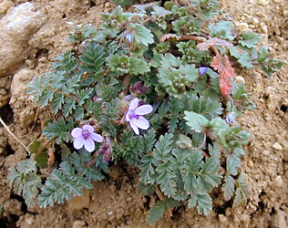

# [[Geraniales]] 

 

## #has_/text_of_/abstract 

> **Geraniales** is a small order of flowering plants, included within the rosid subclade of eudicots. 
> The largest family in the order is Geraniaceae with over 800 species. 
> In addition, the order includes the smaller Francoaceae with about 40 species. 
> Most Geraniales are herbaceous, but there are also shrubs and small trees.
>
> Flower morphology of the Geraniales is rather conserved. 
> They are usually perfectly pentamerous and 
> pentacyclic without fused organs besides the carpels of the superior gynoecium. 
> The androecium is obdiplostemonous. 
> Only a few genera are tetramerous (Francoa, Tetilla, Melianthus). 
> 
> In some genera some stamens (Pelargonium) 
> or a complete whorl of stamens are reduced (Erodium, Melianthus). 
> 
> In the genera Hypseocharis and Monsonia there are 15 instead of the usual ten stamens. 
> Most genera bear nectariferous flowers. 
> The nectary glands are formed by the receptacle and are localised at the bases of the antesepalous stamens.
>
> The economic importance of Geraniales is low. 
> Some species of the genus Pelargonium (Geraniaceae) 
> are cultivated for their aromatic oil used in the perfume industry. 
> 
> Some other species, also mostly within Geraniaceae, have horticultural or medicinal uses. 
> A Paleobotanic record is missing.
>
> [Wikipedia](https://en.wikipedia.org/wiki/Geraniales) 

## Phylogeny 

-   « Ancestral Groups  
    -   [Rosids](../Rosids.md)
    -  [Core Eudicots](../../Core_Eudicots.md))
    -   [Eudicots](../../../Eudicots.md)
    -   [Flowering_Plant](../../../../Flowering_Plant.md)
    -   [Seed_Plant](../../../../../Seed_Plant.md)
    -   [Land_Plant](../../../../../../Land_Plant.md)
    -  [Green plants](../../../../../../../Plant.md))
    -  [Eukarya](../../../../../../../../Eukarya.md))
    -   [Tree of Life](../../../../../../../../Tree_of_Life.md)

-   ◊ Sibling Groups of  Rosids
    -   [Gerrardina](Gerrardina)
    -   [Fagales](Fagales.md)
    -   [Cucurbitales](Cucurbitales.md)
    -   [Rosales](Rosales.md)
    -   [Fabales](Fabales.md)
    -   [Zygophyllales](Zygophyllales.md)
    -   [Oxalidales](Oxalidales.md)
    -   [Malpighiales](Malpighiales.md)
    -   [Celastrales](Celastrales.md)
    -   Geraniales
    -   [Crossosomatales](Crossosomatales.md)
    -   [Myrtales](Myrtales.md)
    -   [Brassicales](Brassicales.md)
    -   [Malvales](Malvales.md)
    -   [Sapindales](Sapindales.md)

-   » Sub-Groups 
	-   *Melianthaceae* [(incl. Francoaceae and Greyiaceae)]
	-   *Geraniaceae* [(geranium family, incl.
	    Hypseocharitaceae)]
	-   *Vivianiaceae* [(incl. Ledocarpaceae)]

## Title Illustrations

------------------------------------------------------------------------)
Scientific Name ::   Erodium cicutarium
Location ::         Westhalten, Strangenberg, Dép. Haut-Rhin, France
Comments           Geraniaceae
Acknowledgements   courtesy [Botanical Image Database](http://www.unibas.ch/botimage/)
Copyright ::          © 2001 University of Basel, Basel, Switzerland 

## Confidential Links & Embeds: 

### #is_/same_as :: [Geraniales](/_Standards/bio/bio~Domain/Eukarya/Plant/Land_Plant/Seed_Plant/Flowering_Plant/Eudicots/Core_Eudicots/Rosids/Geraniales.md) 

### #is_/same_as :: [Geraniales.public](/_public/bio/bio~Domain/Eukarya/Plant/Land_Plant/Seed_Plant/Flowering_Plant/Eudicots/Core_Eudicots/Rosids/Geraniales.public.md) 

### #is_/same_as :: [Geraniales.internal](/_internal/bio/bio~Domain/Eukarya/Plant/Land_Plant/Seed_Plant/Flowering_Plant/Eudicots/Core_Eudicots/Rosids/Geraniales.internal.md) 

### #is_/same_as :: [Geraniales.protect](/_protect/bio/bio~Domain/Eukarya/Plant/Land_Plant/Seed_Plant/Flowering_Plant/Eudicots/Core_Eudicots/Rosids/Geraniales.protect.md) 

### #is_/same_as :: [Geraniales.private](/_private/bio/bio~Domain/Eukarya/Plant/Land_Plant/Seed_Plant/Flowering_Plant/Eudicots/Core_Eudicots/Rosids/Geraniales.private.md) 

### #is_/same_as :: [Geraniales.personal](/_personal/bio/bio~Domain/Eukarya/Plant/Land_Plant/Seed_Plant/Flowering_Plant/Eudicots/Core_Eudicots/Rosids/Geraniales.personal.md) 

### #is_/same_as :: [Geraniales.secret](/_secret/bio/bio~Domain/Eukarya/Plant/Land_Plant/Seed_Plant/Flowering_Plant/Eudicots/Core_Eudicots/Rosids/Geraniales.secret.md)

