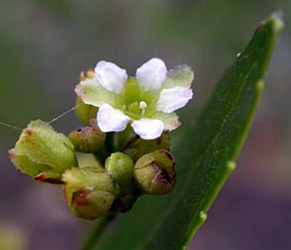
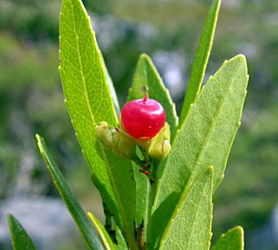

---
aliases:
  - Gerrardinaceae
title: Gerrardina
---

## [[Gerrardinaceae]] 

   

## #has_/text_of_/abstract 

> Gerrardina is a genus of two species of trees, shrubs, and scrambling shrubs found in southeastern Africa. 
> Until recently, the genus was placed in the polyphyletic family Flacourtiaceae, 
> but it was abnormal there due to its apical placentation, small embryos, and mucilaginous foliar epidermis. 
> 
> Analyses of DNA data indicated that the genus did not fit in any known plant family 
> and not clearly in any then-recognized order, and a new family, **Gerrardinaceae**, was thus created for it. 
> 
> Later analyses of additional DNA data and data from wood anatomy 
> indicated that the family should be placed in the order Huerteales.
>
> [Wikipedia](https://en.wikipedia.org/wiki/Gerrardina) 
> 
## Phylogeny 

-   « Ancestral Groups  
    -   [Rosids](../Rosids.md)
    -  [Core Eudicots](../../Core_Eudicots.md) 
    -   [Eudicots](../../../Eudicots.md)
    -   [Flowering_Plant](../../../../Flowering_Plant.md)
    -   [Seed_Plant](../../../../../Seed_Plant.md)
    -   [Land_Plant](../../../../../../Land_Plant.md)
    -  [Green plants](../../../../../../../Plant.md) 
    -  [Eukarya](../../../../../../../../Eukarya.md) 
    -   [Tree of Life](../../../../../../../../Tree_of_Life.md)

-   ◊ Sibling Groups of  Rosids
    -   Gerrardina
    -   [Fagales](Fagales.md)
    -   [Cucurbitales](Cucurbitales.md)
    -   [Rosales](Rosales.md)
    -   [Fabales](Fabales.md)
    -   [Zygophyllales](Zygophyllales.md)
    -   [Oxalidales](Oxalidales.md)
    -   [Malpighiales](Malpighiales.md)
    -   [Celastrales](Celastrales.md)
    -   [Geraniales](Geraniales.md)
    -   [Crossosomatales](Crossosomatales.md)
    -   [Myrtales](Myrtales.md)
    -   [Brassicales](Brassicales.md)
    -   [Malvales](Malvales.md)
    -   [Sapindales](Sapindales.md)

-   » Sub-Groups 
	- *Gerrardina* 

## Introduction

[Mac H. Alford]()

*Gerrardina* is a genus of two species native to southern and eastern
Africa. Traditionally, the genus has been placed in the polyphyletic
family Flacourtiaceae due to its gross similarities with tribe
Homalieae, which have alternate, simple, toothed leaves, receptacular
disk glands, and stamens opposite petals. However, *Gerrardina* differs
from tribe Homalieae, now placed in Salicaceae, by having apical
placentation, small embryos, different leaf teeth, and a mucilaginous
foliar epidermis. Analyses of plastid DNA data indicate that
*Gerrardina* is related to Brassicales, Huerteales, Malvales, and
Sapindales, but further placement has not been possible given the data
presently available.

### Characteristics

*Shrubs* or *small trees*, sometimes scandent. *Leaves* simple,
alternate, stipulate; venation pinnate; margins serrate.
*Inflorescences* axillary, in few-flowered raceme-like cymes. *Flowers*
hermaphroditic, actinomorphic, perigynous. *Calyx* lobes 5, persistent,
aestivation imbricate. *Corolla* lobes 5, caducous. *Stamens* 5,
opposite petals; anther dehiscence longitudinal, introrse. *Disk*
present, cupular, adnate to the hypanthium. *Gynoecium* of 2 carpels
united to form a compound, superior ovary (though recessed in the
receptacle) topped by a single style with a subcapitate or minutely
bifid stigma; ovary unilocular; ovules 4, anatropous, borne on 2
placentae, pendulous from near the apex. *Fruits* pendulous, dry or
fleshy berries with 1-4 seeds. *Seeds* exarillate; embryo minute, erect.

## Title Illustrations

-------------------
[[Gerrardinaceae/gerrardina_blossom.jpg]]
scientific_name ::     Gerrardina foliosa
location ::           South Africa: Eastern Cape Province: Lupatana
specimen_condition ::  Live Specimen
Identified By        Tony Dold
Body Part            Flower
Collection           USMS, GRA
Collector            T. Dold
copyright ::            © 2006 [Tony Dold](http://www.ru.ac.za/botany)

-------------------
![[Gerrardinaceae/gerrardina_Fruit.jpg]]
scientific_name ::     Gerrardina foliosa
location ::           South Africa: Eastern Cape Province: Lupatana
specimen_condition ::  Live Specimen
Identified By        Tony Dold
Collection           USMS, GRA
Collector            T. Dold
copyright ::            © 2006 [Tony Dold](http://www.ru.ac.za/botany)

## Confidential Links & Embeds: 

### #is_/same_as :: [[/_Standards/bio/bio~Domain/Eukarya/Plant/Land_Plant/Seed_Plant/Flowering_Plant/Eudicots/Core_Eudicots/Rosids/Gerrardinaceae|Gerrardinaceae]] 

### #is_/same_as :: [[/_public/bio/bio~Domain/Eukarya/Plant/Land_Plant/Seed_Plant/Flowering_Plant/Eudicots/Core_Eudicots/Rosids/Gerrardinaceae.public|Gerrardinaceae.public]] 

### #is_/same_as :: [[/_internal/bio/bio~Domain/Eukarya/Plant/Land_Plant/Seed_Plant/Flowering_Plant/Eudicots/Core_Eudicots/Rosids/Gerrardinaceae.internal|Gerrardinaceae.internal]] 

### #is_/same_as :: [[/_protect/bio/bio~Domain/Eukarya/Plant/Land_Plant/Seed_Plant/Flowering_Plant/Eudicots/Core_Eudicots/Rosids/Gerrardinaceae.protect|Gerrardinaceae.protect]] 

### #is_/same_as :: [[/_private/bio/bio~Domain/Eukarya/Plant/Land_Plant/Seed_Plant/Flowering_Plant/Eudicots/Core_Eudicots/Rosids/Gerrardinaceae.private|Gerrardinaceae.private]] 

### #is_/same_as :: [[/_personal/bio/bio~Domain/Eukarya/Plant/Land_Plant/Seed_Plant/Flowering_Plant/Eudicots/Core_Eudicots/Rosids/Gerrardinaceae.personal|Gerrardinaceae.personal]] 

### #is_/same_as :: [[/_secret/bio/bio~Domain/Eukarya/Plant/Land_Plant/Seed_Plant/Flowering_Plant/Eudicots/Core_Eudicots/Rosids/Gerrardinaceae.secret|Gerrardinaceae.secret]] 

