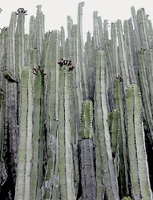

---
aliases:
  - Malpighiales
  - 金虎尾目
has_id_wikidata: Q21887
title: Malpighiales
parent_taxon: '[[_Standards/WikiData/WD~fabids,2683213]]'
instance_of: '[[_Standards/WikiData/WD~taxon,16521]]'
taxon_rank: '[[_Standards/WikiData/WD~order,36602]]'
start_time: -100000000-01-01T00:00:00Z
ITIS_TSN: 822428
image: http://commons.wikimedia.org/wiki/Special:FilePath/Starr%20010309-0546%20Calophyllum%20inophyllum.jpg
EPPO_Code: 1MALO
MeSH_tree_code: B01.875.800.575.912.250.859.797
Commons_category: Malpighiales
taxon_name: Malpighiales
NBN_System_Key: NHMSYS0020824592
taxon_common_name: 金虎尾目
---

# [[Malpighiales]] 

     

#is_/same_as :: [[../../../../../../../../../../WikiData/WD~Malpighiales,21887|WD~Malpighiales,21887]] 

## #has_/text_of_/abstract 

> The **Malpighiales** comprise one of the largest orders of flowering plants. 
> 
> The order is very diverse, with well-known members including 
> willows, violets, aspens and poplars, poinsettia, corpse flower, coca plant, cassava, 
> flaxseed, castor bean, Saint John's wort, passionfruit, mangosteen, and manchineel tree.
>
> The order is not part of any of the classification systems based only on plant morphology 
> and the relationships of its diverse members can be hard to recognize 
> except with molecular phylogenetic evidence. 
> 
> Molecular clock calculations estimate the origin of stem group Malpighiales 
> at around 100 million years ago (Mya) and the origin of crown group Malpighiales at about 90 Mya.
>
> The Malpighiales contain about 36 families and more than 16,000 species, about 7.8% of the eudicots.
>
> [Wikipedia](https://en.wikipedia.org/wiki/Malpighiales) 

## Phylogeny 

-   « Ancestral Groups  
    -   [Rosids](../Rosids.md)
    -  [Core Eudicots](../../Core_Eudicots.md) 
    -   [Eudicots](../../../Eudicots.md)
    -   [Flowering_Plant](../../../../Flowering_Plant.md)
    -   [Seed_Plant](../../../../../Seed_Plant.md)
    -   [Land_Plant](../../../../../../Land_Plant.md)
    -  [Green plants](../../../../../../../Plant.md) 
    -  [Eukarya](../../../../../../../../Eukarya.md) 
    -   [Tree of Life](../../../../../../../../Tree_of_Life.md)

-   ◊ Sibling Groups of  Rosids
    -   [Gerrardina](Gerrardina)
    -   [Fagales](Fagales.md)
    -   [Cucurbitales](Cucurbitales.md)
    -   [Rosales](Rosales.md)
    -   [Fabales](Fabales.md)
    -   [Zygophyllales](Zygophyllales.md)
    -   [Oxalidales](Oxalidales.md)
    -   Malpighiales
    -   [Celastrales](Celastrales.md)
    -   [Geraniales](Geraniales.md)
    -   [Crossosomatales](Crossosomatales.md)
    -   [Myrtales](Myrtales.md)
    -   [Brassicales](Brassicales.md)
    -   [Malvales](Malvales.md)
    -   [Sapindales](Sapindales.md)

-   » Sub-Groups
    -   [Salicaceae](Salicaceae)
    -   [Scyphostegia borneensis](Malpighiales/Scyphostegia_borneensis.md)
    -   [Lacistemataceae](Malpighiales/Lacistemataceae.md)
    -   [Samydaceae](Malpighiales/Samydaceae.md)

## Title Illustrations

------------------------------------------------------------------------------ 
 
Scientific Name ::     Salix laevigata
Location ::           Kearsarge Pass (Fresno County, California, USA)
Comments             Red willow (Salicaceae)
Creator              Photograph by Charles Webber
Specimen Condition   Live Specimen
Source Collection    [CalPhotos](http://calphotos.berkeley.edu/)
Copyright ::            © 1998 [California Academy of Sciences](http://www.calacademy.org/) 

------------------------------------------------------------------------ 
 
Scientific Name ::   Euphorbia canariensis
Location ::         Buenavista del Norte, Teneriffa, Canary Islands
Comments           Euphorbiaceae
Acknowledgements   courtesy [Botanical Image Database](http://www.unibas.ch/botimage/)
Copyright ::          © 2001 University of Basel, Basel, Switzerland 

--------------------------------------------------------------------- 
 
Scientific Name ::  Hypericum cerastoides
Comments          Hypericaceae
Copyright ::         © [Kurt Stüber](http://www.biolib.de/) 

## Confidential Links & Embeds: 

### #is_/same_as :: [[/_Standards/bio/bio~Domain/Eukarya/Plant/Land_Plant/Seed_Plant/Flowering_Plant/Eudicots/Core_Eudicots/Rosids/Malpighiales|Malpighiales]] 

### #is_/same_as :: [[/_public/bio/bio~Domain/Eukarya/Plant/Land_Plant/Seed_Plant/Flowering_Plant/Eudicots/Core_Eudicots/Rosids/Malpighiales.public|Malpighiales.public]] 

### #is_/same_as :: [[/_internal/bio/bio~Domain/Eukarya/Plant/Land_Plant/Seed_Plant/Flowering_Plant/Eudicots/Core_Eudicots/Rosids/Malpighiales.internal|Malpighiales.internal]] 

### #is_/same_as :: [[/_protect/bio/bio~Domain/Eukarya/Plant/Land_Plant/Seed_Plant/Flowering_Plant/Eudicots/Core_Eudicots/Rosids/Malpighiales.protect|Malpighiales.protect]] 

### #is_/same_as :: [[/_private/bio/bio~Domain/Eukarya/Plant/Land_Plant/Seed_Plant/Flowering_Plant/Eudicots/Core_Eudicots/Rosids/Malpighiales.private|Malpighiales.private]] 

### #is_/same_as :: [[/_personal/bio/bio~Domain/Eukarya/Plant/Land_Plant/Seed_Plant/Flowering_Plant/Eudicots/Core_Eudicots/Rosids/Malpighiales.personal|Malpighiales.personal]] 

### #is_/same_as :: [[/_secret/bio/bio~Domain/Eukarya/Plant/Land_Plant/Seed_Plant/Flowering_Plant/Eudicots/Core_Eudicots/Rosids/Malpighiales.secret|Malpighiales.secret]] 

