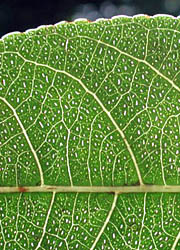
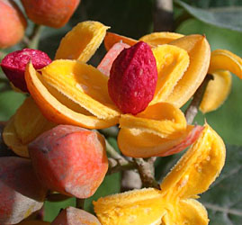

---
title: Samydaceae
---

# [[Samydaceae]] 

     

## #has_/text_of_/abstract 

> **Samydaceae** is a family of tropical and subtropical woody plants, 
> its best known genus being Casearia. 
> 
> It has always been of uncertain placement, in the past 
> usually being submerged in the family Flacourtiaceae.
>
> A 2002 paper included the Samydaceae in the family Salicaceae, 
> a placement accepted in the APG III system onwards 
> and also by Plants of the World Online as of March 2021. 
> This placement has by no means been universally accepted.
>
> [Wikipedia](https://en.wikipedia.org/wiki/Samydaceae) 

## Introduction

[Mac H. Alford]() 

Samydaceae are a family of flowering plants formerly placed in the
polyphyletic Flacourtiaceae. Samydaceae have sometimes been segregated
from Flacourtiaceae (e.g., by Bentham and Hooker) as the group with
well-developed hypanthia, and this tradition has been maintained in many
African floras. Recent analyses based on both morphological and
molecular data indicate that Samydaceae are a monophyletic and
monothetic group related to Salicaceae, which now also include many
former Flacourtiaceae. Some authors (e.g., Chase et al., 2002) even
place Samydaceae in a broader Salicaceae. However, Samydaceae share many
symplesiomorphies with other Malpighialean families, such as
Passifloraceae, and show few obvious morphological connections to
Salicaceae.\

Like many other closely-related taxa in the Malpighiales, Samydaceae
have introrse anther dehiscence, parietal placentation, and arillate
seeds. They also have synapomorphies which are useful for field
identification: pellucid-punctations and/or -lines (usually in the
leaves) and deciduous leaf teeth (theoid type). Almost all members of
the family have minute flowers. The largest genus in the family is
*Casearia*, which has more than 180 species, and the number of species
coupled with the size of the flowers has left the family largely
unstudied.

The genus *Casearia* is pantropical, *Osmelia* and *Pseudosmelia* are
from Indo-Malesia, *Ophiobotrys* and *Trichostephanus* are from tropical
Africa, and all of the other genera are neotropical.

### Characteristics

*Shrubs* or *trees*. *Leaves* alternate, pinnately veined, rarely
acrodromous (*Lunania*), infrequently entire but more commonly with
deciduous conical teeth (theoid teeth), rarely with spinose margins
(*Casearia* sect. *Casearia* unranked group *Ilicifoliae*), rarely with
stellate pubescence (*Ryania*), lamina often with pellucid-punctations
or -lines, stipulate or exstipulate. Mostly hermaphroditic, infrequently
dioecious (*Euceraea*, *Neoptychocarpus*, *Osmelia*, *Pseudosmelia*?),
rarely monoecious (*Trichostephanus*) or polygamous (*Ophiobotrys*).
*Inflorescences* usually axillary fascicles/glomerules or reduced to
single axillary flowers, less commonly corymbs, racemes of spikes, or
panicles of spikes. *Flowers* often minute, wider than 2 cm only in
*Ryania* and *Samyda*. *Hypanthium* generally present, sometimes reduced
or lacking. *Sepals* 4-7, possible less in *Lunania* but hard to tell
due to early splitting, imbricate. *Petals* absent. *Disk* usually
present, adnate to the calyx, and alternating with or inside the whorl
of stamens, in some genera (e.g., *Casearia*) appearing like staminodes
or a fleshy corona. *Stamens* 4 to numerous, typically inserted in 1-3
whorls, sometimes connate to various degrees, anther dehiscence introrse
or rarely latrorse (*Lunania*). *Gynoecium* of one pistil, ovary
superior, unilocular, placentation parietal, ovules few to numerous,
styles usually 1 or distally 3(-5)-branched, 3 in *Osmelia* and
*Pseudosmelia*, stigma usually capitate, rarely sessile. *Fruits* fleshy
or dry 3-valved capsules, occasionally indehiscent. *Seeds* arillate
(except *Tetrathylacium*) or with long, cottony hairs (*Casearia* sect.
*Gossypiospermum*).

## Phylogeny 

-   « Ancestral Groups  
    -   [Malpighiales](../Malpighiales.md)
    -   [Rosids](../../Rosids.md)
    -  [Core Eudicots](../../../Core_Eudicots.md))
    -   [Eudicots](../../../../Eudicots.md)
    -   [Flowering_Plant](../../../../../Flowering_Plant.md)
    -   [Seed_Plant](../../../../../../Seed_Plant.md)
    -   [Land_Plant](../../../../../../../Land_Plant.md)
    -  [Green plants](../../../../../../../../Plant.md))
    -  [Eukarya](../../../../../../../../../Eukarya.md))
    -   [Tree of Life](../../../../../../../../../Tree_of_Life.md)

-   ◊ Sibling Groups of  Malpighiales
    -   [Salicaceae](Salicaceae)
    -   [Scyphostegia borneensis](Scyphostegia_borneensis.md)
    -   [Lacistemataceae](Lacistemataceae.md)
    -   Samydaceae

-   » Sub-Groups 

## Title Illustrations

--------------------)
Scientific Name ::  Casearia arborea
Location ::        Costa Rica: Heredia: Estacion Biologica La Selva
Copyright ::         © 2004 [Lawrence M. Kelly](mailto:lkelly@nybg.org)

--------------------)
Scientific Name ::  Casearia corymbosa
Location ::        Costa Rica: Guanacaste: Palo Verde
Copyright ::         © 2003 [Lawrence M. Kelly](mailto:lkelly@nybg.org)

---------------------) 
Scientific Name ::  Casearia corymbosa
Location ::        Costa Rica: Guanacaste: Palo Verde
Body Part         Fruit with arillate seed
Copyright ::         © 2003 [Fabián Michelangeli](mailto:fabian@nybg.org)

## Confidential Links & Embeds: 

### #is_/same_as ::[Samydaceae](Samydaceae.md)) 

### #is_/same_as :: [Samydaceae.public](/_public/bio/bio~Domain/Eukarya/Plants/Land_Plant/Seed_Plant/Flowering_Plant/Eudicots/Core_Eudicots/Rosids/Malpighiales/Samydaceae.public.md) 

### #is_/same_as :: [Samydaceae.internal](/_internal/bio/bio~Domain/Eukarya/Plants/Land_Plant/Seed_Plant/Flowering_Plant/Eudicots/Core_Eudicots/Rosids/Malpighiales/Samydaceae.internal.md) 

### #is_/same_as :: [Samydaceae.protect](/_protect/bio/bio~Domain/Eukarya/Plants/Land_Plant/Seed_Plant/Flowering_Plant/Eudicots/Core_Eudicots/Rosids/Malpighiales/Samydaceae.protect.md) 

### #is_/same_as :: [Samydaceae.private](/_private/bio/bio~Domain/Eukarya/Plants/Land_Plant/Seed_Plant/Flowering_Plant/Eudicots/Core_Eudicots/Rosids/Malpighiales/Samydaceae.private.md) 

### #is_/same_as :: [Samydaceae.personal](/_personal/bio/bio~Domain/Eukarya/Plants/Land_Plant/Seed_Plant/Flowering_Plant/Eudicots/Core_Eudicots/Rosids/Malpighiales/Samydaceae.personal.md) 

### #is_/same_as :: [Samydaceae.secret](/_secret/bio/bio~Domain/Eukarya/Plants/Land_Plant/Seed_Plant/Flowering_Plant/Eudicots/Core_Eudicots/Rosids/Malpighiales/Samydaceae.secret.md)

