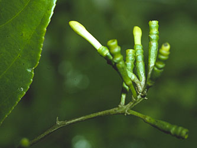

---
aliases:
- Scyphostegia
- Scyphostegia borneensis
- Scyphostegia_borneensis
- 杯盖花属
- 杯蓋花屬
title: Scyphostegia borneensis
has_id_wikidata: Q9075293
dv_has_:
  name_:
    an: Scyphostegia
    ast: Scyphostegia
    bg: Scyphostegia
    ca: Scyphostegia
    ceb: Scyphostegia
    de: Scyphostegia
    en: Scyphostegia
    eo: Scyphostegia
    es: Scyphostegia
    eu: Scyphostegia
    ext: Scyphostegia
    fi: Scyphostegia
    fr: Scyphostegia
    ga: Scyphostegia
    gl: Scyphostegia
    hr: Scyphostegia
    ia: Scyphostegia
    ie: Scyphostegia
    io: Scyphostegia
    it: Scyphostegia
    la: Scyphostegia
    mul: Scyphostegia
    nl: Scyphostegia
    oc: Scyphostegia
    pl: Scyphostegia
    pt: Scyphostegia
    pt_br: Scyphostegia
    ro: Scyphostegia
    ru: Scyphostegia
    sq: Scyphostegia
    sv: Scyphostegia
    uk: Scyphostegia
    vi: Scyphostegia
    vo: Scyphostegia
    war: Scyphostegia
    zh: 杯盖花属
    zh_cn: 杯盖花属
    zh_hans: 杯盖花属
    zh_tw: 杯蓋花屬
---

# [[Scyphostegia borneensis]]  

 

## #has_/text_of_/abstract 

> **Scyphostegia borneensis** is a species of shrub or small tree endemic to Borneo. 
> This unusual plant is the only species in the genus Scyphostegia. 
> 
> In many taxonomic classifications the genus was placed in its own family, the Scyphostegiaceae. 
> 
> Analyses of DNA data indicated that the species is related 
> to a group of species of the now defunct Flacourtiaceae, 
> a group which is now placed in a broadly circumscribed Salicaceae.
>
> [Wikipedia](https://en.wikipedia.org/wiki/Scyphostegia) 

## Introduction

[Mac H. Alford]() 

*Scyphostegia borneensis* is an enigmatic species endemic to the
northern part of Borneo. Its unusual combination of dioecy, basal
placentation, 3-merous flowers, and telescoping inflorescence bracts
have puzzled botanists, and the species has been placed by different
authors in several different and distantly-related families, including
Monimiaceae, Moraceae, Tamaricaceae, and Flacourtiaceae. Most workers
after the early 1900s placed it in its own monotypic family, the
Scyphostegiaceae. Analyses of plastid DNA sequences have clearly
demonstrated that *Scyphostegia borneensis* belongs in Malpighiales and
is a close relative of Salicaceae. Like many Malpighiales, its leaves
are toothed and stipulate and its seeds are arillate. Like Salicaceae,
the anther dehiscence is extrorse, and some authors (e.g., Chase et al.,
2002) place it in a broader Salicaceae. Because it differs from other
Salicaceae in its telescoping bracts, connate and tubular perianth,
connate stamens, basal placentation, and arillate seeds, it is probably
best to continue to place *Scyphostegia borneensis* in its own family,
the Scyphostegiaceae.

### Characteristics

*Shrubs* or *small trees*. *Leaves* simple, alternate, toothed,
stipulate. *Dioecious*. *Inflorescences* terminal, consisting of
racemosely-arranged spikes or racemes, each spike or raceme a series of
flowers within telescoped tubular bracts, the lower bracts subtending a
single flower, the terminal bract subtending two. *Perianth* connate,
tubular, with 6 lobes, 3 in an outer whorl (calyx) and 3 in an inner
whorl (corolla), the whorls more or less equal in female flowers but the
inner whorl conspicuously shorter in male flowers. *Male flowers* with 3
extrastaminal disk glands and with 3 connate stamens, opposite the
petals, anther dehiscence longitudinal and extrorse. *Female flowers*
lacking disk glands, with a gynoecium consisting of a superior,
unilocular, urceolate ovary (appearing somewhat fig-like) with basal
placentation and numerous erect, anatropous ovules; style and stigma not
evident, perhaps depressed into the center. *Fruits* fleshy capsules
deshicent from the apex, reminiscent of Monimiaceae. *Seeds* numerous,
arillate; embryos straight, cotyledons foliaceous.

## Phylogeny 

-   « Ancestral Groups  
    -   [Malpighiales](../Malpighiales.md)
    -   [Rosids](../../Rosids.md)
    -  [Core Eudicots](../../../Core_Eudicots.md) 
    -   [Eudicots](../../../../Eudicots.md)
    -   [Flowering_Plant](../../../../../Flowering_Plant.md)
    -   [Seed_Plant](../../../../../../Seed_Plant.md)
    -   [Land_Plant](../../../../../../../Land_Plant.md)
    -  [Green plants](../../../../../../../../Plant.md) 
    -  [Eukarya](../../../../../../../../../Eukarya.md) 
    -   [Tree of Life](../../../../../../../../../Tree_of_Life.md)

-   ◊ Sibling Groups of  Malpighiales
    -   [Salicaceae](Salicaceae)
    -   Scyphostegia borneensis
    -   [Lacistemataceae](Lacistemataceae.md)
    -   [Samydaceae](Samydaceae.md)

-   » Sub-Groups 

## Title Illustrations

--------------

scientific_name ::     Scyphostegia borneensis
location ::           Malaysia: Sabah: Mt. Kinabalu
specimen_condition ::  Live Specimen
Identified By        Read S. Beaman
Sex ::                Male
copyright ::            © 2004 Read S. Beaman

## Confidential Links & Embeds: 

### #is_/same_as :: [[/_Standards/bio/bio~Domain/Eukarya/Plant/Land_Plant/Seed_Plant/Flowering_Plant/Eudicots/Core_Eudicots/Rosids/Malpighiales/Scyphostegia_borneensis|Scyphostegia_borneensis]] 

### #is_/same_as :: [[/_public/bio/bio~Domain/Eukarya/Plant/Land_Plant/Seed_Plant/Flowering_Plant/Eudicots/Core_Eudicots/Rosids/Malpighiales/Scyphostegia_borneensis.public|Scyphostegia_borneensis.public]] 

### #is_/same_as :: [[/_internal/bio/bio~Domain/Eukarya/Plant/Land_Plant/Seed_Plant/Flowering_Plant/Eudicots/Core_Eudicots/Rosids/Malpighiales/Scyphostegia_borneensis.internal|Scyphostegia_borneensis.internal]] 

### #is_/same_as :: [[/_protect/bio/bio~Domain/Eukarya/Plant/Land_Plant/Seed_Plant/Flowering_Plant/Eudicots/Core_Eudicots/Rosids/Malpighiales/Scyphostegia_borneensis.protect|Scyphostegia_borneensis.protect]] 

### #is_/same_as :: [[/_private/bio/bio~Domain/Eukarya/Plant/Land_Plant/Seed_Plant/Flowering_Plant/Eudicots/Core_Eudicots/Rosids/Malpighiales/Scyphostegia_borneensis.private|Scyphostegia_borneensis.private]] 

### #is_/same_as :: [[/_personal/bio/bio~Domain/Eukarya/Plant/Land_Plant/Seed_Plant/Flowering_Plant/Eudicots/Core_Eudicots/Rosids/Malpighiales/Scyphostegia_borneensis.personal|Scyphostegia_borneensis.personal]] 

### #is_/same_as :: [[/_secret/bio/bio~Domain/Eukarya/Plant/Land_Plant/Seed_Plant/Flowering_Plant/Eudicots/Core_Eudicots/Rosids/Malpighiales/Scyphostegia_borneensis.secret|Scyphostegia_borneensis.secret]] 

