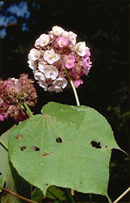
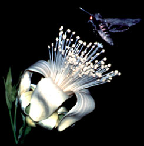
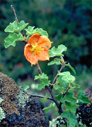

---
aliases:
  - Core_Malvales
  - Core Malvales
title: Core Malvales
---

# Core Malvales 

     

## Phylogeny 

-   « Ancestral Groups  
    -   [Malvales](../Malvales.md)
    -   [Rosids](../../Rosids.md)
    -  [Core Eudicots](../../../Core_Eudicots.md) 
    -   [Eudicots](../../../../Eudicots.md)
    -   [Flowering_Plant](../../../../../Flowering_Plant.md)
    -   [Seed_Plant](../../../../../../Seed_Plant.md)
    -   [Land_Plant](../../../../../../../Land_Plant.md)
    -  [Green plants](../../../../../../../../Plant.md) 
    -  [Eukarya](../../../../../../../../../Eukarya.md) 
    -   [Tree of Life](../../../../../../../../../Tree_of_Life.md)

-   ◊ Sibling Groups of  Malvales
    -   Core Malvales

-   » Sub-Groups 

## Introduction

[Stacey D. Smith and David A. Baum]() 

The core Malvales contains taxa traditionally divided among four
families, Bombacaceae, Malvaceae, Sterculiaceae and Tiliaceae. Molecular
phylogenetic analyses (Alverson et al. 1998; Bayer et al. 1999) showed
that these families do not form natural (monophyletic) groups; thus a
new classification of the core Malvales has been proposed with nine
named clades (as shown above). In total, the core Malvales comprises
approximately 2300 species in 204 genera (Judd et al. 1999). This group
contains several economically important taxa, such as *Theobroma cacao*
(the source of cocoa), *Gossypium* (cotton), *Durio zibethinus*
(durians, a fruit) and many ornamental plants, such as *Hibiscus*,
*Althaea* (hollyhocks) and *Malva* (mallows).

### Characteristics

The core Malvales share the same suite of characters commonly found in
other families in the expanded Malvales, e.g., leaves with palmate
venation (often three principal veins arising from the base of the leaf
blade), mucilage canals within the tissues (think of the slime in Okra),
stellate (star-shaped) hairs on the vegetative parts of the plant and
stipules (leaf-like structures at the base of the leaf stalk). In
addition, members of the core Malvales have nectaries composed of
glandular hairs, usually on the calyx, and seeds with cyclopropenyl
fatty acids.

### Discussion of Phylogenetic Relationships

Molecular data from the chloroplast genes *atpB* and *rbcL* and
particularly *ndhF* have allowed us to identify major lineages in the
core Malvales (Alverson et al. 1999; Bayer et al. 1999), and in some
areas, the relationships among these lineages. /Malvoideae and
/Bombacoideae form a well-supported clade, termed /Malvatheca (Baum et
al. 1998) in reference to their unusual monothecate stamens. The clade
formed by /Malvatheca + /Sterculioideae + /Brownlowioideae +
/Dombeyoideae + /Tilioideae + /Helicteroideae was named /Malvadendrina
(Baum et al. 1998), although no morphological characters have been
identified which unite this group. The /Byttneriina clade,
/Byttneroideae + /Grewioideae (Baum et al. 1998) is strongly supported
as the sister group to the /Malvadendrina although it too lacks apparent
morphological synapomorphies.

### Interesting Malvalean species

*Althaea officinalis*, commonly known as the marshmallow, is a perennial
herb often found in marshy areas of Europe and northeastern North
America. Its thick roots contain about 20% mucilage, the jelly-like
substance used to make the original marshmallows. In the nineteenth
century, the French began mixing the mucilage from *Althaea* roots with
sugar and egg whites to make a foamy meringue that hardened to form a
medicinal candy for soothing sore throats. Although the modern
marshmallow gets its texture from gelatin and not *Althaea*\'s mucilage,
powdered *Althaea* root is still commonly used in teas to treat colds
and sore throats.

## Title Illustrations

------------------------------------------------------------------------------

Scientific Name ::     Dombeya
Location ::           Ranomafana National Park (Madagascar)
Comments             /Dombeyoideae
Creator              Photograph by Gerald and Buff Corsi
Specimen Condition   Live Specimen
Source Collection    [CalPhotos](http://calphotos.berkeley.edu/)
Copyright ::            © 2000 [California Academy of Sciences](http://www.calacademy.org/) 

---------------------------------------------------------------------

Scientific Name ::     Adansonia gibbosa, Agrius convolvuli
Comments             Adansonia gibbosa (/Bombacoideae) flower visited by the hawkmoth Agrius convolvuli.
Reference            From Baum, D. A. 1995. The comparative pollination and floral biology of baobabs (Adansonia- Bombacaceae). Annals of the Missouri Botanical Garden 82(2):322-348.
Creator              Photograph by David Baum
Specimen Condition   Live Specimen
Copyright ::            © 1995 Missouri Botanical Garden Press 

---------------------------------

Scientific Name ::    Fremontodendron californicum ssp. decumbens
Location ::          Pine Hill (El Dorado County, California, USA)
Comments            Pine Hill Fremontia (/Malvoideae)
Creator             Photograph by G. F. Hrusa
Source Collection   [CalPhotos](http://calphotos.berkeley.edu/)
Copyright ::           © 2001 [California Dept. of Food & Agriculture, Botany Laboratory](mailto:FHrusa@ca.gov)

## Confidential Links & Embeds: 

### #is_/same_as :: [Core_Malvales](/_Standards/bio/bio~Domain/Eukarya/Plant/Land_Plant/Seed_Plant/Flowering_Plant/Eudicots/Core_Eudicots/Rosids/Malvales/Core_Malvales.md) 

### #is_/same_as :: [Core_Malvales.public](/_public/bio/bio~Domain/Eukarya/Plant/Land_Plant/Seed_Plant/Flowering_Plant/Eudicots/Core_Eudicots/Rosids/Malvales/Core_Malvales.public.md) 

### #is_/same_as :: [Core_Malvales.internal](/_internal/bio/bio~Domain/Eukarya/Plant/Land_Plant/Seed_Plant/Flowering_Plant/Eudicots/Core_Eudicots/Rosids/Malvales/Core_Malvales.internal.md) 

### #is_/same_as :: [Core_Malvales.protect](/_protect/bio/bio~Domain/Eukarya/Plant/Land_Plant/Seed_Plant/Flowering_Plant/Eudicots/Core_Eudicots/Rosids/Malvales/Core_Malvales.protect.md) 

### #is_/same_as :: [Core_Malvales.private](/_private/bio/bio~Domain/Eukarya/Plant/Land_Plant/Seed_Plant/Flowering_Plant/Eudicots/Core_Eudicots/Rosids/Malvales/Core_Malvales.private.md) 

### #is_/same_as :: [Core_Malvales.personal](/_personal/bio/bio~Domain/Eukarya/Plant/Land_Plant/Seed_Plant/Flowering_Plant/Eudicots/Core_Eudicots/Rosids/Malvales/Core_Malvales.personal.md) 

### #is_/same_as :: [Core_Malvales.secret](/_secret/bio/bio~Domain/Eukarya/Plant/Land_Plant/Seed_Plant/Flowering_Plant/Eudicots/Core_Eudicots/Rosids/Malvales/Core_Malvales.secret.md)

