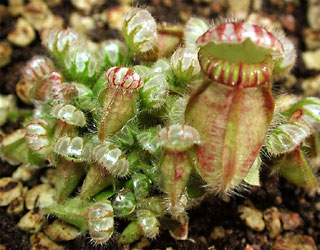
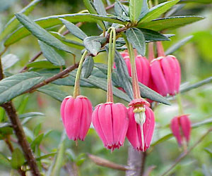

---
aliases:
- Bộ Chua me đất
- Ceceljolike
- gjøkesyreordenen
- Harsyreordningen
- Jänesekapsalaadsed
- Koma tirşengan
- kysličkotvaré
- madársóska-virágúak
- Oksalidaloj
- Oxalidales
- Oxalidals
- Sauerkleeartige
- Surkløver-ordenen
- Szczawikowce
- Sürkliawer
- Turşəngçiçəklilər
- Zaķskābeņu rinda
- šťavelotvaré
- Οξαλιδώδη
- Квасеницецвіті
- Киселицовидни
- Кисличноцветные
- թթվառվույտածաղկավորներ
- חמציצאים
- حماضيات
- شبدرترشکسانان
- ओक्सालिडालेस
- ഓക്സാലിഡേൽസ്
- อันดับกระทืบยอด
- カタバミ目
- 酢浆草目
- 괭이밥목
title: Oxalidales
has_id_wikidata: Q21891
dv_has_:
  name_:
    an: Oxalidales
    ar: حماضيات
    arz: حماضيات
    ast: Oxalidales
    az: Turşəngçiçəklilər
    bcl: Oxalidales
    be_tarask: Oxalidales
    bg: Oxalidales
    bs: Oxalidales
    ca: Oxalidals
    ceb: Oxalidales
    co: Oxalidales
    cs: šťavelotvaré
    da: Surkløver-ordenen
    de: Sauerkleeartige
    el: Οξαλιδώδη
    en: Oxalidales
    en_ca: Oxalidales
    en_gb: Oxalidales
    eo: Oksalidaloj
    es: Oxalidales
    et: Jänesekapsalaadsed
    eu: Oxalidales
    ext: Oxalidales
    fa: شبدرترشکسانان
    fi: Oxalidales
    fr: Oxalidales
    frr: Sürkliawer
    ga: Oxalidales
    gl: Oxalidales
    he: חמציצאים
    hi: ओक्सालिडालेस
    hr: Ceceljolike
    hu: madársóska-virágúak
    hy: թթվառվույտածաղկավորներ
    ia: Oxalidales
    id: Oxalidales
    ie: Oxalidales
    io: Oxalidales
    is: Oxalidales
    it: Oxalidales
    ja: カタバミ目
    jv: Oxalidales
    ko: 괭이밥목
    ku: Koma tirşengan
    la: Oxalidales
    lv: Zaķskābeņu rinda
    mk: Киселицовидни
    ml: ഓക്സാലിഡേൽസ്
    mul: Oxalidales
    nb: gjøkesyreordenen
    nl: Oxalidales
    oc: Oxalidales
    pl: Szczawikowce
    pt: Oxalidales
    pt_br: Oxalidales
    ro: Oxalidales
    ru: Кисличноцветные
    sco: Oxalidales
    sk: kysličkotvaré
    sq: Oxalidales
    sv: Harsyreordningen
    th: อันดับกระทืบยอด
    tr: Oxalidales
    uk: Квасеницецвіті
    vi: Bộ Chua me đất
    vo: Oxalidales
    war: Oxalidales
    zh: 酢浆草目
    zh_cn: 酢浆草目
    zh_hans: 酢浆草目
    zh_hant: 酢浆草目
    zh_tw: 酢浆草目
---

# [[Oxalidales]] 
)  

## #has_/text_of_/abstract 

> **Oxalidales** is an order of flowering plants, included within the rosid subgroup of eudicots.  
> This group comprises six families that contain approximately 2000 species in 58 genera. 
> 
> They are trees, shrubs or woody vines which are found in the wet tropics, 
> particularly on mountains, and warm temperate zones, especially in the southern hemisphere. 
> 
> Compound leaves are common in Oxalidales 
> and the majority of the species in this order have five or six sepals and petals. 
> 
> The following families are typically placed here:
> - Family Brunelliaceae
> - Family Cephalotaceae (Cephalotus follicularis)
> - Family Connaraceae
> - Family Cunoniaceae
> - Family Elaeocarpaceae
> - Family Huaceae
> - Family Oxalidaceae (wood sorrel family)
>
> The family Cephalotaceae contains a single species, - a pitcher plant found in Southwest Australia.
>
> Under the Cronquist system, most of the above families were placed in the Rosales. 
> The Oxalidaceae were placed in the Geraniales, 
> and the Elaeocarpaceae split between the Malvales and Polygalales, 
> in the latter case being treated as the Tremandraceae.
>
> [Wikipedia](https://en.wikipedia.org/wiki/Oxalidales) 

## Phylogeny 

-   « Ancestral Groups  
    -   [Rosids](../Rosids.md)
    -  [Core Eudicots](../../Core_Eudicots.md) 
    -   [Eudicots](../../../Eudicots.md)
    -   [Flowering_Plant](../../../../Flowering_Plant.md)
    -   [Seed_Plant](../../../../../Seed_Plant.md)
    -   [Land_Plant](../../../../../../Land_Plant.md)
    -  [Green plants](../../../../../../../Plant.md) 
    -  [Eukarya](../../../../../../../../Eukarya.md) 
    -   [Tree of Life](../../../../../../../../Tree_of_Life.md)

-   ◊ Sibling Groups of  Rosids
    -   [Gerrardina](Gerrardina)
    -   [Fagales](Fagales.md)
    -   [Cucurbitales](Cucurbitales.md)
    -   [Rosales](Rosales.md)
    -   [Fabales](Fabales.md)
    -   [Zygophyllales](Zygophyllales.md)
    -   Oxalidales
    -   [Malpighiales](Malpighiales.md)
    -   [Celastrales](Celastrales.md)
    -   [Geraniales](Geraniales.md)
    -   [Crossosomatales](Crossosomatales.md)
    -   [Myrtales](Myrtales.md)
    -   [Brassicales](Brassicales.md)
    -   [Malvales](Malvales.md)
    -   [Sapindales](Sapindales.md)

-   » Sub-Groups 

## Title Illustrations

------------------------------------------------------------------------ 
 
scientific_name ::   Cephalotus follicularis
location ::         Native to Southwest Australia
Comments           Albany pitcher plant. Specimen cultivated at the Botanical Garden Basel, Switzerland.
Acknowledgements   courtesy [Botanical Image Database](http://www.unibas.ch/botimage/)
copyright ::          © 2001 University of Basel, Basel, Switzerland 

--------------------------------------------------------------------- 
 
scientific_name ::  Crinodendron hookeranum
Comments          Flower of the lantern tree (Elaeocarpaceae)
copyright ::         © [Kurt Stüber](http://www.biolib.de/) 

## Confidential Links & Embeds: 

### #is_/same_as :: [[/_Standards/bio/bio~Domain/Eukarya/Plant/Land_Plant/Seed_Plant/Flowering_Plant/Eudicots/Core_Eudicots/Rosids/Oxalidales|Oxalidales]] 

### #is_/same_as :: [[/_public/bio/bio~Domain/Eukarya/Plant/Land_Plant/Seed_Plant/Flowering_Plant/Eudicots/Core_Eudicots/Rosids/Oxalidales.public|Oxalidales.public]] 

### #is_/same_as :: [[/_internal/bio/bio~Domain/Eukarya/Plant/Land_Plant/Seed_Plant/Flowering_Plant/Eudicots/Core_Eudicots/Rosids/Oxalidales.internal|Oxalidales.internal]] 

### #is_/same_as :: [[/_protect/bio/bio~Domain/Eukarya/Plant/Land_Plant/Seed_Plant/Flowering_Plant/Eudicots/Core_Eudicots/Rosids/Oxalidales.protect|Oxalidales.protect]] 

### #is_/same_as :: [[/_private/bio/bio~Domain/Eukarya/Plant/Land_Plant/Seed_Plant/Flowering_Plant/Eudicots/Core_Eudicots/Rosids/Oxalidales.private|Oxalidales.private]] 

### #is_/same_as :: [[/_personal/bio/bio~Domain/Eukarya/Plant/Land_Plant/Seed_Plant/Flowering_Plant/Eudicots/Core_Eudicots/Rosids/Oxalidales.personal|Oxalidales.personal]] 

### #is_/same_as :: [[/_secret/bio/bio~Domain/Eukarya/Plant/Land_Plant/Seed_Plant/Flowering_Plant/Eudicots/Core_Eudicots/Rosids/Oxalidales.secret|Oxalidales.secret]] 

