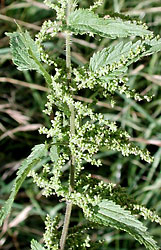

---
aliases:
  - Rosales
  - šipkovci
  - 蔷薇目
has_id_wikidata: Q21895
title: Rosales
parent_taxon: '[[_Standards/WikiData/WD~fabids,2683213]]'
permanent_duplicated_item:
  - '[[_Standards/WikiData/WD~Q23014513,23014513]]'
  - '[[_Standards/WikiData/WD~Q96182801,96182801]]'
instance_of: '[[_Standards/WikiData/WD~taxon,16521]]'
taxon_rank: '[[_Standards/WikiData/WD~order,36602]]'
ITIS_TSN: 24057
OmegaWiki_Defined_Meaning: 361434
Commons_category: Rosales
taxon_name: Rosales
image:
  - http://commons.wikimedia.org/wiki/Special:FilePath/Illustration%20Rosa%20majalis0.jpg
  - http://commons.wikimedia.org/wiki/Special:FilePath/Rosa%20bracteata.jpg
EPPO_Code: 1ROSO
MeSH_tree_code: B01.875.800.575.912.250.859.937
NBN_System_Key: NHMSYS0021060391
taxon_common_name:
  - šipkovci
  - 蔷薇目
---

# [[Rosales]] 

     

#is_/same_as :: [[../../../../../../../../../../WikiData/WD~Rosales,21895|WD~Rosales,21895]] 

## #has_/text_of_/abstract 

> **Rosales** (, roh-ZAY-leez) are an order of flowering plants. Well-known members of Rosales include: 
> roses, strawberries, blackberries and raspberries, apples and pears, plums, peaches and apricots, 
> almonds, rowan and hawthorn, jujube, elms, banyans, figs, mulberries, breadfruit, nettles, hops, and cannabis.
>
> Rosales contain about 7,700 species, distributed into nine families and about 260 genera. 
> Their type family is the rose family, Rosaceae. 
> The largest families are Rosaceae (91/4828) and Urticaceae (53/2625).
>
> [Wikipedia](https://en.wikipedia.org/wiki/Rosales) 

## Phylogeny 

-   « Ancestral Groups  
    -   [Rosids](../Rosids.md)
    -  [Core Eudicots](../../Core_Eudicots.md) 
    -   [Eudicots](../../../Eudicots.md)
    -   [Flowering_Plant](../../../../Flowering_Plant.md)
    -   [Seed_Plant](../../../../../Seed_Plant.md)
    -   [Land_Plant](../../../../../../Land_Plant.md)
    -  [Green plants](../../../../../../../Plant.md) 
    -  [Eukarya](../../../../../../../../Eukarya.md) 
    -   [Tree of Life](../../../../../../../../Tree_of_Life.md)

-   ◊ Sibling Groups of  Rosids
    -   [Gerrardina](Gerrardina)
    -   [Fagales](Fagales.md)
    -   [Cucurbitales](Cucurbitales.md)
    -   Rosales
    -   [Fabales](Fabales.md)
    -   [Zygophyllales](Zygophyllales.md)
    -   [Oxalidales](Oxalidales.md)
    -   [Malpighiales](Malpighiales.md)
    -   [Celastrales](Celastrales.md)
    -   [Geraniales](Geraniales.md)
    -   [Crossosomatales](Crossosomatales.md)
    -   [Myrtales](Myrtales.md)
    -   [Brassicales](Brassicales.md)
    -   [Malvales](Malvales.md)
    -   [Sapindales](Sapindales.md)

-   » Sub-Groups 

## Title Illustrations

------------------------------------------------------------------------
 
scientific_name ::   Urtica dioica
location ::         Allschwil, Basel, Switzerland
Comments           Stinging nettle (Urticaceae). Flowering.
Acknowledgements   courtesy [Botanical Image Database](http://www.unibas.ch/botimage/)
Sex ::              Female
copyright ::          © 2001 University of Basel, Basel, Switzerland 

------------------------------------------------------------------------- 
 
scientific_name ::    Rosa davurica
location ::          Near Barabash-Levada village, Pogranichny distr., Primorsky Territory (Russian Federation)
Comments            Daurian rose (Rosaceae)
Source Collection   [CalPhotos](http://calphotos.berkeley.edu/)
copyright ::           © 1999 [Nick Kurzenko](mailto:kurzenko@ibss.dvo.ru) 

------------------------------------------------------------------------
 
scientific_name ::   Cannabis sativa
Comments           Marijuana plant (Cannabaceae), cultivated at the Botanical Garden Basel, Switzerland.
Acknowledgements   courtesy [Botanical Image Database](http://www.unibas.ch/botimage/)
copyright ::          © 2001 University of Basel, Basel, Switzerland 

## Confidential Links & Embeds: 

### #is_/same_as :: [[/_Standards/bio/bio~Domain/Eukarya/Plant/Land_Plant/Seed_Plant/Flowering_Plant/Eudicots/Core_Eudicots/Rosids/Rosales|Rosales]] 

### #is_/same_as :: [[/_public/bio/bio~Domain/Eukarya/Plant/Land_Plant/Seed_Plant/Flowering_Plant/Eudicots/Core_Eudicots/Rosids/Rosales.public|Rosales.public]] 

### #is_/same_as :: [[/_internal/bio/bio~Domain/Eukarya/Plant/Land_Plant/Seed_Plant/Flowering_Plant/Eudicots/Core_Eudicots/Rosids/Rosales.internal|Rosales.internal]] 

### #is_/same_as :: [[/_protect/bio/bio~Domain/Eukarya/Plant/Land_Plant/Seed_Plant/Flowering_Plant/Eudicots/Core_Eudicots/Rosids/Rosales.protect|Rosales.protect]] 

### #is_/same_as :: [[/_private/bio/bio~Domain/Eukarya/Plant/Land_Plant/Seed_Plant/Flowering_Plant/Eudicots/Core_Eudicots/Rosids/Rosales.private|Rosales.private]] 

### #is_/same_as :: [[/_personal/bio/bio~Domain/Eukarya/Plant/Land_Plant/Seed_Plant/Flowering_Plant/Eudicots/Core_Eudicots/Rosids/Rosales.personal|Rosales.personal]] 

### #is_/same_as :: [[/_secret/bio/bio~Domain/Eukarya/Plant/Land_Plant/Seed_Plant/Flowering_Plant/Eudicots/Core_Eudicots/Rosids/Rosales.secret|Rosales.secret]] 

