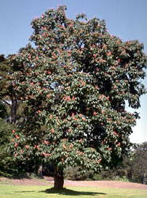
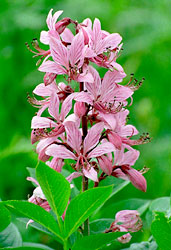
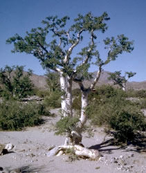

---
aliases:
- bộ Bồ hòn
- javorovci
- Kinesträdordningen
- lønneordenen
- muileniečiai
- mydleńcowce
- mydlonvíkotvaré
- mýdelníkotvaré
- Sabunağacıçiçəklilər
- Sapindales
- Sapindaloj
- Sapindals
- sapindolike
- Seebipuulaadsed
- Seifenbaumartige
- szappanfavirágúak
- Sæbetræ-ordenen
- ziepjkoku rinda
- Σαπινδώδη
- сапіндакветныя
- Сапіндоцвіті
- сапиндоцветни
- сапиндоцветные
- Сапиндус чукӧр
- сапуновидни
- օճառածաղկավորներ
- סבוננאים
- اسپینڈالیس
- افراسانان
- صابونيات
- सैपिंडेलीज़
- సపిండేలిస్
- സാപ്പിൻഡേൽസ്
- อันดับเงาะ
- ムクロジ目
- 无患子目
- 無患子目
- 무환자나무목
title: Sapindales
has_id_wikidata: Q26316
dv_has_:
  name_:
    af: Sapindales
    an: Sapindales
    ar: صابونيات
    arz: صابونيات
    ast: Sapindales
    az: Sabunağacıçiçəklilər
    bar: Sapindales
    bcl: Sapindales
    be: Sapindales
    be-tarask: сапіндакветныя
    bg: сапиндоцветни
    bho: सैपिंडेलीज़
    br: Sapindales
    bs: Sapindales
    ca: Sapindals
    ceb: Sapindales
    co: Sapindales
    cs: mýdelníkotvaré
    cy: Sapindales
    da: Sæbetræ-ordenen
    de: Seifenbaumartige
    de-at: Seifenbaumartige
    de-ch: Sapindales
    el: Σαπινδώδη
    en: Sapindales
    en-ca: Sapindales
    en-gb: Sapindales
    eo: Sapindaloj
    es: Sapindales
    et: Seebipuulaadsed
    eu: Sapindales
    ext: Sapindales
    fa: افراسانان
    fi: Sapindales
    fr: Sapindales
    frp: Sapindales
    frr: Sapindales
    fur: Sapindales
    ga: Sapindales
    gd: Sapindales
    gl: Sapindales
    gsw: Sapindales
    he: סבוננאים
    hr: sapindolike
    hu: szappanfavirágúak
    hy: օճառածաղկավորներ
    ia: Sapindales
    id: Sapindales
    ie: Sapindales
    ilo: Sapindales
    io: Sapindales
    is: Sapindales
    it: Sapindales
    ja: ムクロジ目
    jv: Sapindales
    kg: Sapindales
    ko: 무환자나무목
    koi: Сапиндус чукӧр
    kv: Сапиндус чукӧр
    la: Sapindales
    lb: Sapindales
    li: Sapindales
    lij: Sapindales
    lt: muileniečiai
    lv: ziepjkoku rinda
    mg: Sapindales
    min: Sapindales
    mk: сапуновидни
    ml: സാപ്പിൻഡേൽസ്
    ms: Sapindales
    mul: Sapindales
    nap: Sapindales
    nb: lønneordenen
    nds: Sapindales
    nds-nl: Sapindales
    nl: Sapindales
    nn: Sapindales
    nrm: Sapindales
    nys: Sapindales
    oc: Sapindales
    pcd: Sapindales
    pl: mydleńcowce
    pms: Sapindales
    pt: Sapindales
    pt-br: Sapindales
    rm: Sapindales
    ro: Sapindales
    ru: сапиндоцветные
    sc: Sapindales
    scn: Sapindales
    sco: Sapindales
    sh: Sapindolike
    sk: mydlonvíkotvaré
    sl: javorovci
    sq: Sapindales
    sr: Sapindolike
    su: Sapindales
    sv: Kinesträdordningen
    sw: Sapindales
    te: సపిండేలిస్
    th: อันดับเงาะ
    tl: Sapindales
    tr: Sapindales
    uk: Сапіндоцвіті
    ur: اسپینڈالیس
    vec: Sapindales
    vi: bộ Bồ hòn
    vls: Sapindales
    vo: Sapindales
    wa: Sapindales
    war: Sapindales
    wo: Sapindales
    wuu: 无患子目
    yue: 無患子目
    zh: 无患子目
    zh-cn: 无患子目
    zh-hans: 无患子目
    zu: Sapindales
---
# [[Sapindales]] 

#is_/same_as :: [[../../../../../../../../../../WikiData/WD~Sapindales,26316|WD~Sapindales,26316]] 

## #has_/text_of_/abstract 

> **Sapindales**  is an order of flowering plants. 
> Well-known members of Sapindales include citrus; maples, horse-chestnuts, lychees and rambutans; mangos and cashews; frankincense and myrrh; mahogany and neem.
>
> The APG III system of 2009 includes it in the clade malvids (in rosids, in eudicots) 
> with the following nine families:
> - Anacardiaceae
> - Biebersteiniaceae
> - Burseraceae
> - Kirkiaceae
> - Meliaceae
> - Nitrariaceae (including Peganaceae and Tetradiclidaceae)
> - Rutaceae
> - Sapindaceae
> - Simaroubaceae
>
> The APG II system of 2003 allowed the optional segregation of families now included in the Nitrariaceae.
>
> In the classification system of Dahlgren the Rutaceae were placed in the order Rutales, 
> in the superorder Rutiflorae (also called Rutanae). 
> The Cronquist system of 1981 used a somewhat different circumscription, 
> including the following families:
> -Staphyleaceae
> -Melianthaceae
> -Bretschneideraceae
> -Akaniaceae
> -Sapindaceae- 
> -Hippocastanaceae
> -Aceraceae
> -Burseraceae
> -Anacardiaceae
> -Julianiaceae
> -Simaroubaceae
> -Cneoraceae
> -Meliaceae
> -Rutaceae
> -Zygophyllaceae
>
> The difference from the APG III system is not as large as may appear, 
> as the plants in the families Aceraceae and Hippocastanaceae stay in this order at APG III 
> (both included in family Sapindaceae). 
> 
> The species now composing the family Nitrariaceae in APG III 
> also belonged to this order in the Cronquist system as part of the family Zygophyllaceae, 
> while those now in the family Kirkiaceae were present as part of the family Simaroubaceae.
>
> [Wikipedia](https://en.wikipedia.org/wiki/Sapindales) 

## Phylogeny 

-
-   « Ancestral Groups  
    -   [Rosids](../Rosids.md)
    -  [Core Eudicots](../../Core_Eudicots.md) 
    -   [Eudicots](../../../Eudicots.md)
    -   [Flowering_Plant](../../../../Flowering_Plant.md)
    -   [Seed_Plant](../../../../../Seed_Plant.md)
    -   [Land_Plant](../../../../../../Land_Plant.md)
    -  [Green plants](../../../../../../../Plant.md) 
    -  [Eukarya](../../../../../../../../Eukarya.md) 
    -   [Tree of Life](../../../../../../../../Tree_of_Life.md)

-   ◊ Sibling Groups of  Rosids
    -   [Gerrardina](Gerrardina)
    -   [Fagales](Fagales.md)
    -   [Cucurbitales](Cucurbitales.md)
    -   [Rosales](Rosales.md)
    -   [Fabales](Fabales.md)
    -   [Zygophyllales](Zygophyllales.md)
    -   [Oxalidales](Oxalidales.md)
    -   [Malpighiales](Malpighiales.md)
    -   [Celastrales](Celastrales.md)
    -   [Geraniales](Geraniales.md)
    -   [Crossosomatales](Crossosomatales.md)
    -   [Myrtales](Myrtales.md)
    -   [Brassicales](Brassicales.md)
    -   [Malvales](Malvales.md)
    -   Sapindales

-   » Sub-Groups
    -   [Anacardiaceae](Anacardiaceae)
    -   [Burseraceae](Burseraceae)

## Title Illustrations

 

  ------------------------------------------------------------------------------
  scientific_name ::     Aesculus californica
  Comments             California buckeye (Sapindaceae)
  Creator              Photograph by G. Dallas and Margaret Hanna
  specimen_condition ::  Live Specimen
  Source Collection    [CalPhotos](http://calphotos.berkeley.edu/)
  copyright ::            © 1999 [California Academy of Sciences](http://www.calacademy.org/) 
 
  ------------------------------------------------------------------------------
 

  -------------------------------------------------------------------------
  scientific_name ::     Dictamnus dasycarpus
  location ::           Near Barabash-Levada village, Pogranichny distr., Primorsky Territory (Russian Federation)
  Comments             Rutaceae
  specimen_condition ::  Live Specimen
  Source Collection    [CalPhotos](http://calphotos.berkeley.edu/)
  copyright ::            © 1999 [Nick Kurzenko](mailto:kurzenko@ibss.dvo.ru) 
 
  -------------------------------------------------------------------------
 

  ------------------------------------------------------------------------------
  scientific_name ::     Bursera microphylla
  location ::           Baja California, La Gringa, near (Mexico)
  Comments             Elephant tree (Burseraceae)
  Creator              Photograph by Glenn Vargas
  specimen_condition ::  Live Specimen
  Source Collection    [CalPhotos](http://calphotos.berkeley.edu/)
  copyright ::            © 1999 [California Academy of Sciences](http://www.calacademy.org/) 
 
  ------------------------------------------------------------------------------

## Confidential Links & Embeds: 

### #is_/same_as :: [[/_Standards/bio/bio~Domain/Eukarya/Plant/Land_Plant/Seed_Plant/Flowering_Plant/Eudicots/Core_Eudicots/Rosids/Sapindales|Sapindales]] 

### #is_/same_as :: [[/_public/bio/bio~Domain/Eukarya/Plant/Land_Plant/Seed_Plant/Flowering_Plant/Eudicots/Core_Eudicots/Rosids/Sapindales.public|Sapindales.public]] 

### #is_/same_as :: [[/_internal/bio/bio~Domain/Eukarya/Plant/Land_Plant/Seed_Plant/Flowering_Plant/Eudicots/Core_Eudicots/Rosids/Sapindales.internal|Sapindales.internal]] 

### #is_/same_as :: [[/_protect/bio/bio~Domain/Eukarya/Plant/Land_Plant/Seed_Plant/Flowering_Plant/Eudicots/Core_Eudicots/Rosids/Sapindales.protect|Sapindales.protect]] 

### #is_/same_as :: [[/_private/bio/bio~Domain/Eukarya/Plant/Land_Plant/Seed_Plant/Flowering_Plant/Eudicots/Core_Eudicots/Rosids/Sapindales.private|Sapindales.private]] 

### #is_/same_as :: [[/_personal/bio/bio~Domain/Eukarya/Plant/Land_Plant/Seed_Plant/Flowering_Plant/Eudicots/Core_Eudicots/Rosids/Sapindales.personal|Sapindales.personal]] 

### #is_/same_as :: [[/_secret/bio/bio~Domain/Eukarya/Plant/Land_Plant/Seed_Plant/Flowering_Plant/Eudicots/Core_Eudicots/Rosids/Sapindales.secret|Sapindales.secret]] 

