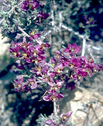

# [[Zygophyllales]] 

## #has_/text_of_/abstract 

> The **Zygophyllales** are an order of dicotyledonous plants, comprising the following two families:
> - Family Zygophyllaceae
> - Family Krameriaceae
>
> According to the Angiosperm Phylogeny Group (APG II) both families are unplaced to order, 
> but nevertheless included in the Eurosids I. 
> The APG III system of 2009, however, recognized this order. 
> 
> Even if the monogeneric family Krameriaceae 
> shares few common traits with the family Zygophyllaceae, 
> researchers see little advantage in keeping it as a separate family (e.g. Sheahan and Chase). 
> 
> The name Zygophyllales can be used 
> if one finds it appropriate to place both families into an order. 
> The order remains unchanged in the APG IV system.
>
> Under the Cronquist system, the Zygophyllaceae were included within the Sapindales, 
> and the Krameriaceae within the Polygalales.
>
> [Wikipedia](https://en.wikipedia.org/wiki/Zygophyllales) 

## Phylogeny 

-   « Ancestral Groups  
    -   [Rosids](../Rosids.md)
    -  [Core Eudicots](../../Core_Eudicots.md))
    -   [Eudicots](../../../Eudicots.md)
    -   [Flowering_Plant](../../../../Flowering_Plant.md)
    -   [Seed_Plant](../../../../../Seed_Plant.md)
    -   [Land_Plant](../../../../../../Land_Plant.md)
    -  [Green plants](../../../../../../../Plant.md))
    -  [Eukarya](../../../../../../../../Eukarya.md))
    -   [Tree of Life](../../../../../../../../Tree_of_Life.md)

-   ◊ Sibling Groups of  Rosids
    -   [Gerrardina](Gerrardina)
    -   [Fagales](Fagales.md)
    -   [Cucurbitales](Cucurbitales.md)
    -   [Rosales](Rosales.md)
    -   [Fabales](Fabales.md)
    -   Zygophyllales
    -   [Oxalidales](Oxalidales.md)
    -   [Malpighiales](Malpighiales.md)
    -   [Celastrales](Celastrales.md)
    -   [Geraniales](Geraniales.md)
    -   [Crossosomatales](Crossosomatales.md)
    -   [Myrtales](Myrtales.md)
    -   [Brassicales](Brassicales.md)
    -   [Malvales](Malvales.md)
    -   [Sapindales](Sapindales.md)

-   » Sub-Groups 

## Title Illustrations

)

  ------------------------------------------------------------------------------
  Scientific Name ::     Larrea tridentata
  Location ::           Death Valley National Monument (Inyo County, California, USA)
  Comments             South American creosote bush (Zygophyllaceae)
  Creator              Photograph by Charles Webber
  Specimen Condition   Live Specimen
  Source Collection    [CalPhotos](http://calphotos.berkeley.edu/)
  Copyright ::            © 1998 [California Academy of Sciences](http://www.calacademy.org/) 
  ------------------------------------------------------------------------------
)

  ---------------------------------------------------------------------------------
  Scientific Name ::     Krameria grayi
  Location ::           California, USA
  Creator              Photograph by Brother Alfred Brousseau
  Specimen Condition   Live Specimen
  Source Collection    [CalPhotos](http://calphotos.berkeley.edu/)
  Copyright ::            © 1995 [Saint Mary\'s College of California](mailto:rpolowin@stmarys-ca.edu) 
  ---------------------------------------------------------------------------------

## Confidential Links & Embeds: 

### #is_/same_as :: [Zygophyllales](/_Standards/bio/bio~Domain/Eukarya/Plant/Land_Plant/Seed_Plant/Flowering_Plant/Eudicots/Core_Eudicots/Rosids/Zygophyllales.md) 

### #is_/same_as :: [Zygophyllales.public](/_public/bio/bio~Domain/Eukarya/Plant/Land_Plant/Seed_Plant/Flowering_Plant/Eudicots/Core_Eudicots/Rosids/Zygophyllales.public.md) 

### #is_/same_as :: [Zygophyllales.internal](/_internal/bio/bio~Domain/Eukarya/Plant/Land_Plant/Seed_Plant/Flowering_Plant/Eudicots/Core_Eudicots/Rosids/Zygophyllales.internal.md) 

### #is_/same_as :: [Zygophyllales.protect](/_protect/bio/bio~Domain/Eukarya/Plant/Land_Plant/Seed_Plant/Flowering_Plant/Eudicots/Core_Eudicots/Rosids/Zygophyllales.protect.md) 

### #is_/same_as :: [Zygophyllales.private](/_private/bio/bio~Domain/Eukarya/Plant/Land_Plant/Seed_Plant/Flowering_Plant/Eudicots/Core_Eudicots/Rosids/Zygophyllales.private.md) 

### #is_/same_as :: [Zygophyllales.personal](/_personal/bio/bio~Domain/Eukarya/Plant/Land_Plant/Seed_Plant/Flowering_Plant/Eudicots/Core_Eudicots/Rosids/Zygophyllales.personal.md) 

### #is_/same_as :: [Zygophyllales.secret](/_secret/bio/bio~Domain/Eukarya/Plant/Land_Plant/Seed_Plant/Flowering_Plant/Eudicots/Core_Eudicots/Rosids/Zygophyllales.secret.md)

