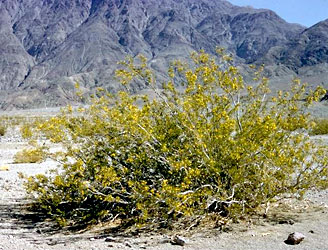

---
aliases:
- Bộ Bá vương
- Həlməlçiçəklilər
- jarmovcotvaré
- Jochblattartige
- kacibotvaré
- Keimerūniečiai
- királydinnye-virágúak
- Koma gindorikên keyan
- Kreosotbusk-ordenen
- Parolistowce
- Pockenholtsordningen
- Seiglehelaadsed
- Zigofilaloj
- Zigofil·lals
- Zygophyllales
- ζυγοφυλλώδη
- Парнолисновидни
- парнолистникоцветни
- парнолистникоцветные
- զուգատերևածաղկավորներ
- قديسيات
- قیچسانان
- อันดับโคกกระสุน
- ハマビシ目
- 蒺藜目
- 남가새목
title: Zygophyllales
has_id_wikidata: Q21899
dv_has_:
  name_:
    an: Zygophyllales
    ar: قديسيات
    arz: قديسيات
    ast: Zygophyllales
    az: Həlməlçiçəklilər
    bg: парнолистникоцветни
    bs: Zygophyllales
    ca: Zigofil·lals
    ceb: Zygophyllales
    cs: kacibotvaré
    da: Kreosotbusk-ordenen
    de: Jochblattartige
    el: ζυγοφυλλώδη
    en: Zygophyllales
    en-ca: Zygophyllales
    en-gb: Zygophyllales
    eo: Zigofilaloj
    es: Zygophyllales
    et: Seiglehelaadsed
    eu: Zygophyllales
    ext: Zygophyllales
    fa: قیچسانان
    fi: Zygophyllales
    fr: Zygophyllales
    frr: Zygophyllales
    ga: Zygophyllales
    gl: Zygophyllales
    hr: Zygophyllales
    hu: királydinnye-virágúak
    hy: զուգատերևածաղկավորներ
    ia: Zygophyllales
    id: Zygophyllales
    ie: Zygophyllales
    io: Zygophyllales
    it: Zygophyllales
    ja: ハマビシ目
    ko: 남가새목
    ku: Koma gindorikên keyan
    la: Zygophyllales
    lt: Keimerūniečiai
    mk: Парнолисновидни
    mul: Zygophyllales
    nb: Zygophyllales
    nl: Zygophyllales
    oc: Zygophyllales
    pl: Parolistowce
    pt: Zygophyllales
    pt-br: Zygophyllales
    ro: Zygophyllales
    ru: парнолистникоцветные
    sh: Zygophyllales
    sk: jarmovcotvaré
    sq: Zygophyllales
    sv: Pockenholtsordningen
    th: อันดับโคกกระสุน
    tr: Zygophyllales
    uk: Zygophyllales
    vi: Bộ Bá vương
    vo: Zygophyllales
    war: Zygophyllales
    zh: 蒺藜目
    zh-cn: 蒺藜目
    zh-tw: 蒺藜目
---
# [[Zygophyllales]] 

## #has_/text_of_/abstract 

> The **Zygophyllales** are an order of dicotyledonous plants, comprising the following two families:
> - Family Zygophyllaceae
> - Family Krameriaceae
>
> According to the Angiosperm Phylogeny Group (APG II) both families are unplaced to order, 
> but nevertheless included in the Eurosids I. 
> The APG III system of 2009, however, recognized this order. 
> 
> Even if the monogeneric family Krameriaceae 
> shares few common traits with the family Zygophyllaceae, 
> researchers see little advantage in keeping it as a separate family (e.g. Sheahan and Chase). 
> 
> The name Zygophyllales can be used 
> if one finds it appropriate to place both families into an order. 
> The order remains unchanged in the APG IV system.
>
> Under the Cronquist system, the Zygophyllaceae were included within the Sapindales, 
> and the Krameriaceae within the Polygalales.
>
> [Wikipedia](https://en.wikipedia.org/wiki/Zygophyllales) 

## Phylogeny 

-   « Ancestral Groups  
    -   [Rosids](../Rosids.md)
    -  [Core Eudicots](../../Core_Eudicots.md) 
    -   [Eudicots](../../../Eudicots.md)
    -   [Flowering_Plant](../../../../Flowering_Plant.md)
    -   [Seed_Plant](../../../../../Seed_Plant.md)
    -   [Land_Plant](../../../../../../Land_Plant.md)
    -  [Green plants](../../../../../../../Plant.md) 
    -  [Eukarya](../../../../../../../../Eukarya.md) 
    -   [Tree of Life](../../../../../../../../Tree_of_Life.md)

-   ◊ Sibling Groups of  Rosids
    -   [Gerrardina](Gerrardina)
    -   [Fagales](Fagales.md)
    -   [Cucurbitales](Cucurbitales.md)
    -   [Rosales](Rosales.md)
    -   [Fabales](Fabales.md)
    -   Zygophyllales
    -   [Oxalidales](Oxalidales.md)
    -   [Malpighiales](Malpighiales.md)
    -   [Celastrales](Celastrales.md)
    -   [Geraniales](Geraniales.md)
    -   [Crossosomatales](Crossosomatales.md)
    -   [Myrtales](Myrtales.md)
    -   [Brassicales](Brassicales.md)
    -   [Malvales](Malvales.md)
    -   [Sapindales](Sapindales.md)

-   » Sub-Groups 

## Title Illustrations

 

  ------------------------------------------------------------------------------
  scientific_name ::     Larrea tridentata
  location ::           Death Valley National Monument (Inyo County, California, USA)
  Comments             South American creosote bush (Zygophyllaceae)
  Creator              Photograph by Charles Webber
  specimen_condition ::  Live Specimen
  Source Collection    [CalPhotos](http://calphotos.berkeley.edu/)
  copyright ::            © 1998 [California Academy of Sciences](http://www.calacademy.org/) 
 
  ------------------------------------------------------------------------------
 

  ---------------------------------------------------------------------------------
  scientific_name ::     Krameria grayi
  location ::           California, USA
  Creator              Photograph by Brother Alfred Brousseau
  specimen_condition ::  Live Specimen
  Source Collection    [CalPhotos](http://calphotos.berkeley.edu/)
  copyright ::            © 1995 [Saint Mary\'s College of California](mailto:rpolowin@stmarys-ca.edu) 
 
  ---------------------------------------------------------------------------------

## Confidential Links & Embeds: 

### #is_/same_as :: [[/_Standards/bio/bio~Domain/Eukarya/Plant/Land_Plant/Seed_Plant/Flowering_Plant/Eudicots/Core_Eudicots/Rosids/Zygophyllales|Zygophyllales]] 

### #is_/same_as :: [[/_public/bio/bio~Domain/Eukarya/Plant/Land_Plant/Seed_Plant/Flowering_Plant/Eudicots/Core_Eudicots/Rosids/Zygophyllales.public|Zygophyllales.public]] 

### #is_/same_as :: [[/_internal/bio/bio~Domain/Eukarya/Plant/Land_Plant/Seed_Plant/Flowering_Plant/Eudicots/Core_Eudicots/Rosids/Zygophyllales.internal|Zygophyllales.internal]] 

### #is_/same_as :: [[/_protect/bio/bio~Domain/Eukarya/Plant/Land_Plant/Seed_Plant/Flowering_Plant/Eudicots/Core_Eudicots/Rosids/Zygophyllales.protect|Zygophyllales.protect]] 

### #is_/same_as :: [[/_private/bio/bio~Domain/Eukarya/Plant/Land_Plant/Seed_Plant/Flowering_Plant/Eudicots/Core_Eudicots/Rosids/Zygophyllales.private|Zygophyllales.private]] 

### #is_/same_as :: [[/_personal/bio/bio~Domain/Eukarya/Plant/Land_Plant/Seed_Plant/Flowering_Plant/Eudicots/Core_Eudicots/Rosids/Zygophyllales.personal|Zygophyllales.personal]] 

### #is_/same_as :: [[/_secret/bio/bio~Domain/Eukarya/Plant/Land_Plant/Seed_Plant/Flowering_Plant/Eudicots/Core_Eudicots/Rosids/Zygophyllales.secret|Zygophyllales.secret]] 

