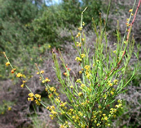

---
aliases:
  - Santalales
title: Santalales
has_id_wikidata: Q21851
---
## Phylogeny 

-   « Ancestral Groups  
    -  [Core Eudicots](../Core_Eudicots.md) 
    -   [Core_Eudicots](../Core_Eudicots.md)
    -   [Flowering_Plant](../../../Flowering_Plant.md)
    -   [Seed_Plant](../../../../Seed_Plant.md)
    -   [Land_Plant](../../../../../Land_Plant.md)
    -  [Green plants](../../../../../../Plant.md) 
    -  [Eukarya](../../../../../../../Eukarya.md) 
    -   [Tree of Life](../../../../../../../Tree_of_Life.md)

-   ◊ Sibling Groups of  Core Eudicots
    -   Santalales
    -   [Saxifragales](Saxifragales.md)
    -   [Berberidopsidales](Berberidopsidales.md)
    -   [Rosids](Rosids.md)
    -   [Caryophyllales](Caryophyllales.md)
    -   [Asterids](Asterids.md)

-   » Sub-Groups 

# [[Santalales]]  

## #has_/text_of_/abstract 

> The **Santalales** are an order of flowering plants in the dicotyledons. 
> 
> Well-known members of the Santalales include sandalwoods and the many species of mistletoes. 
> The order has a cosmopolitan distribution, but is heavily concentrated in tropical and subtropical regions. 
> 
> It derives its name from its type genus, Santalum (sandalwood).
>
> [Wikipedia](https://en.wikipedia.org/wiki/Santalales) 

## Title Illustrations

 

  ------------------------------------------------------------------------
  scientific_name ::   Osyris alba
  location ::         Samos, Greece
  Comments           Santalaceae
  Acknowledgements   courtesy [Botanical Image Database](http://www.unibas.ch/botimage/)
  copyright ::          © 2001 University of Basel, Basel, Switzerland 
  ------------------------------------------------------------------------
 

  ------------------------------------------------------------------------
  scientific_name ::   Viscum album, Sorbus aria
  location ::         Arlesheim, Switzerland
  Comments           Mistletoe, Viscum album (Loranthaceae), growing on the trunk of a whitebeam, Sorbus aria (Rosaceae)
  Acknowledgements   courtesy [Botanical Image Database](http://www.unibas.ch/botimage/)
  copyright ::          © 2001 University of Basel, Basel, Switzerland 
  ------------------------------------------------------------------------

## Confidential Links & Embeds: 

### #is_/same_as :: [[/_Standards/bio/bio~Domain/Eukarya/Plant/Land_Plant/Seed_Plant/Flowering_Plant/Eudicots/Core_Eudicots/Santalales|Santalales]] 

### #is_/same_as :: [[/_public/bio/bio~Domain/Eukarya/Plant/Land_Plant/Seed_Plant/Flowering_Plant/Eudicots/Core_Eudicots/Santalales.public|Santalales.public]] 

### #is_/same_as :: [[/_internal/bio/bio~Domain/Eukarya/Plant/Land_Plant/Seed_Plant/Flowering_Plant/Eudicots/Core_Eudicots/Santalales.internal|Santalales.internal]] 

### #is_/same_as :: [[/_protect/bio/bio~Domain/Eukarya/Plant/Land_Plant/Seed_Plant/Flowering_Plant/Eudicots/Core_Eudicots/Santalales.protect|Santalales.protect]] 

### #is_/same_as :: [[/_private/bio/bio~Domain/Eukarya/Plant/Land_Plant/Seed_Plant/Flowering_Plant/Eudicots/Core_Eudicots/Santalales.private|Santalales.private]] 

### #is_/same_as :: [[/_personal/bio/bio~Domain/Eukarya/Plant/Land_Plant/Seed_Plant/Flowering_Plant/Eudicots/Core_Eudicots/Santalales.personal|Santalales.personal]] 

### #is_/same_as :: [[/_secret/bio/bio~Domain/Eukarya/Plant/Land_Plant/Seed_Plant/Flowering_Plant/Eudicots/Core_Eudicots/Santalales.secret|Santalales.secret]] 

