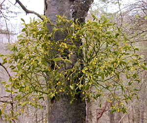

---
aliases:
- Bộ Đàn hương
- Koma sendelan
- lanikovci
- Linalehikulaadsed
- Sandałowce
- Sandelholtoortagen
- Sandelholzartige
- sandeltreordenen
- Sandeltræ-ordenen
- Sandelviðarbálkur
- Santalales
- Santalaloj
- Santalals
- Santaliečiai
- Santalolike
- santalotvaré
- Santalu rinda
- santálotvaré
- szantálfavirágúak
- Səndəlçiçəklilər
- Σανδαλιώδη
- сандаловидни
- санталакветныя
- санталоцветни
- санталоцветные
- սանտալածաղկավորներ
- סנטלניים
- صندلسانان
- صندليات
- सैंटालेलीस
- സന്റാലലേസ്
- อันดับย่านตีเมีย
- ビャクダン目
- 檀香目
- 단향목
title: Santalales
has_id_wikidata: Q21851
dv_has_:
  name_:
    an: Santalales
    ar: صندليات
    arz: صندليات
    ast: Santalales
    az: Səndəlçiçəklilər
    be: Santalales
    be-tarask: санталакветныя
    bg: санталоцветни
    bs: Santalales
    ca: Santalals
    ceb: Santalales
    co: Santalales
    cs: santálotvaré
    da: Sandeltræ-ordenen
    de: Sandelholzartige
    el: Σανδαλιώδη
    en: Santalales
    en-ca: Santalales
    en-gb: Santalales
    eo: Santalaloj
    es: Santalales
    et: Linalehikulaadsed
    eu: Santalales
    ext: Santalales
    fa: صندلسانان
    fi: Santalales
    fr: Santalales
    frr: Sandelholtoortagen
    ga: Santalales
    gl: Santalales
    he: סנטלניים
    hi: सैंटालेलीस
    hr: Santalolike
    hu: szantálfavirágúak
    hy: սանտալածաղկավորներ
    ia: Santalales
    id: Santalales
    ie: Santalales
    io: Santalales
    is: Sandelviðarbálkur
    it: Santalales
    ja: ビャクダン目
    ko: 단향목
    ku: Koma sendelan
    la: Santalales
    lt: Santaliečiai
    lv: Santalu rinda
    mk: сандаловидни
    ml: സന്റാലലേസ്
    mul: Santalales
    nb: sandeltreordenen
    nl: Santalales
    oc: Santalales
    pl: Sandałowce
    pt: Santalales
    pt-br: Santalales
    ro: Santalales
    ru: санталоцветные
    sk: santalotvaré
    sl: lanikovci
    sq: Santalales
    sv: Santalales
    th: อันดับย่านตีเมีย
    uk: Santalales
    vi: Bộ Đàn hương
    vo: Santalales
    war: Santalales
    zh: 檀香目
    zh-cn: 檀香目
    zh-hans: 檀香目
    zh-hant: 檀香目
---
## Phylogeny 

-   « Ancestral Groups  
    -  [Core Eudicots](../Core_Eudicots.md) 
    -   [Core_Eudicots](../Core_Eudicots.md)
    -   [Flowering_Plant](../../../Flowering_Plant.md)
    -   [Seed_Plant](../../../../Seed_Plant.md)
    -   [Land_Plant](../../../../../Land_Plant.md)
    -  [Green plants](../../../../../../Plant.md) 
    -  [Eukarya](../../../../../../../Eukarya.md) 
    -   [Tree of Life](../../../../../../../Tree_of_Life.md)

-   ◊ Sibling Groups of  Core Eudicots
    -   Santalales
    -   [Saxifragales](Saxifragales.md)
    -   [Berberidopsidales](Berberidopsidales.md)
    -   [Rosids](Rosids.md)
    -   [Caryophyllales](Caryophyllales.md)
    -   [Asterids](Asterids.md)

-   » Sub-Groups 

# [[Santalales]]  

## #has_/text_of_/abstract 

> The **Santalales** are an order of flowering plants in the dicotyledons. 
> 
> Well-known members of the Santalales include sandalwoods and the many species of mistletoes. 
> The order has a cosmopolitan distribution, but is heavily concentrated in tropical and subtropical regions. 
> 
> It derives its name from its type genus, Santalum (sandalwood).
>
> [Wikipedia](https://en.wikipedia.org/wiki/Santalales) 

## Title Illustrations

 

  ------------------------------------------------------------------------
  scientific_name ::   Osyris alba
  location ::         Samos, Greece
  Comments           Santalaceae
  Acknowledgements   courtesy [Botanical Image Database](http://www.unibas.ch/botimage/)
  copyright ::          © 2001 University of Basel, Basel, Switzerland 
  ------------------------------------------------------------------------
 

  ------------------------------------------------------------------------
  scientific_name ::   Viscum album, Sorbus aria
  location ::         Arlesheim, Switzerland
  Comments           Mistletoe, Viscum album (Loranthaceae), growing on the trunk of a whitebeam, Sorbus aria (Rosaceae)
  Acknowledgements   courtesy [Botanical Image Database](http://www.unibas.ch/botimage/)
  copyright ::          © 2001 University of Basel, Basel, Switzerland 
  ------------------------------------------------------------------------

## Confidential Links & Embeds: 

### #is_/same_as :: [[/_Standards/bio/bio~Domain/Eukarya/Plant/Land_Plant/Seed_Plant/Flowering_Plant/Eudicots/Core_Eudicots/Santalales|Santalales]] 

### #is_/same_as :: [[/_public/bio/bio~Domain/Eukarya/Plant/Land_Plant/Seed_Plant/Flowering_Plant/Eudicots/Core_Eudicots/Santalales.public|Santalales.public]] 

### #is_/same_as :: [[/_internal/bio/bio~Domain/Eukarya/Plant/Land_Plant/Seed_Plant/Flowering_Plant/Eudicots/Core_Eudicots/Santalales.internal|Santalales.internal]] 

### #is_/same_as :: [[/_protect/bio/bio~Domain/Eukarya/Plant/Land_Plant/Seed_Plant/Flowering_Plant/Eudicots/Core_Eudicots/Santalales.protect|Santalales.protect]] 

### #is_/same_as :: [[/_private/bio/bio~Domain/Eukarya/Plant/Land_Plant/Seed_Plant/Flowering_Plant/Eudicots/Core_Eudicots/Santalales.private|Santalales.private]] 

### #is_/same_as :: [[/_personal/bio/bio~Domain/Eukarya/Plant/Land_Plant/Seed_Plant/Flowering_Plant/Eudicots/Core_Eudicots/Santalales.personal|Santalales.personal]] 

### #is_/same_as :: [[/_secret/bio/bio~Domain/Eukarya/Plant/Land_Plant/Seed_Plant/Flowering_Plant/Eudicots/Core_Eudicots/Santalales.secret|Santalales.secret]] 

