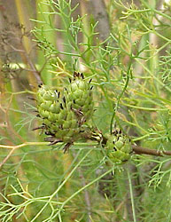
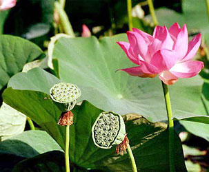
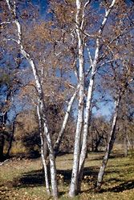

---
aliases:
- Bộ Quắn hoa
- Prootealaadsed
- Protea-ordenen
- Proteales
- Protealoj
- Proteals
- proteju kārta
- proteotvaré
- Proteyaçiçəklilər
- próteavirágúak
- Silberbaumartige
- srebrnikowce
- πρωτεώδη
- Протеєцвіті
- протеецветные
- Протея чукӧр
- чинароцветни
- פרוטנאים
- بروطيات
- راچیورگے
- چنارسانان
- प्रोटियेलीज़
- อันดับเหมือดคน
- ヤマモガシ目
- 山龍眼目
- 山龙眼目
- 프로테아목
title: Proteales
has_id_wikidata: Q21838
dv_has_:
  name_:
    af: Proteales
    an: Proteales
    ar: بروطيات
    arz: بروطيات
    ast: Proteales
    az: Proteyaçiçəklilər
    bar: Proteales
    bg: чинароцветни
    br: Proteales
    bs: Proteales
    ca: Proteals
    ceb: Proteales
    co: Proteales
    cs: proteotvaré
    cy: Proteales
    da: Protea-ordenen
    de: Silberbaumartige
    de-at: Proteales
    de-ch: Proteales
    el: πρωτεώδη
    en: Proteales
    en-ca: Proteales
    en-gb: Proteales
    eo: Protealoj
    es: Proteales
    et: Prootealaadsed
    eu: Proteales
    ext: Proteales
    fa: چنارسانان
    fi: Proteales
    fr: Proteales
    frp: Proteales
    frr: Proteales
    fur: Proteales
    ga: Proteales
    gd: Proteales
    gl: Proteales
    gsw: Proteales
    he: פרוטנאים
    hi: प्रोटियेलीज़
    hr: Proteales
    hu: próteavirágúak
    ia: Proteales
    id: Proteales
    ie: Proteales
    io: Proteales
    is: Proteales
    it: Proteales
    ja: ヤマモガシ目
    kg: Proteales
    ko: 프로테아목
    koi: Протея чукӧр
    ku: Proteales
    la: Proteales
    lb: Proteales
    li: Proteales
    lij: Proteales
    lv: proteju kārta
    mg: Proteales
    min: Proteales
    ms: Proteales
    mul: Proteales
    nap: Proteales
    nb: Proteales
    nds: Proteales
    nds-nl: Proteales
    nl: Proteales
    nn: Proteales
    nrm: Proteales
    nys: Proteales
    oc: Proteales
    pcd: Proteales
    pl: srebrnikowce
    pms: Proteales
    pnb: راچیورگے
    pt: Proteales
    pt-br: Proteales
    rm: Proteales
    ro: Proteales
    ru: протеецветные
    sc: Proteales
    scn: Proteales
    sco: Proteales
    sk: Proteales
    sl: Proteales
    sq: Proteales
    sv: Proteales
    sw: Proteales
    th: อันดับเหมือดคน
    tr: Proteales
    uk: Протеєцвіті
    vec: Proteales
    vi: Bộ Quắn hoa
    vls: Proteales
    vo: Proteales
    wa: Proteales
    war: Proteales
    wo: Proteales
    yue: 山龍眼目
    zh: 山龙眼目
    zh-cn: 山龙眼目
    zh-hans: 山龙眼目
    zh-hant: 山龍眼目
    zu: Proteales
---
## Phylogeny 

-   « Ancestral Groups  
    -   [Eudicots](../Eudicots.md)
    -   [Flowering_Plant](../../Flowering_Plant.md)
    -   [Seed_Plant](../../../Seed_Plant.md)
    -   [Land_Plant](../../../../Land_Plant.md)
    -  [Green plants](../../../../../Plant.md) 
    -  [Eukarya](../../../../../../Eukarya.md) 
    -   [Tree of Life](../../../../../../Tree_of_Life.md)

-   ◊ Sibling Groups of  eudicots
    -   [Buxaceae](Buxaceae.md)
    -   [Ranunculales](Ranunculales.md)
    -   Proteales
    -  [Core Eudicots](Core_Eudicots.md) 

-   » Sub-Groups 

# [[Proteales]]  

     

## #has_/text_of_/abstract 

> **Proteales** is an order of flowering plants consisting of three (or four) families. 
> The Proteales have been recognized by almost all taxonomists.
>
> The representatives of the Proteales can be very different from each other 
> due to their very early divergence. 
> 
> They possess seeds with little or no endosperm. The ovules are often atropic.
>
> The oldest fossils of Proteales are of the nelumbonaceous genus Notocyamus 
> from the Barremian stage of the Early Cretaceous of Brazil, 126–121 Ma (million years ago). 
> 
> According to molecular clock calculations, 
> the lineage that led to Proteales split from other plants about 128 Ma or 125 Ma.
>
> [Wikipedia](https://en.wikipedia.org/wiki/Proteales) 

## Title Illustrations

---------------------------------------------------------------------
 
scientific_name ::  Petrophila pedunculata
Comments          Proteaceae
copyright ::         © [Kurt Stüber](http://www.biolib.de/) 

-------------------------------------------------------------------------
 
scientific_name ::     Nelumbo nucifera
location ::           Vladivostok suburb, Primorsky Territory, Russian Federation
Comments             Sacred lotus
specimen_condition ::  Live Specimen
Source Collection    [CalPhotos](http://calphotos.berkeley.edu/)
copyright ::            © 1999 [Nick Kurzenko](mailto:kurzenko@ibss.dvo.ru) 

------------------------------------------------------------------------------

scientific_name ::     Platanus racemosa
location ::           Alameda County, California, US
Comments             Western Sycamore
Creator              Photograph by Charles Webber
specimen_condition ::  Live Specimen
Source Collection    [CalPhotos](http://calphotos.berkeley.edu/)
copyright ::            © 1998 [California Academy of Sciences](http://www.calacademy.org/) 
------------------------------------------------------------------------------

## Confidential Links & Embeds: 

### #is_/same_as :: [[/_Standards/bio/bio~Domain/Eukarya/Plant/Land_Plant/Seed_Plant/Flowering_Plant/Eudicots/Proteales|Proteales]] 

### #is_/same_as :: [[/_public/bio/bio~Domain/Eukarya/Plant/Land_Plant/Seed_Plant/Flowering_Plant/Eudicots/Proteales.public|Proteales.public]] 

### #is_/same_as :: [[/_internal/bio/bio~Domain/Eukarya/Plant/Land_Plant/Seed_Plant/Flowering_Plant/Eudicots/Proteales.internal|Proteales.internal]] 

### #is_/same_as :: [[/_protect/bio/bio~Domain/Eukarya/Plant/Land_Plant/Seed_Plant/Flowering_Plant/Eudicots/Proteales.protect|Proteales.protect]] 

### #is_/same_as :: [[/_private/bio/bio~Domain/Eukarya/Plant/Land_Plant/Seed_Plant/Flowering_Plant/Eudicots/Proteales.private|Proteales.private]] 

### #is_/same_as :: [[/_personal/bio/bio~Domain/Eukarya/Plant/Land_Plant/Seed_Plant/Flowering_Plant/Eudicots/Proteales.personal|Proteales.personal]] 

### #is_/same_as :: [[/_secret/bio/bio~Domain/Eukarya/Plant/Land_Plant/Seed_Plant/Flowering_Plant/Eudicots/Proteales.secret|Proteales.secret]] 

