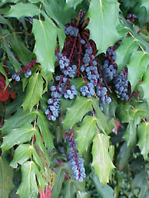
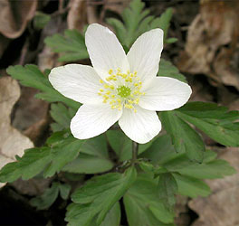
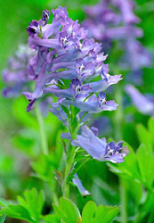

---
aliases:
  - Ranunculaceae
  - Ranunculales
title: Ranunculales
---

# [[Ranunculales]]  

## #has_/text_of_/abstract 

> **Ranunculales** is an order of flowering plants. 
> It contains the family Ranunculaceae, the buttercup family, 
> because the name of the order is based on the name of a genus in that family. 
> 
> Ranunculales belongs to a paraphyletic group known as the basal eudicots. 
> It is the most basal clade in this group; in other words, it is sister to the remaining eudicots. 
> 
> Widely known members include poppies, barberries, hellebores, and buttercups.
>
> [Wikipedia](https://en.wikipedia.org/wiki/Ranunculales) 

## Phylogeny 

-   « Ancestral Groups  
    -   [Eudicots](../Eudicots.md)
    -   [Flowering_Plant](../../Flowering_Plant.md)
    -   [Seed_Plant](../../../Seed_Plant.md)
    -   [Land_Plant](../../../../Land_Plant.md)
    -  [Green plants](../../../../../Plant.md) 
    -  [Eukarya](../../../../../../Eukarya.md) 
    -   [Tree of Life](../../../../../../Tree_of_Life.md)

-   ◊ Sibling Groups of  eudicots
    -   [Buxaceae](Buxaceae.md)
    -   Ranunculales
    -   [Proteales](Proteales.md)
    -  [Core Eudicots](Core_Eudicots.md) 

-   » Sub-Groups 

## Title Illustrations

---------------------------------------------------------------------

Scientific Name ::  Mahonia bealei
Comments          Berberidaceae
Copyright ::         © [Kurt Stüber](http://www.biolib.de/) 

------------------------------------------------------------------------

Scientific Name ::   Anemone nemorosa
Location ::         Botanical Garden, Basel, Switzerland
Comments           Ranunculaceae
Acknowledgements   courtesy [Botanical Image Database](http://www.unibas.ch/botimage/)
Copyright ::          © 2001 University of Basel, Basel, Switzerland 

-------------------------------------------------------------------------

Scientific Name ::     Corydalis ambigua
Location ::           Kiparisovo village near Vladivostok, Primorsky Territory (Russian Federation)
Comments             Papaveraceae
Specimen Condition   Live Specimen
Source Collection    [CalPhotos](http://calphotos.berkeley.edu/)
Copyright ::            © 2000 [Nick Kurzenko](mailto:kurzenko@ibss.dvo.ru) 

## Confidential Links & Embeds: 

### #is_/same_as :: [Ranunculales](/_Standards/bio/bio~Domain/Eukarya/Plant/Land_Plant/Seed_Plant/Flowering_Plant/Eudicots/Ranunculales.md) 

### #is_/same_as :: [Ranunculales.public](/_public/bio/bio~Domain/Eukarya/Plant/Land_Plant/Seed_Plant/Flowering_Plant/Eudicots/Ranunculales.public.md) 

### #is_/same_as :: [Ranunculales.internal](/_internal/bio/bio~Domain/Eukarya/Plant/Land_Plant/Seed_Plant/Flowering_Plant/Eudicots/Ranunculales.internal.md) 

### #is_/same_as :: [Ranunculales.protect](/_protect/bio/bio~Domain/Eukarya/Plant/Land_Plant/Seed_Plant/Flowering_Plant/Eudicots/Ranunculales.protect.md) 

### #is_/same_as :: [Ranunculales.private](/_private/bio/bio~Domain/Eukarya/Plant/Land_Plant/Seed_Plant/Flowering_Plant/Eudicots/Ranunculales.private.md) 

### #is_/same_as :: [Ranunculales.personal](/_personal/bio/bio~Domain/Eukarya/Plant/Land_Plant/Seed_Plant/Flowering_Plant/Eudicots/Ranunculales.personal.md) 

### #is_/same_as :: [Ranunculales.secret](/_secret/bio/bio~Domain/Eukarya/Plant/Land_Plant/Seed_Plant/Flowering_Plant/Eudicots/Ranunculales.secret.md)

