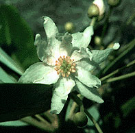

---
aliases:
- Bộ Bạch quế bì
- Canella-ordenen
- Canellales
- Canel·lals
- Kanelaaloj
- Kanellowce
- kanelotvaré
- Κανελλώδη
- Канеллоцветные
- канелоцветни
- Канэлакветныя
- קנלאים
- كانلال
- مگنولیان کانلال
- カネラ目
- 白樟目
- 카넬라목
title: Canellales
has_id_wikidata: Q21023
dv_has_:
  name_:
    an: Canellales
    ar: كانلال
    arz: كانلال
    ast: Canellales
    az: Canellales
    be_tarask: Канэлакветныя
    bg: канелоцветни
    bs: Canellales
    ca: Canel·lals
    ceb: Canellales
    cs: kanelotvaré
    da: Canella-ordenen
    de: Canellales
    el: Κανελλώδη
    en: Canellales
    en_ca: Canellales
    en_gb: Canellales
    eo: Kanelaaloj
    es: Canellales
    eu: Canellales
    ext: Canellales
    fa: مگنولیان کانلال
    fi: Canellales
    fr: Canellales
    frr: Canellales
    ga: Canellales
    gl: Canellales
    he: קנלאים
    hr: Canellales
    hu: Canellales
    ia: Canellales
    id: Canellales
    ie: Canellales
    ilo: Canellales
    io: Canellales
    it: Canellales
    ja: カネラ目
    ko: 카넬라목
    ku: Canellales
    la: Canellales
    mul: Canellales
    nb: Canellales
    nl: Canellales
    oc: Canellales
    pl: Kanellowce
    pt: Canellales
    pt_br: Canellales
    ro: Canellales
    ru: Канеллоцветные
    sl: Canellales
    sq: Canellales
    sr: Canellales
    sv: Canellales
    uk: Canellales
    vi: Bộ Bạch quế bì
    vo: Canellales
    war: Canellales
    zh: 白樟目
---
## Phylogeny 

-   « Ancestral Groups  
    -   [Magnoliids](../Magnoliids.md)
    -   [Flowering_Plant](../../Flowering_Plant.md)
    -   [Seed_Plant](../../../Seed_Plant.md)
    -   [Land_Plant](../../../../Land_Plant.md)
    -  [Green plants](../../../../../Plant.md) 
    -  [Eukarya](../../../../../../Eukarya.md) 
    -   [Tree of Life](../../../../../../Tree_of_Life.md)

-   ◊ Sibling Groups of  magnoliids
    -   [Piperales](Piperales.md)
    -   Canellales
    -   [Magnoliales](Magnoliales.md)
    -   [Laurales](Laurales.md)

-   » Sub-Groups 

# [[Canellales]] 

Image © 1995 M. J. Donoghue

## #has_/text_of_/abstract 

> **Canellales** is the botanical name for an order of flowering plants, 
> one of the four orders of the magnoliids. 
> 
> It is recognized by the most recent classification of flowering plants, the APG IV system. 
> It is defined to contain two families: 
> Canellaceae and Winteraceae, which comprise 136 species of fragrant trees and shrubs. 
> 
> The Canellaceae are found in tropical America and Africa, 
> and the Winteraceae are part of the Antarctic flora 
> (found in diverse parts of the southern hemisphere). 
> 
> Although the order was defined based on phylogenetic studies, 
> a number of possible synapomorphies have been suggested, relating to the pollen tube, 
> the seeds, the thickness of the integument, and other aspects of the morphology.
>
> Until 1999, these two families were not considered to be closely related. 
> Instead the Winteraceae were considered to be a primitive family 
> (due to the structure of the xylem and carpel, 
> a structure which now seems to be derived from xylem and carpels more typical of the angiosperms as a whole). 
> 
> The Canellaceae was often considered to be related to the Myristicaceae. 
> However, studies starting in 1999, based on molecular phylogeny or morphology, 
> have supported uniting these two families.
>
> [Wikipedia](https://en.wikipedia.org/wiki/Canellales) 

## Confidential Links & Embeds: 

### #is_/same_as :: [[/_Standards/bio/bio~Domain/Eukarya/Plant/Land_Plant/Seed_Plant/Flowering_Plant/Magnoliids/Canellales|Canellales]] 

### #is_/same_as :: [[/_public/bio/bio~Domain/Eukarya/Plant/Land_Plant/Seed_Plant/Flowering_Plant/Magnoliids/Canellales.public|Canellales.public]] 

### #is_/same_as :: [[/_internal/bio/bio~Domain/Eukarya/Plant/Land_Plant/Seed_Plant/Flowering_Plant/Magnoliids/Canellales.internal|Canellales.internal]] 

### #is_/same_as :: [[/_protect/bio/bio~Domain/Eukarya/Plant/Land_Plant/Seed_Plant/Flowering_Plant/Magnoliids/Canellales.protect|Canellales.protect]] 

### #is_/same_as :: [[/_private/bio/bio~Domain/Eukarya/Plant/Land_Plant/Seed_Plant/Flowering_Plant/Magnoliids/Canellales.private|Canellales.private]] 

### #is_/same_as :: [[/_personal/bio/bio~Domain/Eukarya/Plant/Land_Plant/Seed_Plant/Flowering_Plant/Magnoliids/Canellales.personal|Canellales.personal]] 

### #is_/same_as :: [[/_secret/bio/bio~Domain/Eukarya/Plant/Land_Plant/Seed_Plant/Flowering_Plant/Magnoliids/Canellales.secret|Canellales.secret]] 

