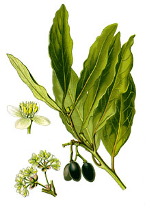

---
aliases:
- babérvirágúak
- bộ Nguyệt quế
- Dəfnəçiçəklilər
- Koma qaran
- Laurales
- Laurals
- Lauramediečiai
- Laurbær-ordenen
- lauru rinda
- Laŭraloj
- Loorbeeroortagen
- Loorberipuulaadsed
- Lorbeerartige
- Lovorolike
- Tanom nga lawrel
- Tireslin
- vavřínotvaré
- wawrzynowce
- Δαφνώδη
- Лаўракветныя
- Лавроцвіті
- лавроцветни
- лавроцветные
- ловоровидни
- դափնածաղկավորներ
- עראים
- برگبوسانان
- غاريات
- लौरालेस
- ലോറേൽസ്
- อันดับอบเชย
- クスノキ目
- 樟目
- 녹나무목
title: Laurales
has_id_wikidata: Q21801
dv_has_:
  name_:
    an: Laurales
    ar: غاريات
    arz: غاريات
    ast: Laurales
    az: Dəfnəçiçəklilər
    bcl: Laurales
    be: Лаўракветныя
    be_tarask: Лаўракветныя
    bg: лавроцветни
    bs: Laurales
    ca: Laurals
    ceb: Tanom nga lawrel
    co: Laurales
    cs: vavřínotvaré
    da: Laurbær-ordenen
    de: Lorbeerartige
    de_ch: Lorbeerartige
    el: Δαφνώδη
    en: Laurales
    en_ca: Laurales
    en_gb: Laurales
    eo: Laŭraloj
    es: Laurales
    et: Loorberipuulaadsed
    eu: Laurales
    ext: Laurales
    fa: برگبوسانان
    fi: Laurales
    fr: Laurales
    frr: Loorbeeroortagen
    ga: Laurales
    gl: Laurales
    he: עראים
    hi: लौरालेस
    hr: Lovorolike
    hu: babérvirágúak
    hy: դափնածաղկավորներ
    ia: Laurales
    id: Laurales
    ie: Laurales
    io: Laurales
    it: Laurales
    ja: クスノキ目
    jv: Laurales
    kab: Tireslin
    ko: 녹나무목
    ku: Koma qaran
    la: Laurales
    lt: Lauramediečiai
    lv: lauru rinda
    mk: ловоровидни
    ml: ലോറേൽസ്
    ms: Laurales
    mul: Laurales
    nb: Laurales
    nl: Laurales
    oc: Laurales
    pl: wawrzynowce
    pt: Laurales
    pt_br: Laurales
    ro: Laurales
    ru: лавроцветные
    sco: Laurales
    sq: Laurales
    sr: Laurales
    sv: Laurales
    th: อันดับอบเชย
    tr: Laurales
    uk: Лавроцвіті
    vi: bộ Nguyệt quế
    vls: Laurales
    vo: Laurales
    war: Laurales
    yue: 樟目
    zh: 樟目
    zh_cn: 樟目
    zh_hans: 樟目
    zh_hant: 樟目
---
## Phylogeny 

-   « Ancestral Groups  
    -   [Magnoliids](../Magnoliids.md)
    -   [Flowering_Plant](../../Flowering_Plant.md)
    -   [Seed_Plant](../../../Seed_Plant.md)
    -   [Land_Plant](../../../../Land_Plant.md)
    -  [Green plants](../../../../../Plant.md) 
    -  [Eukarya](../../../../../../Eukarya.md) 
    -   [Tree of Life](../../../../../../Tree_of_Life.md)

-   ◊ Sibling Groups of  magnoliids
    -   [Piperales](Piperales.md)
    -   [Canellales](Canellales.md)
    -   [Magnoliales](Magnoliales.md)
    -   Laurales

-   » Sub-Groups
    -   [Gomortega nitida](Laurales/Gomortega_nitida.md)

# [[Laurales]] 

 

## #has_/text_of_/abstract 

> The **Laurales** are an order of flowering plants. They are magnoliids, related to the Magnoliales.
>
> The order includes about 2500–2800 species from 85 to 90 genera, 
> which comprise seven families of trees and shrubs. 
> 
> Most of the species are tropical and subtropical, though a few genera reach the temperate zone.  
> 
> The best known species in this order are those of the Lauraceae 
> (for example bay laurel, cinnamon, avocado, and Sassafras), 
> and the ornamental shrub Calycanthus of the Calycanthaceae.
>
> The earliest lauraceous fossils are from the early Cretaceous. 
> 
> It is possible that the ancient origin of this order 
> is one of the reasons for its highly diverged morphology. 
> 
> Presently no single morphological property is known, 
> which would unify all the members of Laurales. 
> 
> The presently accepted classification is based on molecular and genetic analysis.
>
> [Wikipedia](https://en.wikipedia.org/wiki/Laurales) 

## Title Illustrations

--------------------------------------------
 
scientific_name ::    Laurus nobilis
Comments            Laurel, bay leaf, Lauraceae.
Reference           Otto Wilhelm Thomé\'s Flora von Deutschland, Österreich und der Schweiz - in Wort und Bild für Schule und Haus (1885 - 1905)
Source Collection   [BioLib Online Library of Biological Books](http://www.biolib.de/)

## Confidential Links & Embeds: 

### #is_/same_as :: [[/_Standards/bio/bio~Domain/Eukarya/Plant/Land_Plant/Seed_Plant/Flowering_Plant/Magnoliids/Laurales|Laurales]] 

### #is_/same_as :: [[/_public/bio/bio~Domain/Eukarya/Plant/Land_Plant/Seed_Plant/Flowering_Plant/Magnoliids/Laurales.public|Laurales.public]] 

### #is_/same_as :: [[/_internal/bio/bio~Domain/Eukarya/Plant/Land_Plant/Seed_Plant/Flowering_Plant/Magnoliids/Laurales.internal|Laurales.internal]] 

### #is_/same_as :: [[/_protect/bio/bio~Domain/Eukarya/Plant/Land_Plant/Seed_Plant/Flowering_Plant/Magnoliids/Laurales.protect|Laurales.protect]] 

### #is_/same_as :: [[/_private/bio/bio~Domain/Eukarya/Plant/Land_Plant/Seed_Plant/Flowering_Plant/Magnoliids/Laurales.private|Laurales.private]] 

### #is_/same_as :: [[/_personal/bio/bio~Domain/Eukarya/Plant/Land_Plant/Seed_Plant/Flowering_Plant/Magnoliids/Laurales.personal|Laurales.personal]] 

### #is_/same_as :: [[/_secret/bio/bio~Domain/Eukarya/Plant/Land_Plant/Seed_Plant/Flowering_Plant/Magnoliids/Laurales.secret|Laurales.secret]] 

