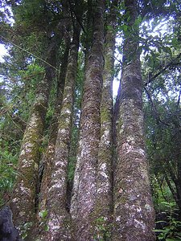

---
aliases:
- Gomortega
- Gomortega keule
- Gomortega nitida
- Gomortegaceae
- Gomortega_nitida
- جومورتيجا كولى
- کئوله
- 奎乐果
- 케울레나무
title: Gomortega nitida
has_id_wikidata: Q131312
dv_has_:
  name_:
    an: Gomortega keule
    arz: جومورتيجا كولى
    ast: Gomortega keule
    bg: Gomortega keule
    bs: Gomortega
    ca: Gomortega keule
    ceb: Gomortega keule
    cs: Gomortega keule
    da: Gomortega keule
    de: Gomortega keule
    en: Gomortega keule
    en-gb: Gomortega
    eo: Gomortega keule
    es: Gomortega keule
    eu: Gomortega keule
    ext: Gomortega keule
    fa: کئوله
    fi: Gomortega keule
    fr: Gomortega keule
    ga: Gomortega keule
    gl: Gomortega keule
    hr: Gomortega keule
    ia: Gomortega keule
    id: Gomortega keule
    ie: Gomortega keule
    ig: Gomortega keule
    io: Gomortega keule
    it: Gomortega keule
    ko: 케울레나무
    la: Gomortega keule
    mul: Gomortega keule
    nb: Gomortega keule
    nl: Gomortega keule
    oc: Gomortega keule
    pl: Gomortega keule
    pt: Gomortegaceae
    pt-br: Gomortega keule
    ro: Gomortega keule
    ru: Gomortega keule
    sq: Gomortega keule
    sr: Gomortega keule
    sr-ec: Gomortega keule
    sr-el: Gomortega keule
    sv: Gomortega keule
    uk: Gomortega keule
    vi: Gomortega keule
    vo: Gomortega keule
    war: Gomortega keule
    zh: 奎乐果
---
# [[Gomortega_nitida]] 

 

## #has_/text_of_/abstract 

> Gomortega keule (syn. G. nitida; Spanish names keule, queule, and hualhual) 
> is a species of tree endemic to Chile. 
> 
> It is the sole species of the genus Gomortega and, according to the APG IV system of 2016 (unchanged from the APG systems of 2009, 2003 and 1998), 
> of the monotypic family Gomortegaceae, assigned to the order Laurales in the clade magnoliids.
>
> [Wikipedia](https://en.wikipedia.org/wiki/Gomortega) 

## Phylogeny 

-   « Ancestral Groups  
    -   [Laurales](../Laurales.md)
    -   [Magnoliids](../../Magnoliids.md)
    -   [Flowering_Plant](../../../Flowering_Plant.md)
    -   [Seed_Plant](../../../../Seed_Plant.md)
    -   [Land_Plant](../../../../../Land_Plant.md)
    -  [Green plants](../../../../../../Plant.md) 
    -  [Eukarya](../../../../../../../Eukarya.md) 
    -   [Tree of Life](../../../../../../../Tree_of_Life.md)

-   ◊ Sibling Groups of  Laurales
    -   Gomortega nitida

-   » Sub-Groups 

## Title Illustrations

------------------------------------------------------------------------
 
scientific_name ::     Gomortega keule (syn. Gomortega nitida)
location ::           Quebrada de Caramávida, Bio-Bio, Chile
Acknowledgements     Proyecto Chilebosque http://www.chilebosque.cl
specimen_condition ::  Live Specimen
Identified By        Diego Alarcon
Body Part            trunks
Size                 20 m tall
copyright ::            © [Diego Alarcon](http://www.chilebosque.cl/) 

## Confidential Links & Embeds: 

### #is_/same_as :: [[/_Standards/bio/bio~Domain/Eukarya/Plant/Land_Plant/Seed_Plant/Flowering_Plant/Magnoliids/Laurales/Gomortega_nitida|Gomortega_nitida]] 

### #is_/same_as :: [[/_public/bio/bio~Domain/Eukarya/Plant/Land_Plant/Seed_Plant/Flowering_Plant/Magnoliids/Laurales/Gomortega_nitida.public|Gomortega_nitida.public]] 

### #is_/same_as :: [[/_internal/bio/bio~Domain/Eukarya/Plant/Land_Plant/Seed_Plant/Flowering_Plant/Magnoliids/Laurales/Gomortega_nitida.internal|Gomortega_nitida.internal]] 

### #is_/same_as :: [[/_protect/bio/bio~Domain/Eukarya/Plant/Land_Plant/Seed_Plant/Flowering_Plant/Magnoliids/Laurales/Gomortega_nitida.protect|Gomortega_nitida.protect]] 

### #is_/same_as :: [[/_private/bio/bio~Domain/Eukarya/Plant/Land_Plant/Seed_Plant/Flowering_Plant/Magnoliids/Laurales/Gomortega_nitida.private|Gomortega_nitida.private]] 

### #is_/same_as :: [[/_personal/bio/bio~Domain/Eukarya/Plant/Land_Plant/Seed_Plant/Flowering_Plant/Magnoliids/Laurales/Gomortega_nitida.personal|Gomortega_nitida.personal]] 

### #is_/same_as :: [[/_secret/bio/bio~Domain/Eukarya/Plant/Land_Plant/Seed_Plant/Flowering_Plant/Magnoliids/Laurales/Gomortega_nitida.secret|Gomortega_nitida.secret]] 

