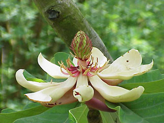
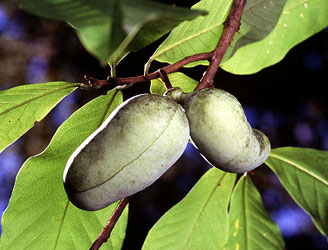

---
aliases:
- Bộ Mộc lan
- Koma manolyayan
- liliomfa-virágúak
- Magnoliales
- Magnolialoj
- Magnolials
- magnoliaordenen
- magnoliaordningen
- magnolie-ordenen
- Magnolienartige
- magnolijevci
- Magnolijiečiai
- Magnolijolike
- magnoliju rinda
- Magnoliowce
- magnoolialaadsed
- Magnoolienoortagen
- magnóliotvaré
- Maqnoliyaçiçəklilər
- Tanom nga magnolia
- šácholanotvaré
- Μαγνολιώδη
- Магнолієцвіті
- Магноліякветныя
- магноліяпсіды
- магнолиецветни
- магнолиецветные
- Магнолионтæ
- Магнолия чукӧр
- מגנולאים
- ماجنوليات
- ماغنوليات
- مگنولی
- میگنولطب
- മഗ്നോളിയേൽസ്
- อันดับจำปา
- モクレン目
- 木兰目
- 木蘭目
- 목련목
title: Magnoliales
has_id_wikidata: Q27187
dv_has_:
  name_:
    af: Magnoliales
    an: Magnoliales
    ar: ماغنوليات
    arz: ماجنوليات
    ast: Magnoliales
    az: Maqnoliyaçiçəklilər
    bcl: Magnoliales
    be: магноліяпсіды
    be_tarask: Магноліякветныя
    bg: магнолиецветни
    bs: Magnoliales
    ca: Magnolials
    ceb: Tanom nga magnolia
    co: Magnoliales
    cs: šácholanotvaré
    cy: Magnoliales
    da: magnolie-ordenen
    de: Magnolienartige
    el: Μαγνολιώδη
    en: Magnoliales
    eo: Magnolialoj
    es: Magnoliales
    et: magnoolialaadsed
    eu: Magnoliales
    ext: Magnoliales
    fa: مگنولی
    fi: Magnoliales
    fr: Magnoliales
    frr: Magnoolienoortagen
    ga: Magnoliales
    gl: Magnoliales
    he: מגנולאים
    hr: Magnolijolike
    hu: liliomfa-virágúak
    ia: Magnoliales
    id: Magnoliales
    ie: Magnoliales
    ilo: Magnoliales
    io: Magnoliales
    it: Magnoliales
    ja: モクレン目
    ko: 목련목
    koi: Магнолия чукӧр
    ku: Koma manolyayan
    kv: Магнолия чукӧр
    la: Magnoliales
    lt: Magnolijiečiai
    lv: magnoliju rinda
    ml: മഗ്നോളിയേൽസ്
    ms: Magnoliales
    mul: Magnoliales
    nb: magnoliaordenen
    nl: Magnoliales
    oc: Magnoliales
    os: Магнолионтæ
    pl: Magnoliowce
    pt: Magnoliales
    pt_br: Magnoliales
    ro: Magnoliales
    ru: магнолиецветные
    sco: Magnoliales
    sk: magnóliotvaré
    sl: magnolijevci
    sq: Magnoliales
    sr: Magnoliales
    sv: magnoliaordningen
    th: อันดับจำปา
    uk: Магнолієцвіті
    ur: میگنولطب
    vi: Bộ Mộc lan
    vo: Magnoliales
    war: Magnoliales
    yue: 木蘭目
    zh: 木兰目
---

# [[Magnoliales]] 

   
 

## #has_/text_of_/abstract 

> The **Magnoliales** are an order of flowering plants. Well-known members of Magnoliales include: magnolias, tulip trees, custard apples, American pawpaw, cherimoyas, ylang-ylang, soursop fruit, and nutmeg.
>
> [Wikipedia](https://en.wikipedia.org/wiki/Magnoliales) 

## Phylogeny 

-   « Ancestral Groups  
    -   [Magnoliids](../Magnoliids.md)
    -   [Flowering_Plant](../../Flowering_Plant.md)
    -   [Seed_Plant](../../../Seed_Plant.md)
    -   [Land_Plant](../../../../Land_Plant.md)
    -  [Green plants](../../../../../Plant.md) 
    -  [Eukarya](../../../../../../Eukarya.md) 
    -   [Tree of Life](../../../../../../Tree_of_Life.md)

-   ◊ Sibling Groups of  magnoliids
    -   [Piperales](Piperales.md)
    -   [Canellales](Canellales.md)
    -   Magnoliales
    -   [Laurales](Laurales.md)

-   » Sub-Groups 

## Title Illustrations  

---------------------------------------------------------------------
 
scientific_name ::  Magnolia tripetala
Comments          Magnoliaceae
copyright ::         © [Kurt Stüber](http://www.biolib.de/) 

----------------------------------------------------------------------------------------------
 
scientific_name ::  Asimina triloba
Comments          Pawpaw tree, Annonaceae
Creator           Photo by Scott Bauer
copyright ::         © [USDA Agricultural Research Service USDA Agricultural Research Service](http://www.ars.usda.gov/is/graphics/photos/) 

## Confidential Links & Embeds: 

### #is_/same_as :: [[/_Standards/bio/bio~Domain/Eukarya/Plant/Land_Plant/Seed_Plant/Flowering_Plant/Magnoliids/Magnoliales|Magnoliales]] 

### #is_/same_as :: [[/_public/bio/bio~Domain/Eukarya/Plant/Land_Plant/Seed_Plant/Flowering_Plant/Magnoliids/Magnoliales.public|Magnoliales.public]] 

### #is_/same_as :: [[/_internal/bio/bio~Domain/Eukarya/Plant/Land_Plant/Seed_Plant/Flowering_Plant/Magnoliids/Magnoliales.internal|Magnoliales.internal]] 

### #is_/same_as :: [[/_protect/bio/bio~Domain/Eukarya/Plant/Land_Plant/Seed_Plant/Flowering_Plant/Magnoliids/Magnoliales.protect|Magnoliales.protect]] 

### #is_/same_as :: [[/_private/bio/bio~Domain/Eukarya/Plant/Land_Plant/Seed_Plant/Flowering_Plant/Magnoliids/Magnoliales.private|Magnoliales.private]] 

### #is_/same_as :: [[/_personal/bio/bio~Domain/Eukarya/Plant/Land_Plant/Seed_Plant/Flowering_Plant/Magnoliids/Magnoliales.personal|Magnoliales.personal]] 

### #is_/same_as :: [[/_secret/bio/bio~Domain/Eukarya/Plant/Land_Plant/Seed_Plant/Flowering_Plant/Magnoliids/Magnoliales.secret|Magnoliales.secret]] 

