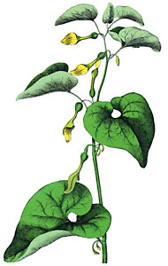
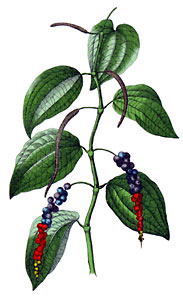

# [[Piperales]] 

   

#is_/same_as :: [[../../../../../../../../_Standards/WikiData/WD~Piperales,27287|WD~Piperales,27287]] 

## #has_/text_of_/abstract 

> **Piperales** is an order of flowering plants (4,170 recognized species). 
> It includes the family Piperaceae,  
> but other taxa have been included or disincluded variously over time.  
> 
> Well-known plants which may be included in this order include 
> black pepper, kava, the many Peperomias, pepper elder, lizard's tail, birthwort, and wild ginger. 
> 
> The two perianthless families Piperaceae and Saururaceae are mainly herbaceous plants 
> possessing highly reduced flowers.
>
> [Wikipedia](https://en.wikipedia.org/wiki/Piperales) 

## Phylogeny 

-   « Ancestral Groups  
    -   [Magnoliids](../Magnoliids.md)
    -   [Flowering_Plant](../../Flowering_Plant.md)
    -   [Seed_Plant](../../../Seed_Plant.md)
    -   [Land_Plant](../../../../Land_Plant.md)
    -  [Green plants](../../../../../Plant.md) 
    -  [Eukarya](../../../../../../Eukarya.md) 
    -   [Tree of Life](../../../../../../Tree_of_Life.md)

-   ◊ Sibling Groups of  magnoliids
    -   Piperales
    -   [Canellales](Canellales.md)
    -   [Magnoliales](Magnoliales.md)
    -   [Laurales](Laurales.md)

-   » Sub-Groups 

## Title Illustrations

------------------------------------- 
)
Scientific Name ::    Aristolochia clematitis
Comments            Birthwort, Aristolochiaceae
Reference           Gotthilf Heinrich von Schubert\'s Naturgeschichte des Pflanzenreichs nach dem Linné\'schen System (1887)
Source Collection   [BioLib Online Library of Biological Books](http://www.biolib.de/)

-------------------------------------

Scientific Name ::    Piper nigrum
Comments            Black pepper, Piperaceae
Reference           Gotthilf Heinrich von Schubert\'s Naturgeschichte des Pflanzenreichs nach dem Linné\'schen System (1887)
Source Collection   [BioLib Online Library of Biological Books](http://www.biolib.de/)

## Confidential Links & Embeds: 

### #is_/same_as :: [[/_Standards/bio/bio~Domain/Eukarya/Plant/Land_Plant/Seed_Plant/Flowering_Plant/Magnoliids/Piperales|Piperales]] 

### #is_/same_as :: [[/_public/bio/bio~Domain/Eukarya/Plant/Land_Plant/Seed_Plant/Flowering_Plant/Magnoliids/Piperales.public|Piperales.public]] 

### #is_/same_as :: [[/_internal/bio/bio~Domain/Eukarya/Plant/Land_Plant/Seed_Plant/Flowering_Plant/Magnoliids/Piperales.internal|Piperales.internal]] 

### #is_/same_as :: [[/_protect/bio/bio~Domain/Eukarya/Plant/Land_Plant/Seed_Plant/Flowering_Plant/Magnoliids/Piperales.protect|Piperales.protect]] 

### #is_/same_as :: [[/_private/bio/bio~Domain/Eukarya/Plant/Land_Plant/Seed_Plant/Flowering_Plant/Magnoliids/Piperales.private|Piperales.private]] 

### #is_/same_as :: [[/_personal/bio/bio~Domain/Eukarya/Plant/Land_Plant/Seed_Plant/Flowering_Plant/Magnoliids/Piperales.personal|Piperales.personal]] 

### #is_/same_as :: [[/_secret/bio/bio~Domain/Eukarya/Plant/Land_Plant/Seed_Plant/Flowering_Plant/Magnoliids/Piperales.secret|Piperales.secret]] 

