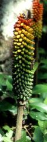
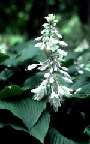
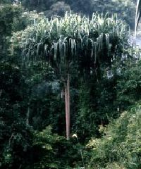

---
aliases:
- Bir pallali o‘simliklar
- Birləpəlilər
- Centzīntiliztica
- Ch'ulla phutuy raphiyuq
- eensaadlobbiges
- eenzaadlobbigen
- Eenzoadlobbign
- egyszikűek
- einfrøblada planter
- Einkímblöðungar
- enfrøbladede planter
- enhjärtbladiga växter
- Enkimbladede
- enokaličnice
- jednoděložné
- Jednoklíčnolistové
- jednoliścienne
- jednosupnice
- Lelijainiai
- Liliopsida
- monacotailéadón
- Monocot
- Monocotiledonate
- Monocotiledoni
- Monocotiledònies
- monocotiledónea
- Monocotiledóneas
- monocots
- Monocotyledon
- Monocotyledoneae
- Monocotyledons
- Monocotylédones
- monokotil
- Monokotiledon
- Monokotiledone biljke
- Monokotiledoni
- Monokotiledòn
- Monokotyledonen
- Tan-chí-hio̍h si̍t-bu̍t
- Taynayyawin
- tek çenekliler
- Tetanduran wiji tunggal
- thực vật một lá mầm
- Tokan-dravin-tsimoka
- Unukotiledonaj plantoj
- Viendīgļlapji
- Vėinskiltē augalā
- yksisirkkaiset
- Üheidulehelised
- Μονοκοτυλήδονο
- аднадольныя
- Бер өлешле үсемлекләр
- Бер өлөшлөләр
- Бир үлүштүү өсүмдүктөр
- Дара жарнақтылар
- едносемеделни
- Иухайон зайæгойтæ
- монокотиледоне биљке
- Монокотиледони
- огтысё будосъёс
- однодольні
- однодольные
- Пĕр пайвăрăлли
- Цхьа дакъа дола
- Միաշաքիլավորներ
- חד-פסיגיים
- أحاديات الفلقة
- اکدالے
- تکلپهایها
- یک دالہ
- एक बीजपत्री
- एकदलीय वनस्पति
- একবীজপত্রী
- ଏକବୀଜପତ୍ରୀ
- ஒருவித்திலையி
- ఏకదళబీజాలు
- ഏകബീജപത്ര സസ്യങ്ങൾ
- ඒක බීජ පත්රී ශාක
- พืชใบเลี้ยงเดี่ยว
- ართლებერამეფი
- ერთლებნიანები
- 单子叶植物
- 単子葉類
- 單子葉植物
- ꯃꯣꯅꯣꯀꯣꯠ ꯃꯔꯨ
- 외떡잎식물
title: Monocotyledons
has_id_wikidata: Q78961
dv_has_:
  name_:
    af: eensaadlobbiges
    ar: أحاديات الفلقة
    ast: monocots
    az: Birləpəlilər
    ba: Бер өлөшлөләр
    be: аднадольныя
    be_tarask: аднадольныя
    bg: едносемеделни
    bn: একবীজপত্রী
    bs: Monokotiledone biljke
    ca: Monocotiledònies
    ceb: monocots
    cs: jednoděložné
    cv: Пĕр пайвăрăлли
    cy: Monocotyledon
    da: Enkimbladede
    de: Monokotyledonen
    el: Μονοκοτυλήδονο
    en: monocots
    eo: Unukotiledonaj plantoj
    es: Liliopsida
    et: Üheidulehelised
    eu: Liliopsida
    fa: تکلپهایها
    fi: yksisirkkaiset
    fr: Monocotylédones
    ga: monacotailéadón
    gl: Monocotiledóneas
    gsw: Monokotyledonen
    ha: monocots
    he: חד-פסיגיים
    hi: एक बीजपत्री
    hr: jednosupnice
    ht: Monokotiledòn
    hu: egyszikűek
    hy: Միաշաքիլավորներ
    ia: Monocotyledoneae
    id: monokotil
    ilo: Monocotyledon
    inh: Цхьа дакъа дола
    is: Einkímblöðungar
    it: Monocotiledoni
    ja: 単子葉類
    jv: Tetanduran wiji tunggal
    ka: ერთლებნიანები
    kab: Taynayyawin
    kk: Дара жарнақтылар
    ko: 외떡잎식물
    ku: Liliopsida
    ky: Бир үлүштүү өсүмдүктөр
    la: Monocotyledoneae
    lb: Liliopsida
    lt: Lelijainiai
    lv: Viendīgļlapji
    mg: Tokan-dravin-tsimoka
    mk: Монокотиледони
    ml: ഏകബീജപത്ര സസ്യങ്ങൾ
    mni: ꯃꯣꯅꯣꯀꯣꯠ ꯃꯔꯨ
    ms: Monokotiledon
    nah: Centzīntiliztica
    nan: Tan-chí-hio̍h si̍t-bu̍t
    nb: enfrøbladede planter
    ne: एकदलीय वनस्पति
    nl: eenzaadlobbigen
    nn: einfrøblada planter
    oc: Monocotyledon
    or: ଏକବୀଜପତ୍ରୀ
    os: Иухайон зайæгойтæ
    pl: jednoliścienne
    pnb: اکدالے
    pt: monocotiledónea
    qu: Ch'ulla phutuy raphiyuq
    ro: Monocotiledonate
    ru: однодольные
    scn: Monocotyledon
    sco: monocots
    sgs: Vėinskiltē augalā
    sh: Monokotiledone biljke
    si: ඒක බීජ පත්රී ශාක
    sk: Jednoklíčnolistové
    sl: enokaličnice
    sq: monocots
    sr: монокотиледоне биљке
    su: Liliopsida
    sv: enhjärtbladiga växter
    sw: Monokotiledoni
    ta: ஒருவித்திலையி
    te: ఏకదళబీజాలు
    th: พืชใบเลี้ยงเดี่ยว
    tr: tek çenekliler
    tt: Бер өлешле үсемлекләр
    udm: огтысё будосъёс
    uk: однодольні
    ur: یک دالہ
    uz: Bir pallali o‘simliklar
    vi: thực vật một lá mầm
    vls: Eenzoadlobbign
    war: monocots
    wuu: 单子叶植物
    xmf: ართლებერამეფი
    yue: 單子葉植物
    zh: 單子葉植物
---
# [[Monocot]] 

     
Images © 1997 [William J. Hahn](mailto:wjh22@georgetown.edu) 

## #has_/text_of_/abstract 

> **Monocotyledons**, commonly referred to as monocots, (Lilianae sensu Chase & Reveal) 
> are flowering plants whose seeds contain only one embryonic leaf, or cotyledon. 
> 
> A monocot taxon has been in use for several decades, but with various ranks and under several different names. The APG IV system recognises its monophyly but does not assign it to a taxonomic rank, and instead uses the term "monocots" to refer to the group. 
>
> Monocotyledons are contrasted with the dicotyledons, which have two cotyledons. Unlike the monocots however, the dicots are not monophyletic and the two cotyledons are instead the ancestral characteristic of all flowering plants. Botanists now classify dicots into the eudicots ("true dicots") and several basal lineages from which the monocots emerged.
>
> The monocots are extremely important economically, culturally, and ecologically, 
> and make up a majority of plant biomass used in agriculture. 
> 
> Common crops such as dates, onions, garlic, rice, wheat, maize, and sugarcane are all monocots. 
> 
> The grasses alone cover over 40% of Earth's land area 
> and contribute a significant portion of the human diet. 
> 
> Other monocots, like orchids, tulips, daffodils, and lilies are common houseplants 
> and have been the subjects of several celebrations, holidays, and artworks for thousands of years.
>
> [Wikipedia](https://en.wikipedia.org/wiki/Monocotyledon) 

## Phylogeny 

-   « Ancestral Groups  
    -   [Flowering_Plant](../Flowering_Plant.md)
    -   [Seed_Plant](../../Seed_Plant.md)
    -   [Land_Plant](../../../Land_Plant.md)
    -  [Green plants](../../../../Plant.md) 
    -  [Eukarya](../../../../../Eukarya.md) 
    -   [Tree of Life](../../../../../Tree_of_Life.md)

-   ◊ Sibling Groups of  Angiosperms
    -   [Amborella trichopoda](Amborella.md)
    -   [Magnoliids](Magnoliids.md)
    -   [Chloranthaceae](Chloranthaceae.md)
    -   [Ceratophyllaceae](Ceratophyllaceae.md)
    -   Monocotyledons
    -   [Eudicots](Eudicots.md)
    -   [Austrobaileyales](Austrobaileyales.md)
    -   [Nymphaeaceae](Nymphaeaceae.md)

-   » Sub-Groups
    -   [Alismatanae](Monocot/Alismatanae.md)
    -   [Aranae](Monocot/Aranae.md)
    -   [Liliales](Monocot/Liliales.md)
    -   [Asparagales](Monocot/Asparagales.md)
    -   [Pandanales](Monocot/Pandanales.md)
    -   [Dioscoreales](Monocot/Dioscoreales.md)
    -   [Palm](Monocot/Palm.md)
    -   [Zingiberales](Monocot/Zingiberales.md)
    -   [Commelinanae](Monocot/Commelinids/Commelinanae.md)

## Introduction

[William J. Hahn]()

The Monocotyledons are one of the most distinctive major lineages of angiosperms 
and traditionally have been paired with the Dicotyledons 
as the two main groups of flowering plants. 

Among the monocots are some of the largest families of angiosperms 
(such as the orchids with ca. 20,000 species and the grasses with ca. 15,000 species) 
as well as some of the most economically important species of plants. 

Numerous vegetation types are dominated by monocots 
including grasslands, palm savannas, sedge meadows, and cattail marshes.

### Characteristics

The shared, derived character that unites all monocots is the single cotyledon, 
a feature first noted by John Ray in 1703. 

Other features that are common in monocots 
but not necessarily unique to or universal among them are: 
- vascular bundles irregularly distributed in cross section of the stem, 
- parallel veins in the leaves (mostly in the more derived groups), and 
- flower parts in multiples of three. 

Despite the lack of true secondary growth in monocots, 
most growth habits are found in the group 
including floating and submerged aquatics, lianas, trees, epiphytes, and forbs of all sizes.

### Relationships of Monocots to other Angiosperms

A singular origin for the monocots is generally accepted with numerous
morphological synapomorphies proposed for the group (Donoghue and Doyle,
1989; Doyle and Donoghue, 1992; Tucker and Douglas, 1996). Additionally,
most molecular analyses of monocots have provided strong support for
their monophyly (Chase, et al., 1993, 1995; Duvall, et al., 1993; Hamby
and Zimmer, 1992).

Relative to other angiosperms, the monocots are most frequently placed
among a group of predominantly herbaceous magnoliid taxa (Lactoridaceae,
Aristolochiaceae, Piperaceae, Sauraraceae, Nymphaeaceae) collectively
referred to as the \"paleoherbs\" (Donoghue and Doyle, 1989). The
specific relationships among these taxa are still unclear but a close
relationship of the monocots with either the woody magnoliid taxa or the
more derived, tricolpate, \"eudicots\" is not supported in any analysis.

The fossil record of the Monocotyledons is old with the first probable
monocot remains dating to the Early Cretaceous. The presence of
morphologically diverse fossils by the Campanian suggests a relatively
rapid radiation into most of the extant major groups early in the course
of monocot evolution (Herendeen and Crane, 1995).

### Discussion of Phylogenetic Relationships

The terminal taxa in this phylogeny are based on the major groups
recognized and delimited by Dahlgren, et al. (1985) and Thorne (1992a,
b) with several modifications. Although earlier work by Huber (1969,
1977) provided the context for a more explicit analysis of monocot
relationships, Dahlgren and co-workers were the first to utilize
cladistic approaches to the study of monocot phylogeny and their
taxonomy is still the most complete. As such, it has served as the basis
for most recent studies of the monocots (e.g., Rudall, et al, 1995).
Alternate taxonomic systems of Cronquist (1981), Thorne (1992a, b) and
Takhtajan (1980, 1987) are largely congruent with that of Dahlgren, et
al. (1985) but differ in treatment of lilioid and basal monocots. The
systems of Dahlgren and Thorne maintain numerous smaller families in the
Lilianae as opposed to a few relatively large ones and place lilioid
elements at the base of the monocots rather than the Alismatanae and
Aranae.

The phylogenetic hypothesis represented here is based largely on the
rbcL reconstructions of Duvall, et al. (1993a, b) and Chase, et al.
(1995a) with consideration of the morphological studies of Dalhgren, et
al. (1983, 1985) and Stevenson and Loconte (1995; see also Chase, et
al., 1995b) as well as the nrDNA 18S SSU studies of Hamby and Zimmer
(1992) and Bharathan and Zimmer (1995). Resolution within and among
certain subgroups is predominantly based on various works presented in
Rudall, et al. (1995).

The general relationships depicted in this tree are recovered in most
analyses although taxon sampling is not completely comparable from study
to study. Differences in topology concern the nature of the basal
lineages (specifically the position of the alismatid/aroid and the
dioscorealean/melanthioid lineages), placement of certain enigmatic taxa
such as the Cyclanthaceae, Eriocaulaceae, Hanguanaceae, Pandanaceae,
Velloziaceae, and Xyridaceae, and resolution within the Lilianae and
Commelinanae.

While some earlier studies had suggested basal positions for groups such
as the palms (Arecanae), most recent analyses place either the
Alismatanae and Aranae (e.g., Duvall, et al., 1993a, 1993b; Chase, et
al., 1993, 1995), or members of the lilioid orders Dioscoreales (e.g.,
Huber, 1969; Dahlgren et al. 1983, 1985; Stevenson and Loconte, 1995)
and Melanthiales (e.g., Thorne, 1992; Takhtajan, 1969) as sister to the
remainder of the monocots. Much of the difference seen in these two
alternative hypotheses is due to uncertainties over the position of
monocots within the angiosperms and attendant ambiguity in outgroup
choice. Character state homologies are not obvious in many cases and
alternate outgroups provide different character state polarizations. The
current weight of evidence, however, seems to support the
alismatid/aroid hypothesis. An example of this is the trans-spliced
structure of the 4th intron in the mitochondrial gene nad1 shared by all
monocots sampled except Araceae and Alismataceae (Qui & Palmer, 1996).

## Confidential Links & Embeds: 

### #is_/same_as :: [[/_Standards/bio/bio~Domain/Eukarya/Plant/Land_Plant/Seed_Plant/Flowering_Plant/Monocot|Monocot]] 

### #is_/same_as :: [[/_public/bio/bio~Domain/Eukarya/Plant/Land_Plant/Seed_Plant/Flowering_Plant/Monocot.public|Monocot.public]] 

### #is_/same_as :: [[/_internal/bio/bio~Domain/Eukarya/Plant/Land_Plant/Seed_Plant/Flowering_Plant/Monocot.internal|Monocot.internal]] 

### #is_/same_as :: [[/_protect/bio/bio~Domain/Eukarya/Plant/Land_Plant/Seed_Plant/Flowering_Plant/Monocot.protect|Monocot.protect]] 

### #is_/same_as :: [[/_private/bio/bio~Domain/Eukarya/Plant/Land_Plant/Seed_Plant/Flowering_Plant/Monocot.private|Monocot.private]] 

### #is_/same_as :: [[/_personal/bio/bio~Domain/Eukarya/Plant/Land_Plant/Seed_Plant/Flowering_Plant/Monocot.personal|Monocot.personal]] 

### #is_/same_as :: [[/_secret/bio/bio~Domain/Eukarya/Plant/Land_Plant/Seed_Plant/Flowering_Plant/Monocot.secret|Monocot.secret]] 

