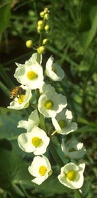

---
aliases:
- Alismaloj
- Alismatales
- Alismatals
- Alismatanae
- Baqəvərçiçəklilər
- Bộ Trạch tả
- Cirveņu rinda
- Dumblialaiškiečiai
- Froschlöffelartige
- hídőrvirágúak
- Koma pelkevçiyan
- Konnarohulaadsed
- porečnikovci
- Skeblad-ordenen
- vassgroordenen
- żabieńcowce
- žabníkotvaré
- žabočunolike
- αλισματώδη
- воднотегавцовидни
- Кербезгүлдер тұқымдасы
- лаваницоцветни
- Частухоцвіті
- частухоцветные
- Шальнікакветныя
- հովվափողածաղկավորներ
- כף צפרדע
- در نمو درخت
- قاشقواشسانان
- مزماريات
- अलिस्माटेल्स
- अलिस्माटेल्स्
- ಅಲಿಸ್ಮಟೆಲ್ಸ್
- อันดับขาเขียด
- オモダカ目
- 泽泻目
- 澤瀉目
- 택사목
title: Alismatanae
has_id_wikidata: Q27341
dv_has_:
  name_:
    an: Alismatales
    ar: مزماريات
    arz: مزماريات
    ast: Alismatales
    az: Baqəvərçiçəklilər
    be: Шальнікакветныя
    be_tarask: Шальнікакветныя
    bg: лаваницоцветни
    bs: Alismatales
    ca: Alismatals
    ceb: Alismatales
    co: Alismatales
    cs: žabníkotvaré
    da: Skeblad-ordenen
    de: Froschlöffelartige
    el: αλισματώδη
    en: Alismatales
    eo: Alismaloj
    es: Alismatales
    et: Konnarohulaadsed
    eu: Alismatales
    ext: Alismatales
    fa: قاشقواشسانان
    fi: Alismatales
    fr: Alismatales
    frr: Alismatales
    ga: Alismatales
    gl: Alismatales
    he: כף צפרדע
    hi: अलिस्माटेल्स
    hr: žabočunolike
    hu: hídőrvirágúak
    hy: հովվափողածաղկավորներ
    ia: Alismatales
    id: Alismatales
    ie: Alismatales
    io: Alismatales
    it: Alismatales
    ja: オモダカ目
    kk: Кербезгүлдер тұқымдасы
    kn: ಅಲಿಸ್ಮಟೆಲ್ಸ್
    ko: 택사목
    ku: Koma pelkevçiyan
    la: Alismatales
    lt: Dumblialaiškiečiai
    lv: Cirveņu rinda
    mk: воднотегавцовидни
    mul: Alismatales
    nah: Alismatales
    nb: vassgroordenen
    nl: Alismatales
    nn: vassgroordenen
    oc: Alismatales
    pl: żabieńcowce
    pt: Alismatales
    pt_br: Alismatales
    ro: Alismatales
    ru: частухоцветные
    sa: अलिस्माटेल्स्
    sco: Alismatales
    sh: Alismatales
    sl: porečnikovci
    sq: Alismatales
    sr: Alismatales
    sv: Alismatales
    th: อันดับขาเขียด
    tr: Alismatales
    uk: Частухоцвіті
    ur: در نمو درخت
    vi: Bộ Trạch tả
    vo: Alismatales
    war: Alismatales
    yue: 澤瀉目
    zh: 泽泻目
---

# [[Alismatanae]] 

 

## #has_/text_of_/abstract 

> The Alismatales (alismatids) are an order of flowering plants including about 4,500 species. 
> Plants assigned to this order are mostly tropical or aquatic. 
> Some grow in fresh water, some in marine habitats. 
> Perhaps the most important food crop in the order is the taro plant, Colocasia esculenta.
>
> [Wikipedia](https://en.wikipedia.org/wiki/Alismatales) 

## Introduction

[William J. Hahn]()

The pondweeds and relatives are almost exclusively aquatic or marine and
show numerous specializations for this habitat. Many of these features
are reductions in form which have confounded attempts at phylogenetic
resolution for the group (Dahlgren and Rasmussen, 1983; Les and Haynes,
1995). The superorder includes 15 families, 56 genera, and approximately
500 species.

### Characteristics

Morphological synapomorphies for the alismatids include presence of
intravaginal squamulae, lack of an endosperm, and root hair cells
shorter than epidermal cells. (Dahlgren and Rasmussen, 1983; Dahlgren et
al, 1985; Dalgren and Bremer, 1985).

## Phylogeny 

-   « Ancestral Groups  
    -   [Monocot](../Monocot.md)
    -   [Flowering_Plant](../../Flowering_Plant.md)
    -   [Seed_Plant](../../../Seed_Plant.md)
    -   [Land_Plant](../../../../Land_Plant.md)
    -  [Green plants](../../../../../Plant.md) 
    -  [Eukarya](../../../../../../Eukarya.md) 
    -   [Tree of Life](../../../../../../Tree_of_Life.md)

-   ◊ Sibling Groups of  Monocotyledons
    -   Alismatanae
    -   [Aranae](Aranae.md)
    -   [Liliales](Liliales.md)
    -   [Asparagales](Asparagales.md)
    -   [Pandanales](Pandanales.md)
    -   [Dioscoreales](Dioscoreales.md)
    -   [Palm](Palm.md)
    -   [Zingiberales](Zingiberales.md)
    -   [Commelinanae](Commelinids/Commelinanae.md)

-   » Sub-Groups 

## Confidential Links & Embeds: 

### #is_/same_as :: [[/_Standards/bio/bio~Domain/Eukarya/Plant/Land_Plant/Seed_Plant/Flowering_Plant/Monocot/Alismatanae|Alismatanae]] 

### #is_/same_as :: [[/_public/bio/bio~Domain/Eukarya/Plant/Land_Plant/Seed_Plant/Flowering_Plant/Monocot/Alismatanae.public|Alismatanae.public]] 

### #is_/same_as :: [[/_internal/bio/bio~Domain/Eukarya/Plant/Land_Plant/Seed_Plant/Flowering_Plant/Monocot/Alismatanae.internal|Alismatanae.internal]] 

### #is_/same_as :: [[/_protect/bio/bio~Domain/Eukarya/Plant/Land_Plant/Seed_Plant/Flowering_Plant/Monocot/Alismatanae.protect|Alismatanae.protect]] 

### #is_/same_as :: [[/_private/bio/bio~Domain/Eukarya/Plant/Land_Plant/Seed_Plant/Flowering_Plant/Monocot/Alismatanae.private|Alismatanae.private]] 

### #is_/same_as :: [[/_personal/bio/bio~Domain/Eukarya/Plant/Land_Plant/Seed_Plant/Flowering_Plant/Monocot/Alismatanae.personal|Alismatanae.personal]] 

### #is_/same_as :: [[/_secret/bio/bio~Domain/Eukarya/Plant/Land_Plant/Seed_Plant/Flowering_Plant/Monocot/Alismatanae.secret|Alismatanae.secret]] 

