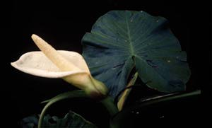
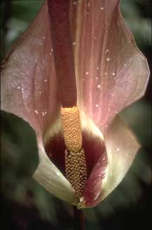

---
aliases:
  - aroid
  - Arana
  - Ariflorae
  - Aranae
title: Aranae
---

## Phylogeny 

-   « Ancestral Groups  
    -   [Monocot](../Monocot.md)
    -   [Flowering_Plant](../../Flowering_Plant.md)
    -   [Seed_Plant](../../../Seed_Plant.md)
    -   [Land_Plant](../../../../Land_Plant.md)
    -  [Green plants](../../../../../Plant.md) 
    -  [Eukarya](../../../../../../Eukarya.md) 
    -   [Tree of Life](../../../../../../Tree_of_Life.md)

-   ◊ Sibling Groups of  Monocotyledons
    -   [Alismatanae](Alismatanae.md)
    -   Aranae
    -   [Liliales](Liliales.md)
    -   [Asparagales](Asparagales.md)
    -   [Pandanales](Pandanales.md)
    -   [Dioscoreales](Dioscoreales.md)
    -   [Palm](Palm.md)
    -   [Zingiberales](Zingiberales.md)
    -   [Commelinanae](Commelinids/Commelinanae.md)

-   » Sub-Groups 

# [[Aranae]]

The aroids 

 
 
Images © 1997 [William J. Hahn](mailto:wjh22@georgetown.edu)  

## #has_/text_of_/abstract 

> Arales is an order of flowering plants. 
> The name was used in the Cronquist system for an order placed in subclass Arecidae, 
> circumscribed as (1981):
> - order Arales
> - family Acoraceae
> - family Araceae
> - family Lemnaceae
>
> In the classification system of Dahlgren the Arales were in the superorder Ariflorae 
> (also called **Aranae**), but did not include Acoraceae as a separate family. 
> Instead, Acorus, its only genus, was included in the Araceae. 
> Arales was the only order included in the Ariflorae.
>
> The APG II system elevates the first of these three families 
> to become an order Acorales of its own (consisting of the single genus, Acorus) 
> and unites the last two of these families into the one family Araceae 
> assigning this to the order Alismatales.
>
> [Wikipedia](https://en.wikipedia.org/wiki/Arales) 

## Introduction

[William J. Hahn]()

The aroids are a predominantly tropical group of herbaceous terrestrial or epiphytic plants. 
Edible plants, poisonous species, ornamentals. 
The superorder contains 2 families, 110 genera, and approximately 2500 species.

### Characteristics

The aroids are distinguished by distichous leaves, paracytic stomata,
carpels with multiple ovules, and albuminous seeds (Grayum, 1990). A
close relationships to the alismatids is supported in most analyses.

## Confidential Links & Embeds: 

### #is_/same_as :: [[/_Standards/bio/bio~Domain/Eukarya/Plant/Land_Plant/Seed_Plant/Flowering_Plant/Monocot/Aranae|Aranae]] 

### #is_/same_as :: [[/_public/bio/bio~Domain/Eukarya/Plant/Land_Plant/Seed_Plant/Flowering_Plant/Monocot/Aranae.public|Aranae.public]] 

### #is_/same_as :: [[/_internal/bio/bio~Domain/Eukarya/Plant/Land_Plant/Seed_Plant/Flowering_Plant/Monocot/Aranae.internal|Aranae.internal]] 

### #is_/same_as :: [[/_protect/bio/bio~Domain/Eukarya/Plant/Land_Plant/Seed_Plant/Flowering_Plant/Monocot/Aranae.protect|Aranae.protect]] 

### #is_/same_as :: [[/_private/bio/bio~Domain/Eukarya/Plant/Land_Plant/Seed_Plant/Flowering_Plant/Monocot/Aranae.private|Aranae.private]] 

### #is_/same_as :: [[/_personal/bio/bio~Domain/Eukarya/Plant/Land_Plant/Seed_Plant/Flowering_Plant/Monocot/Aranae.personal|Aranae.personal]] 

### #is_/same_as :: [[/_secret/bio/bio~Domain/Eukarya/Plant/Land_Plant/Seed_Plant/Flowering_Plant/Monocot/Aranae.secret|Aranae.secret]] 

