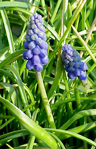
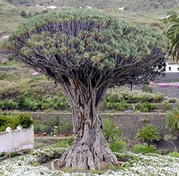
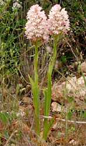

---
aliases:
- Asparagales
- Asparagaloj
- Asparagals
- asparges-ordenen
- aspargesordenen
- Asparilaadsed
- Bộ Măng tây
- chřestotvaré
- Koma çavmarkan
- Laukabálkur
- Moegdenhmwnzdungh
- Qulançarkimilər
- Smidriečiai
- Spargelartige
- Spargeloortagen
- sparrisordningen
- Sparģeļu rinda
- spárgavirágúak
- szparagowce
- Tanom nga asparagos
- Tizikemt
- Šparogolike
- Ασπαραγώδη
- зайчесянкоцветни
- Спаржа зизай
- Спаржакветныя
- Спаржецветные
- Холодкоцвіті
- шпаргловидни
- ծնեբեկածաղկավորներ
- אספרגאים
- ستاوری
- مارچوبهسانان
- هليونيات
- ہلیونطب
- அசுபாரகேல்சு
- อันดับหน่อไม้ฝรั่ง
- クサスギカズラ目
- 天門冬目
- 天门冬目
- 비짜루목
has_id_wikidata: Q26229
title: Asparagales
parent_taxon: '[[_Standards/WikiData/WD~monocots,78961]]'
instance_of: '[[_Standards/WikiData/WD~taxon,16521]]'
taxon_rank: '[[_Standards/WikiData/WD~order,36602]]'
ITIS_TSN: 897479
OmegaWiki_Defined_Meaning: 358558
image:
- http://commons.wikimedia.org/wiki/Special:FilePath/Asperge%20in%20bloei%20Asparagus%20officinalis.jpg
- http://commons.wikimedia.org/wiki/Special:FilePath/Illustration%20Asparagus%20officinalis0b.jpg
PAEnflowered_taxon_URL: https://www.paenflowered.org/apgii/asparagales
EPPO_Code: 1ASGO
P8189: 987007530396505171
Commons_gallery: Asparagales
Commons_category: Asparagales
taxon_name: Asparagales
NBN_System_Key: NHMSYS0020824581
taxon_common_name: 天门冬目
MeSH_tree_code: B01.875.800.575.912.250.618.100
dv_has_:
  name_:
    af: Asparagales
    an: Asparagales
    ar: هليونيات
    arz: هليونيات
    ast: Asparagales
    az: Qulançarkimilər
    be: Спаржакветныя
    be_tarask: Спаржакветныя
    bg: зайчесянкоцветни
    bs: Asparagales
    ca: Asparagals
    ceb: Tanom nga asparagos
    co: Asparagales
    cs: chřestotvaré
    cy: Asparagales
    da: asparges-ordenen
    de: Spargelartige
    el: Ασπαραγώδη
    en: Asparagales
    eo: Asparagaloj
    es: Asparagales
    et: Asparilaadsed
    eu: Asparagales
    ext: Asparagales
    fa: مارچوبهسانان
    fi: Asparagales
    fr: Asparagales
    frr: Spargeloortagen
    ga: Asparagales
    gl: Asparagales
    he: אספרגאים
    hr: Šparogolike
    hu: spárgavirágúak
    hy: ծնեբեկածաղկավորներ
    ia: Asparagales
    id: Asparagales
    ie: Asparagales
    inh: Спаржа зизай
    io: Asparagales
    is: Laukabálkur
    it: Asparagales
    ja: クサスギカズラ目
    kab: Tizikemt
    ko: 비짜루목
    ku: Koma çavmarkan
    la: Asparagales
    lb: Asparagales
    lt: Smidriečiai
    lv: Sparģeļu rinda
    mk: шпаргловидни
    mt: Asparagales
    mul: Asparagales
    nb: aspargesordenen
    nl: Asparagales
    nn: aspargesordenen
    oc: Asparagales
    pl: szparagowce
    pnb: ستاوری
    pt: Asparagales
    pt_br: Asparagales
    ro: Asparagales
    ru: Спаржецветные
    scn: Asparagales
    sco: Asparagales
    sl: Asparagales
    sq: Asparagales
    sr: Asparagales
    sv: sparrisordningen
    ta: அசுபாரகேல்சு
    th: อันดับหน่อไม้ฝรั่ง
    tr: Asparagales
    uk: Холодкоцвіті
    ur: ہلیونطب
    vi: Bộ Măng tây
    vls: Asparagales
    vo: Asparagales
    war: Asparagales
    wuu: 天门冬目
    yue: 天門冬目
    za: Moegdenhmwnzdungh
    zh: 天门冬目
    zh_cn: 天门冬目
    zh_hans: 天门冬目
    zh_tw: 天門冬目
---

# [[Asparagales]] 

#is_/same_as :: [[../../../../../../../../WikiData/WD~Asparagales,26229|WD~Asparagales,26229]] 

## #has_/text_of_/abstract 

> **Asparagales** (asparagoid lilies) are a diverse order of flowering plants in the monocots. 
> 
> Under the APG IV system of flowering plant classification, 
> Asparagales are the largest order of monocots 
> with 14 families, 1,122 genera, and about 36,000 species, with members as varied as 
> asparagus, orchids, yuccas, irises, onions, garlic, leeks, and other Alliums, 
> daffodils, snowdrops, amaryllis, agaves, butcher's broom, Agapanthus, Solomon's seal, 
> hyacinths, bluebells, spider plants, grasstrees, aloe, freesias, gladioli, crocuses, and saffron.
>
> Most species of Asparagales are herbaceous perennials, 
> although some are climbers and some are trees or shrubs. 
> 
> The order also contains many geophytes (bulbs, corms, and various kinds of tuber). 
> 
> The leaves of almost all species form a tight rosette, 
> either at the base of the plant or at the end of the stem, but occasionally along the stem. 
> 
> The flowers are not particularly distinctive, being 'lily type', with six tepals and up to six stamina. 
> One of the defining characteristics (synapomorphies) of the order 
> is the presence of phytomelanin, a black pigment present in the seed coat, creating a dark crust. 
> Phytomelanin is found in most families of the Asparagales 
> (although not in Orchidaceae, thought to be the sister-group of the rest of the order).
>
> The order Asparagales takes its name from the type family Asparagaceae 
> and has only recently been recognized in classification systems. 
> 
> The order is clearly circumscribed on the basis of molecular phylogenetics, 
> but it is difficult to define morphologically since its members are structurally diverse. 
> 
> The order was first put forward by Huber in 1977 
> and later taken up in the Dahlgren system of 1985 
> and then the Angiosperm Phylogeny Group systems. 
> 
> Before this, many of its families were assigned to the old order Liliales, 
> which was redistributed over three orders, Liliales, Asparagales, and Dioscoreales, 
> based on molecular phylogenetics. 
> 
> The boundaries of the Asparagales and of its families 
> have undergone a series of changes in recent years; 
> future research may lead to further changes and ultimately greater stability.
>
> The order is thought to have first diverged from other related monocots 
> some 120–130 million years ago (early in the Cretaceous period), 
> although given the difficulty in classifying the families involved, estimates are likely to be uncertain.
>
> From an economic point of view, the order Asparagales is second in importance 
> within the monocots only to the order Poales (which includes grasses and cereals). 
> 
> Species are used as 
> - food and flavourings (e.g. onion, garlic, leek, asparagus, vanilla, saffron), 
> - in medicinal or cosmetic applications (Aloe), 
> - as cut flowers (e.g. freesia, gladiolus, iris, orchids), and 
> - as garden ornamentals (e.g. day lilies, lily of the valley, Agapanthus).
>
> [Wikipedia](https://en.wikipedia.org/wiki/Asparagales) 

## Title Illustrations

---------------------------------------------------------------------

scientific_name ::  Muscari neglectum
Comments          Hyacinthaceae
copyright ::         © [Kurt Stüber](http://www.biolib.de/) 

------------------------------------------------------------------------
 
scientific_name ::   Dracaena draco
location ::         Icod de los Vinos, Teneriffa, Canary Islands, cultivated?
Comments           Dragon tree (Convallariaceae)
Acknowledgements   courtesy [Botanical Image Database](http://www.unibas.ch/botimage/)
copyright ::          © 2001 University of Basel, Basel, Switzerland 

------------------------------------------------------------------------

scientific_name ::    Anacamptis pyramidalis
location ::          Samos, Greece
Comments            Orchidaceae
Source Collection   [Botanical Image Database](http://www.unibas.ch/botimage/)
copyright ::           © 2001 University of Basel, Basel, Switzerland 

## Phylogeny 

-   « Ancestral Groups  
    -   [Monocot](../Monocot.md)
    -   [Flowering_Plant](../../Flowering_Plant.md)
    -   [Seed_Plant](../../../Seed_Plant.md)
    -   [Land_Plant](../../../../Land_Plant.md)
    -   [Green plants](../../../../../Plant.md)
    -  [Eukarya](../../../../../../Eukarya.md) 
    -   [Tree of Life](../../../../../../Tree_of_Life.md)

-   ◊ Sibling Groups of  Monocotyledons
    -   [Alismatanae](Alismatanae.md)
    -   [Aranae](Aranae.md)
    -   [Liliales](Liliales.md)
    -   Asparagales
    -   [Pandanales](Pandanales.md)
    -   [Dioscoreales](Dioscoreales.md)
    -   [Palm](Palm.md)
    -   [Zingiberales](Zingiberales.md)
    -   [Commelinanae](Commelinids/Commelinanae.md)

-   » Sub-Groups
    -   [Hyacinthaceae](Asparagales/Hyacinthaceae.md)
	-   *Agapanthaceae*
	-   *Agavaceae*
	-   *Alliaceae*
	-   *Amaryllidaceae*
	-   *Anemarrhenaceae*
	-   *Anthericaceae*
	-   *Aphyllanthaceae*
	-   *Asparagaceae*
	-   *Asphodelaceae*
	-   *Asteliaceae*
	-   *Behniaceae*
	-   *Blandfordiaceae*
	-   *Boryaceae*
	-   *Convallariaceae*
	-   *Doryanthaceae*
	-   *Hemerocallidaceae*
	-   *Herreriaceae*
	-   *Hesperocallidaceae*
	-   *[Hyacinthaceae](Asparagales/Hyacinthaceae.md "go to ToL page")*
	    [(Hyacinthus, Ornithogalum, Scilla and their
	    relatives)]
	-   *Hypoxidaceae*
	-   *Iridaceae*
	-   *Ixioliriaceae*
	-   *Lanariaceae*
	-   *Laxmaniaceae*
	-   *Orchidaceae*
	-   *Tecophiliaceae*
	-   *Themidaceae*
	-   *Xanthorrhoeaceae*
	-   *Xeronemataceae*

## Confidential Links & Embeds: 

### #is_/same_as :: [[/_Standards/bio/bio~Domain/Eukarya/Plant/Land_Plant/Seed_Plant/Flowering_Plant/Monocot/Asparagales|Asparagales]] 

### #is_/same_as :: [[/_public/bio/bio~Domain/Eukarya/Plant/Land_Plant/Seed_Plant/Flowering_Plant/Monocot/Asparagales.public|Asparagales.public]] 

### #is_/same_as :: [[/_internal/bio/bio~Domain/Eukarya/Plant/Land_Plant/Seed_Plant/Flowering_Plant/Monocot/Asparagales.internal|Asparagales.internal]] 

### #is_/same_as :: [[/_protect/bio/bio~Domain/Eukarya/Plant/Land_Plant/Seed_Plant/Flowering_Plant/Monocot/Asparagales.protect|Asparagales.protect]] 

### #is_/same_as :: [[/_private/bio/bio~Domain/Eukarya/Plant/Land_Plant/Seed_Plant/Flowering_Plant/Monocot/Asparagales.private|Asparagales.private]] 

### #is_/same_as :: [[/_personal/bio/bio~Domain/Eukarya/Plant/Land_Plant/Seed_Plant/Flowering_Plant/Monocot/Asparagales.personal|Asparagales.personal]] 

### #is_/same_as :: [[/_secret/bio/bio~Domain/Eukarya/Plant/Land_Plant/Seed_Plant/Flowering_Plant/Monocot/Asparagales.secret|Asparagales.secret]] 

