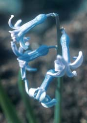
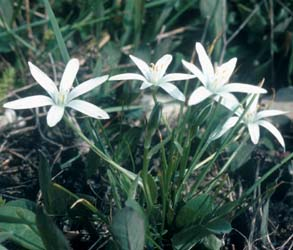
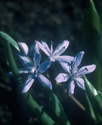
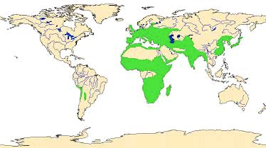
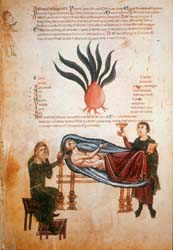

---
aliases:
  - Hyacinthaceae
title: Hyacinthaceae
---

## Phylogeny 

-   « Ancestral Groups  
    -   [Asparagales](../Asparagales.md)
    -   [Monocot](../../Monocot.md)
    -   [Flowering_Plant](../../../Flowering_Plant.md)
    -   [Seed_Plant](../../../../Seed_Plant.md)
    -   [Land_Plant](../../../../../Land_Plant.md)
    -  [Green plants](../../../../../../Plant.md))
    -  [Eukarya](../../../../../../../Eukarya.md))
    -   [Tree of Life](../../../../../../../Tree_of_Life.md)

-   ◊ Sibling Groups of  Asparagales
    -   Hyacinthaceae

-   » Sub-Groups 

# [[Hyacinthaceae]]

Hyacinthus, Ornithogalum, Scilla and their relatives 

      

## #has_/text_of_/abstract 

> Scilloideae (named after the genus Scilla, "squill") 
> is a subfamily of bulbous plants within the family Asparagaceae. 
> 
> Scilloideae is sometimes treated as a separate family **Hyacinthaceae**, 
> named after the genus Hyacinthus. 
> 
> Scilloideae or Hyacinthaceae include many familiar garden plants such as 
> Hyacinthus (hyacinths), Hyacinthoides (bluebells), Muscari (grape hyacinths) 
> and Scilla and Puschkinia (squills or scillas). Some are important as cut flowers.
>
> Scilloideae are distributed mostly in Mediterranean climates, 
> including South Africa, Central Asia and South America. 
> 
> Their flowers have six tepals and six stamens with a superior ovary, 
> which previously placed them within the lily family (Liliaceae), 
> and their leaves are fleshy, mucilaginous, and arranged in a basal rosette.
>
> The Scilloideae, like most lily-like monocots, 
> were at one time placed in a very broadly defined lily family (Liliaceae). 
> 
> The subfamily is recognized in modern classification systems such as the APG III system of 2009. 
> It is also treated as the separate family Hyacinthaceae, 
> as it is by many researchers and was in earlier APG systems. 
> 
> Determining the boundaries between genera within the Scilloideae is an active area of research. 
> The number of genera varies widely from source to source, from about 30 to about 70. 
> The situation has been described as being in a "state of flux".
>
> [Wikipedia](https://en.wikipedia.org/wiki/Scilloideae) 

## Introduction

[M. Pfosser and F. Speta]()

The generic names *Hyacinthus*, *Ornithogalum* and *Scilla* 
have already been in use since ancient Greek times and represent the core genera of Hyacinthaceae. 

In his Genera Plantarum (1754) Linné based his circumscription of these three genera 
mainly on characters of the flowers. 

As a consequence of this decision, distributing the species
that are nowadays believed to belong to the plant family Hyacinthaceae
into these three genera would result in a highly unnatural
classification. Only the splitting of these old genera into numerous and
more homogeneous genera finally resulted in a more appropriate
classification with the recognition of mainly monophyletic groups. Today
the family Hyacinthaceae consists of approximately 70 genera and 1000
species.

The Hyacinthaceae prefer open, sunny habitats with dry and hot
vegetation periods. In temperate regions they appear as spring geophytes
in deciduous broadleaved forests. A few species like *Rhadamanthus
urgineoides* from Madagascar grow epiphytic on trees in rainforests.

### Characteristics

The Hyacinthaceae are mostly bulbous plants with subterraneous or
epigeal bulbs. The inflorescence is a raceme bearing one to hundreds of
flowers. The superior ovary of the flower discriminates Hyacinthaceae
from bulbous plants belonging to the family Amaryllidaceae. Only
*Bowiea* with its hemi-inferior ovary is an exception to this rule. The
inflorescence of this unusual genus is a strongly branched raceme - a
character only shared with one other genus in the family, *Schizobasis*.
The often prominent scape never bears foliage leaves and thus
discriminates Hyacinthaceae from Liliaceae sensu stricto. The flowers
are mainly visited by insects or in some genera also by birds.

### Geographic Distribution

Geographic distribution of Hyacinthaceae (in green).

The family has main centers of diversity with large numbers of species
in southern Africa and the Mediterranean. The monotypic subfamily
Oziroeoideae with the single genus *Oziroe* is found only in Andine
South America. The Urgineoideae are distributed from South Africa to the
Mediterranean and further to Arabia, India, and Burma. The
Ornithogaloideae extend from South Africa and Southern France to Arabia
and India, with *Loncomelos* ranging from the Mediterranean to the Ural
mountains. The subfamily Hyacinthoideae has the widest distribution,
extending from South Africa to East Asia (*Barnardia*), India
(*Ledebouria*), Northwest Europe (*Tractema*), and Central Asia
(*Bellevalia*, *Fessia*, *Muscari*).

### Economic Uses

The sea onion is found in remedies in herbals and medicinal books since
earliest times. Picture taken from the Codex Vindobonensis 93 (13.
century)

*Charybdis maritima*, the sea onion, has been in medicinal use since
earliest times and was mentioned as early as 1554 B.C. in the Papyrus
Ebers of the Middle Empire of Egypt as a cure for dropsy (Figala, 1972).
Bufadienolides isolated from *C. maritima* and *Urginea indica* aggr.
are used for the production of cardiac active substances (Krenn, 1994).
Cardenolides from *Ornithogalum* have apparently not been utilized so
far.

In South Africa, several species such as *Eliokarmos thyrsoides*,
*Ledebouria cooperi*, *L. inguinata*, *L. ovatifolia*, *L. revoluta*,
*Zahariadia saundersiae*, and several members of subfamily Urgineoideae
are poisonous to grazing animals. The toxic compound scilliroside (a
bufadienolide) is used for poisoning rats.

Hyacinthaceae are only occasionally used for human consumption. In
Greece, the bulbs of *Muscari comosum* are eaten pickled, and in France,
the inflorescences of *Loncomelos pyrenaicus* are eaten as a vegetable.
In Africa, bushmen eat the bulbs of *Ledebouria apertiflora* and *L.
revoluta*.

More important is the use of various species as ornamentals and cut
flowers. Species of *Chouardia*, *Hyacinthoides*, *Hyacinthus*,
*Muscari*, *Othocallis*, *Puschkinia*, and *Scilla*, are spring flowers
of Northern Hemisphere parks and gardens. In southern Africa, species of
*Eucomis*, *Galtonia*, *Veltheimia*, and others are cultivated as
ornamentals. *Eliokarmos thyrsoides* and related species are important
as cut flowers.

### Discussion of Phylogenetic Relationships

Based on chemotaxonomical, morphological, cytological, and molecular
data the members of Hyacinthaceae can be divided into the four
subfamilies Oziroeoideae, Urgineoideae, Ornithogaloideae, and
Hyacinthoideae (Pfosser and Speta, 1999; Speta, 1998a; Speta, 1998b).
Enough evidence has accumulated to demonstrate that the North American
genera *Camassia* and *Chlorogalum* can no longer be included in
Hyacinthaceae (Pfosser and Speta, 1999). Instead, rbcL sequence data
(Chase et al., 1995; Fay and Chase, 1996), trnL/F sequence data (Pfosser
and Speta, 1999), as well as serological data (Cupov and Kutjavina,
1981) point to a relationship of these genera to Agavaceae, Funkiaceae,
and Anthericaceae and not to Hyacinthaceae.

## Title Illustrations

-------------)
Scientific Name ::  Hyacinthus orientalis L.
Location ::        cult. Greci, Romania
Copyright ::         © 2001 M. Pfosser and F. Speta

----------------
  
Scientific Name ::  Ornithogalum umbellatum sensu lato L.
Location ::        Monte Conero, Italy
Copyright ::         © 2001 M. Pfosser and F. Speta

-------------
  
Scientific Name ::  Scilla bifolia L.
Location ::        Feldkirchen, Austria
Copyright ::         © 2001 M. Pfosser and F. Speta

## Confidential Links & Embeds: 

### #is_/same_as :: [Hyacinthaceae](/_Standards/bio/bio~Domain/Eukarya/Plant/Land_Plant/Seed_Plant/Flowering_Plant/Monocot/Asparagales/Hyacinthaceae.md) 

### #is_/same_as :: [Hyacinthaceae.public](/_public/bio/bio~Domain/Eukarya/Plant/Land_Plant/Seed_Plant/Flowering_Plant/Monocot/Asparagales/Hyacinthaceae.public.md) 

### #is_/same_as :: [Hyacinthaceae.internal](/_internal/bio/bio~Domain/Eukarya/Plant/Land_Plant/Seed_Plant/Flowering_Plant/Monocot/Asparagales/Hyacinthaceae.internal.md) 

### #is_/same_as :: [Hyacinthaceae.protect](/_protect/bio/bio~Domain/Eukarya/Plant/Land_Plant/Seed_Plant/Flowering_Plant/Monocot/Asparagales/Hyacinthaceae.protect.md) 

### #is_/same_as :: [Hyacinthaceae.private](/_private/bio/bio~Domain/Eukarya/Plant/Land_Plant/Seed_Plant/Flowering_Plant/Monocot/Asparagales/Hyacinthaceae.private.md) 

### #is_/same_as :: [Hyacinthaceae.personal](/_personal/bio/bio~Domain/Eukarya/Plant/Land_Plant/Seed_Plant/Flowering_Plant/Monocot/Asparagales/Hyacinthaceae.personal.md) 

### #is_/same_as :: [Hyacinthaceae.secret](/_secret/bio/bio~Domain/Eukarya/Plant/Land_Plant/Seed_Plant/Flowering_Plant/Monocot/Asparagales/Hyacinthaceae.secret.md)

